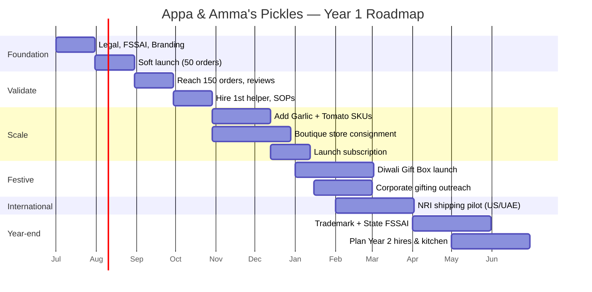

# Appa & Amma's Pickles — Business Plan

A practical, lean launch plan for a family-run homemade pickle brand operating out of a village in India. Built for limited capital (₹1.5–3 lakh seed), realistic execution by 1–2 family members, and gradual, profitable scaling.

---

## 1. Brand Positioning

**Positioning statement:**
> For Indians who miss the taste of home, **Appa & Amma's Pickles** are handcrafted village pickles made from generational family recipes — the same jar Amma would have packed for you, just delivered to your door.

**Positioning pillars:**
- **Authentic, not artisanal-marketed** — real village kitchen, real family, no factory.
- **Generational recipe credibility** — recipes are the product, not just the ingredients.
- **Emotional, not gourmet** — we sell *memory and belonging*, not "premium condiments".
- **Small batch, traceable** — each batch tied to a date, a hand, a story.

**Category:** Premium-mass homemade pickles (₹250–450 / 250g range) — above commodity Priya/Mother's, below boutique D2C brands like Pickle Pickle.

---

## 2. Mission and Vision

**Mission:**
To bring the taste of an Indian home kitchen to every Indian who is far from one — preserving traditional family recipes, supporting our village, and never compromising on how Amma would make it.

**Vision (5 years):**
To be the most trusted homemade pickle brand for the Indian diaspora and urban Indian families, known for honesty, taste, and a story worth sharing — while keeping production rooted in our village and creating dignified livelihoods for women there.

**Core values:**
1. **Recipe over scale** — we change the kitchen, never the recipe.
2. **Hands you can name** — every jar is made by someone we know.
3. **Honest labels** — no preservatives we wouldn't use at home.
4. **Slow growth, strong roots** — profitability over vanity metrics.

---

## 3. Unique Selling Proposition (USP)

**Primary USP:**
> "Handmade in our village by Amma herself — the same recipe, the same hands, just a bigger jar."

**Supporting differentiators:**
| Lever | Most competitors | Appa & Amma's |
|---|---|---|
| Production | Factory / co-packer | Family kitchen, village |
| Recipe origin | "Traditional" (vague) | Named family, photo, region |
| Preservatives | Sodium benzoate common | Only oil + salt + spice |
| Batch transparency | None | Batch number, maker name, date on jar |
| Story | Generic | Real Appa & Amma, real village, real photos |
| Connection | Transactional | Handwritten thank-you note in first order |

---

## 4. Target Audience

**Primary segment — "The Homesick Professional" (60% of focus)**
- Age 25–40, urban metros (Bangalore, Mumbai, Pune, Hyderabad, Delhi-NCR, Chennai)
- Lives away from hometown, cooks occasionally, orders groceries online
- Buys via Instagram, WhatsApp, D2C site
- Pain: "Store pickles don't taste like home." Willing to pay 2–3× for authenticity.
- ARPU target: ₹600–900 per order (2 jars)

**Secondary segment — "The Nostalgic NRI" (25%)**
- Indian diaspora in US, UK, UAE, Singapore, Australia
- Buys 4–6 jars at a time as gifts or for self
- Reached via Instagram, family referrals, India-trip pickup
- ARPU: ₹2,500–4,000 per order
- Phase 2 (month 6+) once shelf life and packaging are export-grade

**Tertiary segment — "The Modern Family" (15%)**
- 35–55, urban families, kids, dual income
- Buys monthly, prefers gift-pack format for relatives
- Reached via word-of-mouth, Instagram, local society pop-ups

---

## 5. Product Strategy

### Launch SKUs (Month 0–3)
| SKU | Size | Why |
|---|---|---|
| Mango Pickle (Avakaya-style) | 250g | Highest-demand category, anchor product |
| Lemon Pickle | 250g | Year-round availability, longest shelf life |
| Bitter Gourd Pickle | 250g | Differentiator — rare in market, builds brand identity |

### Format strategy
- **250g glass jar** as hero SKU — premium feel, microwave/fridge safe, photogenic.
- **100g taster jar** at ₹120–150 — low-friction first purchase, gifting.
- **Combo of 3 (250g)** — flagship gifting/NRI SKU.

### Roadmap
- **Month 0–3:** 3 SKUs × 2 sizes = 6 SKUs. Focus on consistency.
- **Month 4–6:** Add Garlic Pickle + Tomato-Garlic (seasonal-independent, high repeat).
- **Month 7–12:** Launch **Festive Gift Box** (3×100g + handwritten note) for Diwali/Onam.
- **Year 2:** Regional specials (Gongura, Amla), Podis as adjacency.

### Quality & shelf-life targets
- 9-month shelf life, oil-sealed, no chemical preservatives.
- Get an FSSAI lab test on each SKU before launch (~₹3,000–5,000 per SKU).
- Standardize: digital scale, measured oil, masala pre-mix in weighed packets.

---

## 6. Pricing Strategy

### Cost structure (per 250g jar — indicative)
| Item | Cost (₹) |
|---|---|
| Raw material (mango/lemon/karela + spices) | 55–75 |
| Oil (gingelly/mustard) | 30–40 |
| Glass jar + lid + label + seal | 35–45 |
| Outer box + bubble wrap | 15 |
| Labour (allocated) | 20 |
| Logistics (avg., domestic) | 60–80 |
| Payment gateway + platform fees (~5%) | 18 |
| **Total landed cost** | **₹230–290** |

### Retail pricing
| SKU | MRP | Margin |
|---|---|---|
| 100g taster | ₹150 | ~45% |
| 250g single | ₹350 (Mango/Lemon), ₹380 (Karela) | ~35–40% |
| Combo of 3 (250g) | ₹950 (save ₹100) | ~38% |
| NRI 3-pack (export) | ₹1,800–2,200 + shipping | ~45% |

### Pricing principles
- **Never discount the recipe.** Use combos and free shipping above ₹999, not %-off.
- **Anchor with the combo** — most customers should land on the 3-pack.
- **Founding-100 price** (first 100 customers): free 100g jar with any order — builds reviews, not discounts the brand.

---

## 7. Packaging Strategy

### Primary pack
- **250g round glass jar** with metal twist lid + induction seal liner.
- Cost-efficient suppliers: Borosil seconds, local glass jar wholesalers in Firozabad / Ahmedabad.
- Wrap lid in red gingham cloth + jute twine for the "tied by Amma" cue (₹3–4 added cost, huge perceived value).

### Label
- Front: Brand name in Tamil/Telugu/Kannada script + English, product name, photo of Amma's hands, "Handmade in [village name]".
- Back: Ingredients (short list), batch number, maker's first name, date of making, "Best within 9 months", FSSAI license number, storage tips.
- Use a single label design system across SKUs — different accent colour per pickle.

### Outer / shipping
- Recycled brown corrugated box, jute filler or shredded paper (not plastic bubble for brand consistency, though use bubble for fragile lanes).
- **Insert card** (the highest-ROI ₹5 you'll ever spend):
  - Handwritten "Thank you, [Name]" on the first 500 orders — Amma or Appa signs.
  - QR code → "Meet the family" video (1 min, phone-shot, subtitled).
  - Recipe card: "3 ways Amma eats this pickle."

### Compliance
- FSSAI license (Registration tier, ₹100/yr, fits homemade <₹12L turnover; upgrade to State license when crossing).
- Net weight, MRP, manufacturer address, veg mark, batch, mfg date — mandatory under Legal Metrology.

---

## 8. Distribution Strategy

### Phase 1 — Months 0–3: Direct, low-cost
1. **WhatsApp Business catalogue** — primary channel. Zero platform fee. Order via chat.
2. **Instagram shop** — discovery + DM → WhatsApp checkout.
3. **Simple Shopify / Dukaan / Shiprocket Social store** (₹0–500/mo) — for credibility and UPI/card payments.
4. **Friends & family + colony/society pop-ups** in 1–2 metros where family members live.

### Phase 2 — Months 4–6: Scale direct
5. Onboard onto **Shiprocket** for pan-India COD-free shipping (₹50–80/order, weight-based).
6. Test **one** marketplace: **Amazon Karigar** (handmade) or **OpenInApp / Wishlink** influencer storefronts. Avoid Flipkart/Big Basket until margins justify them.
7. **Local kirana / gourmet store** consignment in 2–3 stores in home metro (Nature's Basket, FoodHall-style boutique stores). Margin: 30–35% to retailer.

### Phase 3 — Months 7–12: Selective expansion
8. **NRI shipping** via Shiprocket X / DTDC International. Focus: US, UAE, Singapore. Use a freight forwarder; pickles are allowed but documentation matters.
9. **Corporate gifting** (Diwali) — high-margin, one-shot orders of 50–500 jars. Pitch HR teams via LinkedIn.
10. **Subscription** — "Pickle of the Month" at ₹399/mo, 100g rotating SKU.

### What NOT to do (year 1)
- Don't list on Blinkit/Zepto/Instamart — margins kill homemade brands.
- Don't take big retail chain orders without working capital. They pay in 60–90 days.
- Don't dilute by adding non-pickle SKUs early (papads, masalas) — focus wins.

---

## 9. Marketing Strategy

### Brand voice
Warm, unpolished, in first person from Amma/Appa or "the daughter who runs the Instagram." Bilingual captions. Never corporate.

### Channels & tactics

**1. Instagram (primary, ₹0–5k/mo)**
- 4 posts/week: 2 process Reels (hands cutting mango, sun-drying), 1 family/story post, 1 customer/recipe post.
- Hashtags: regional + nostalgia (#hometaste #avakaya #amma).
- Reach out to **20 nano-influencers** (5k–30k followers, food/diaspora niche) per month with 1 free combo. Target: 2–3 organic posts/month.

**2. WhatsApp community (highest-LTV channel)**
- Build a "Amma's Kitchen" broadcast list from day 1.
- Send: new batch alerts, recipe of the week, "first 20 jars" drops to create scarcity.
- Aim for 500 contacts by Day 90, 2,000 by Day 365.

**3. Content / SEO (slow, compounding)**
- 1 blog post / month on the website: "How to tell if your mango pickle has gone bad", "Avakaya vs. Avakai vs. Maagaai".
- YouTube: 1 long-form/month — Amma making a pickle, no edits, no music. This single asset can carry the brand.

**4. Referral**
- "Send a jar home" — refer a friend, both get ₹100 off next order.
- Hand-write the referrer's name on the friend's thank-you card.

**5. PR / earned**
- Pitch *The Hindu Metro Plus*, *Mid-Day*, *The Better India*, *Homegrown*, *Curly Tales* with the family story angle once you have 500 orders shipped.

**6. Paid (only after Day 60, only after organic CAC is known)**
- Meta ads: ₹300–500/day, retargeting site visitors only for first 30 days.
- Target CAC: ≤₹250 for first order, ≤₹100 for repeat customers.

### Marketing calendar levers
- **Pickle season (Apr–Jun):** mango harvest = hero campaign. Pre-orders open in March.
- **Diwali (Oct–Nov):** corporate gifting + festive boxes.
- **Pongal/Sankranti, Onam, Ugadi:** regional pickle drops with limited batches.

---

## 10. Financial Projections (Year 1, conservative)

### Seed investment: ₹2,00,000
| Head | ₹ |
|---|---|
| FSSAI + lab tests + legal | 15,000 |
| Initial inventory (raw + packaging for 500 jars) | 60,000 |
| Branding (logo, label design via a freelancer) | 15,000 |
| Photography (one-day shoot in village) | 10,000 |
| Website (Dukaan/Shopify Lite + domain, 1 yr) | 8,000 |
| Initial marketing (influencer seeding, ads) | 30,000 |
| Equipment upgrade (jars, sealer, scale, racks) | 25,000 |
| Working capital buffer | 37,000 |
| **Total** | **2,00,000** |

### Monthly run-rate projection (Year 1)

| Month | Orders | Avg ticket | Revenue (₹) | Gross margin | Net (after marketing+ops) |
|---|---|---|---|---|---|
| 1 | 40 | 600 | 24,000 | 9,600 | -15,000 |
| 2 | 80 | 650 | 52,000 | 21,000 | -8,000 |
| 3 | 150 | 700 | 1,05,000 | 42,000 | 5,000 |
| 4 | 220 | 720 | 1,58,000 | 63,000 | 18,000 |
| 5 | 300 | 750 | 2,25,000 | 90,000 | 35,000 |
| 6 | 380 | 780 | 2,96,000 | 1,18,000 | 55,000 |
| 7 | 450 | 800 | 3,60,000 | 1,44,000 | 75,000 |
| 8 | 520 | 820 | 4,26,000 | 1,70,000 | 92,000 |
| 9 | 600 | 850 | 5,10,000 | 2,04,000 | 1,15,000 |
| 10 (Diwali) | 1,000 | 950 | 9,50,000 | 3,80,000 | 2,40,000 |
| 11 | 700 | 850 | 5,95,000 | 2,38,000 | 1,40,000 |
| 12 | 750 | 880 | 6,60,000 | 2,64,000 | 1,55,000 |

**Year 1 totals (rough):**
- Revenue: **₹43–45 lakh**
- Gross profit: **₹17–18 lakh** (~40%)
- Net profit (post-everything, founder unpaid): **₹7–9 lakh**
- Break-even: **Month 3**
- Customer count: ~5,000; repeat rate target: 35%

### Key unit economics to defend
- Gross margin ≥ 38%
- CAC ≤ ₹250
- Repeat purchase within 90 days ≥ 30%
- Spoilage / returns < 2%

---

## 11. Risks and Mitigation

| Risk | Likelihood | Impact | Mitigation |
|---|---|---|---|
| Spoilage / shelf-life failure | Medium | High (brand-killing) | Lab-test every SKU; standardise oil ratio; batch-test before shipping; refund + replace policy. |
| Inconsistent taste batch-to-batch | High | High | Weighed masala pre-mixes; written recipe SOP; one designated "head cook" (Amma) approves every batch. |
| Logistics damage (broken jars) | Medium | Medium | Bubble wrap + corner protectors; shift to PET if breakage > 3%; insure shipments above ₹2,000. |
| FSSAI / labelling non-compliance | Low | High | Get registration before first sale; audit label with a compliance consultant once. |
| Cash trapped in inventory | High | Medium | Pre-order model for mango season; never carry >45 days inventory; collect upfront on D2C. |
| Family bandwidth / burnout | High | High | Cap orders/day from Day 1 ("only 30 jars/day"); hire 1–2 women from village by Month 4; document SOPs. |
| Copycat brands | Medium | Low–Med | Story is the moat — keep showing real faces, real village. Trademark name in Class 30 (~₹9,000). |
| Raw material price spike (mango, oil) | Medium | Medium | Buy mango at season peak, store as cut-and-salted base; maintain 2 oil suppliers. |
| Negative review / contamination scare | Low | Very High | Batch traceability; respond within 4 hrs; offer full refund + replacement; never argue publicly. |
| Over-dependence on Instagram | High | Medium | Build WhatsApp list and email list from day 1; own the customer relationship. |

---

## 12. 30-Day Plan (Foundation)

**Week 1 — Legal + identity**
- [ ] Apply for FSSAI Registration (Basic).
- [ ] Register business (Proprietorship + GST if needed; not mandatory <₹40L).
- [ ] Open current account, set up UPI for business (Razorpay/PhonePe Business).
- [ ] Lock brand name; check trademark availability; buy domain `appaammapickles.com` (or .in).
- [ ] Brief a freelance designer (Fiverr/Behance) — logo + label system. Budget ₹10–15k.

**Week 2 — Product readiness**
- [ ] Finalise recipe SOPs in writing for all 3 pickles (quantities in grams, not "andaza").
- [ ] Source: glass jars (sample 3 suppliers), oil (bulk), spices (wholesale APMC).
- [ ] Send one jar of each SKU to an FSSAI-empanelled lab for shelf-life and microbial test.
- [ ] Photograph the village kitchen, Amma's hands, raw mango pile, finished jars — one full day, natural light.

**Week 3 — Channel setup**
- [ ] Set up Instagram + WhatsApp Business + Dukaan/Shopify Lite store.
- [ ] Upload 9 grid posts (story, product, process). Bio with WhatsApp link.
- [ ] Print 200 labels, 200 thank-you cards, 100 boxes for first run.
- [ ] Build a "first 100 customers" list from family + friends + their referrals.

**Week 4 — Soft launch**
- [ ] Make 100 jars total (40 Mango + 30 Lemon + 30 Karela).
- [ ] Ship to first 50 paying customers (friends-of-friends, paid full price — no free).
- [ ] Collect WhatsApp feedback on Day 7 from each. Document quotes for testimonials.
- [ ] **Goal:** 50 orders shipped, 20 reviews collected, 0 spoilage complaints.

---

## 13. 90-Day Plan (Validate & systematise)

**Days 31–60 — Sharpen the product-market fit**
- Hit **150 cumulative orders**, 30+ public reviews (Google Business + Instagram).
- Re-shoot product photography with feedback (most common: "I want to see the pickle, not just the jar").
- Launch the **Combo of 3** as the hero SKU; track if AOV moves from ₹600 → ₹800.
- Seed **20 nano-influencers** (₹0 budget, only product). Track which 3 actually convert.
- Start Meta Ads at ₹300/day, retargeting only. Measure CAC honestly.
- Set up Shiprocket account; move from manual courier to automated label printing.

**Days 61–90 — Build the engine**
- Hit **350 cumulative orders**, 30%+ repeat rate.
- Hire **1 helper from the village** (woman, paid fairly, trained on SOPs).
- Document the **batch sheet** — every jar tied to date, batch, maker. Photograph each batch.
- Launch **WhatsApp broadcast list** with first batch alert ("Only 60 jars this Sunday").
- Pitch **3 boutique gourmet stores** in your home metro for consignment.
- Run first **founder-to-customer call series**: Amma calls 20 repeat customers personally to thank. Record permission-given clips → marketing gold.
- **Decision gate:** is gross margin ≥ 38% and is repeat ≥ 30%? If yes, scale. If no, fix before spending.

**End-of-90-day targets**
- Revenue: ₹1.8–2.2 lakh cumulative
- Customers: 350–400
- Reviews: 60+
- WhatsApp list: 500
- Instagram: 3,000 followers (organic)
- Cash: roughly break-even, working capital intact

---

## 14. First-Year Roadmap

### Quarterly themes

**Q1 (Months 1–3) — "Prove it tastes like home"**
- 3 SKUs, 2 sizes, 350+ orders, 30%+ repeat.
- One channel mastered (Instagram → WhatsApp → website).
- Founders still hand-pack every order.

**Q2 (Months 4–6) — "Build the kitchen, not just the brand"**
- Hire 2 helpers from the village. Pay above local rate.
- Add Garlic + Tomato pickle SKUs.
- 3 boutique stores onboarded.
- Cross 1,000 cumulative customers.
- Move accounting to Zoho Books / Khatabook; founder stops doing receipts manually.

**Q3 (Months 7–9) — "Diwali is the championship"**
- 60-day Diwali campaign: gift box pre-orders open Aug 15.
- Corporate gifting outreach to 100 HR/admin contacts via LinkedIn.
- Launch "Pickle of the Month" subscription.
- Begin NRI pilot — 50 international orders to gauge cost/feasibility.

**Q4 (Months 10–12) — "Don't break what works; prepare to scale"**
- Apply for **State FSSAI license** (mandatory above ₹12L turnover).
- File trademark for brand name + logo (Class 29 + 30).
- Move from home kitchen overflow to a dedicated village production room (still home-style, FSSAI-grade hygiene).
- Plan Year 2: a 4th regional SKU, a co-branded NRI pack, and a possible angel cheque (only if needed; bootstrap as long as possible).

### Year-1 success scorecard
| Metric | Conservative | Stretch |
|---|---|---|
| Revenue | ₹35 L | ₹50 L |
| Net profit (founder unpaid) | ₹5 L | ₹10 L |
| Customers | 4,000 | 6,500 |
| Repeat rate | 30% | 40% |
| Instagram followers | 8,000 | 20,000 |
| WhatsApp list | 2,000 | 4,000 |
| SKUs | 5 | 7 |
| Helpers hired (village women) | 2 | 4 |

---

## Closing principle

> Every decision in Year 1 should pass one filter: **"Would Amma still recognise this jar as hers?"**
> If yes — ship it. If no — fix it, even if it's slower.
>
> The brand's defensibility is not the recipe (recipes leak). It's the **trust that the recipe still comes from her hands**. Protect that, and everything else compounds.
