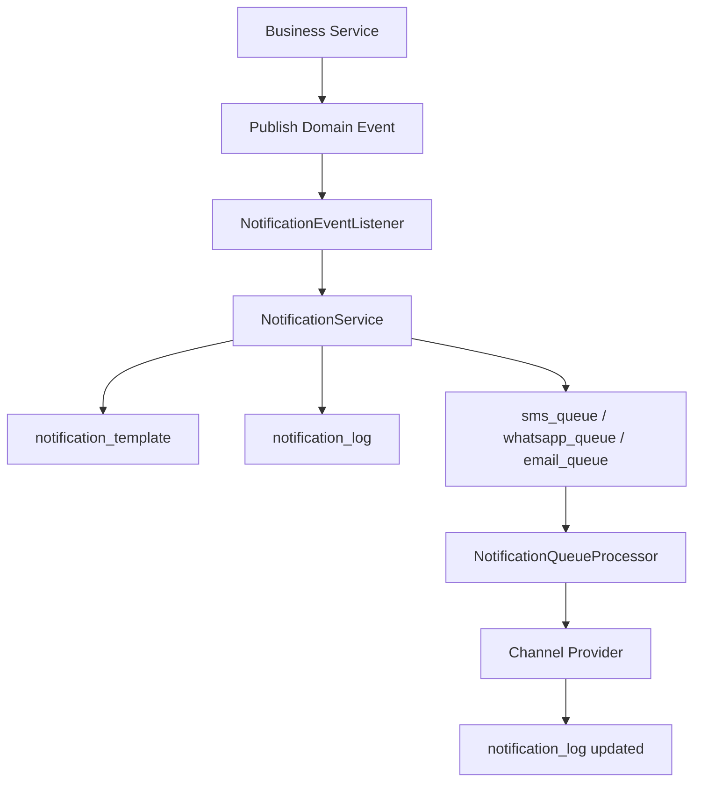
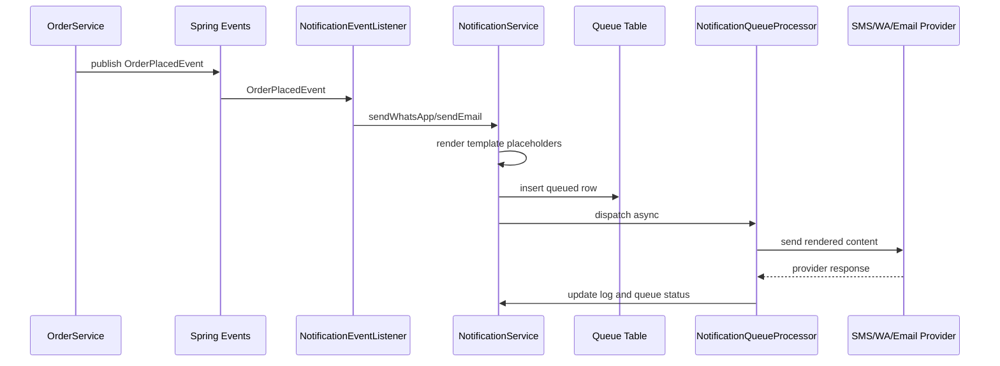

# Notification Architecture

This subsystem centralizes SMS, WhatsApp, and Email delivery around database-driven templates, queue tables, retry processing, and domain events.

## Overview

- `notification_template`: template source of truth
- `notification_log`: immutable delivery audit trail
- `sms_queue`, `whatsapp_queue`, `email_queue`: channel-specific dispatch queues
- `NotificationService`: resolves templates, renders placeholders, creates logs, and enqueues work
- `NotificationQueueProcessor`: async dispatcher with retry and dead-letter behavior
- Provider interfaces: `SmsProvider`, `WhatsAppProvider`, `EmailProvider`
- Event listeners: translate business events into notification requests

## Flow

## Order Sequence

## Template Placeholders

- `{{CustomerName}}`
- `{{OrderId}}`
- `{{Amount}}`
- `{{Items}}`
- `{{TrackingNumber}}`
- `{{TrackingUrl}}`
- `{{OTP}}`
- `{{ReviewLink}}`
- `{{ExpiryMinutes}}`

## Extensibility

To add a new channel such as push notifications:

1. Add a new `NotificationChannel` enum value.
2. Create a queue table and entity for that channel.
3. Introduce a new provider interface and provider implementations.
4. Add dispatch logic in `NotificationQueueProcessor`.
5. Create templates in `notification_template` using the new channel.

The business-event layer remains unchanged.