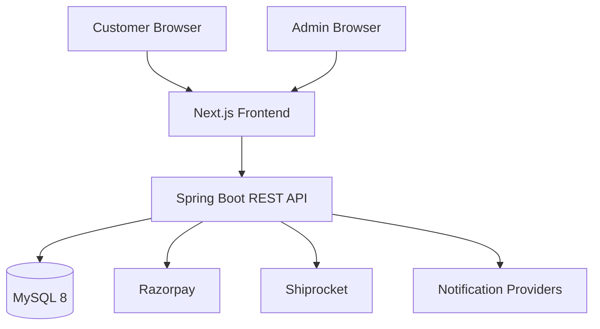

# Website Flow And Architecture

## Overview

This project is a monorepo with a Next.js 15 frontend and a Spring Boot 3 backend. It powers a direct-to-consumer ecommerce experience for Appa & Amma's Pickles and an internal admin surface for business operations.

## Technical Stack

### Frontend

- Next.js 15
- React 19
- TypeScript
- Tailwind CSS
- Zustand

### Backend

- Java 17
- Spring Boot 3.3.x
- Spring Web
- Spring Data JPA
- Spring Security
- Bean Validation
- MapStruct
- Lombok
- OpenAPI / Swagger

### Data And Infra

- MySQL 8
- Flyway migrations
- Docker and Docker Compose
- Razorpay integration
- Shiprocket integration

## System Flow



## Website Flow

### Public Customer Flow

1. User lands on the homepage.
2. User explores product categories or featured items.
3. User opens a product detail page.
4. User adds items to cart.
5. User proceeds through checkout.
6. User places an order and receives confirmation.
7. User later tracks the order or contacts support if needed.

### Trust And Content Flow

1. User reads brand story on the homepage or about page.
2. User checks reviews, FAQ, and contact information.
3. User gains confidence before placing an order.

### Admin Flow

1. Admin logs in.
2. Admin opens dashboard.
3. Admin manages products, orders, contacts, reviews, and inventory.
4. Admin handles shipping, payment follow-up, and notifications.

## Current Frontend Structure

```text
frontend/
├── src/
│   ├── app/                 # Next.js App Router routes
│   │   ├── about/
│   │   ├── account/
│   │   ├── admin/
│   │   ├── auth/
│   │   ├── bulk-orders/
│   │   ├── cart/
│   │   ├── checkout/
│   │   ├── contact/
│   │   ├── faq/
│   │   ├── label-preview/
│   │   ├── order/
│   │   ├── products/
│   │   ├── reviews/
│   │   ├── track-order/
│   │   ├── globals.css
│   │   ├── layout.tsx
│   │   └── page.tsx
│   ├── features/            # Domain features
│   │   ├── address/
│   │   ├── admin/
│   │   ├── auth/
│   │   ├── cart/
│   │   ├── category/
│   │   ├── checkout/
│   │   ├── contact/
│   │   ├── delivery/
│   │   ├── order/
│   │   ├── product/
│   │   ├── review/
│   │   └── shipping/
│   └── shared/              # Shared UI, hooks, libs, types, constants
│       ├── constants/
│       ├── hooks/
│       ├── layout/
│       ├── lib/
│       ├── types/
│       └── ui/
├── public/
└── package.json
```

## Current Backend Structure

```text
backend/
├── src/main/java/com/appaamma/pickles/
│   ├── api/                 # HTTP layer by version/domain
│   ├── common/              # Shared DTO wrappers and base classes
│   ├── config/              # Security, app config, bootstrap
│   ├── domain/              # Entities and repositories
│   ├── exception/           # Global exception handling
│   ├── security/            # JWT and auth internals
│   └── PicklesApplication.java
├── src/main/resources/
│   ├── application.yml
│   └── db/migration/        # Flyway SQL migrations
└── build.gradle.kts
```

## Architectural Principles

- Keep frontend route composition in `src/app` and feature logic in `src/features`.
- Keep reusable utilities, shared UI, and app-wide types in `src/shared`.
- Keep backend layering explicit: controller to service to repository to entity.
- Keep APIs versioned under `/api/v1`.
- Keep customer auth and admin auth logically separated.
- Keep operational integrations behind backend services, never directly in the frontend.

## Backend Request Lifecycle

1. Frontend or admin calls a REST endpoint.
2. Spring Security validates access for protected endpoints.
3. Controller accepts and validates request DTOs.
4. Service applies business rules and orchestrates operations.
5. Repository reads or writes domain entities.
6. Response DTOs are returned in a consistent API wrapper.

## Frontend Rendering Approach

- App Router is the routing foundation.
- SEO-sensitive pages should prefer server-first rendering where practical.
- Interactive UI belongs in client components only where needed.
- Shared config, API helpers, and typed models should remain centralized.

## Integration Boundaries

- Payments should be initiated from frontend only through backend-approved flows.
- Shipping creation and tracking sync should remain backend-controlled.
- Notifications should be event-driven from backend domain actions.
- Secrets must never be embedded in frontend code.

## Deployment Shape

- Frontend can deploy independently from backend.
- Backend depends on MySQL and environment-based secrets.
- Docker Compose is available for local or packaged environments.

## Documentation Intent

This document should be updated whenever route structure, backend package boundaries, or major integrations change.