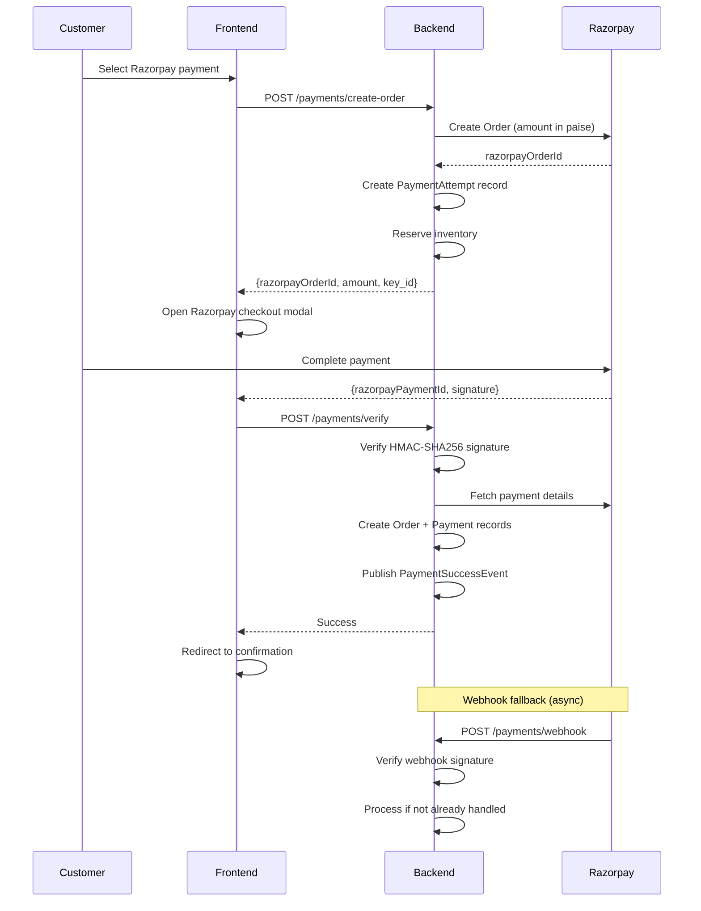
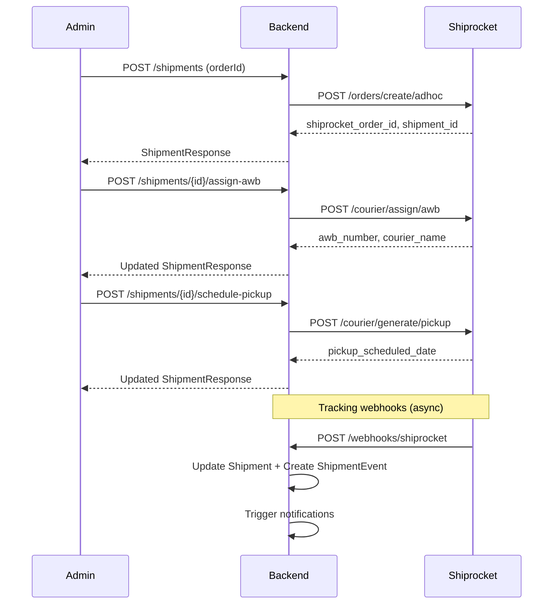
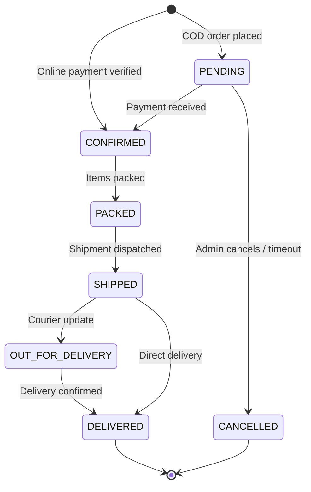
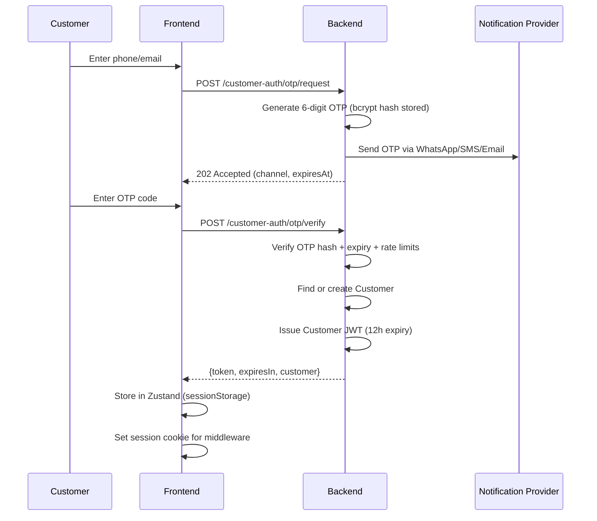
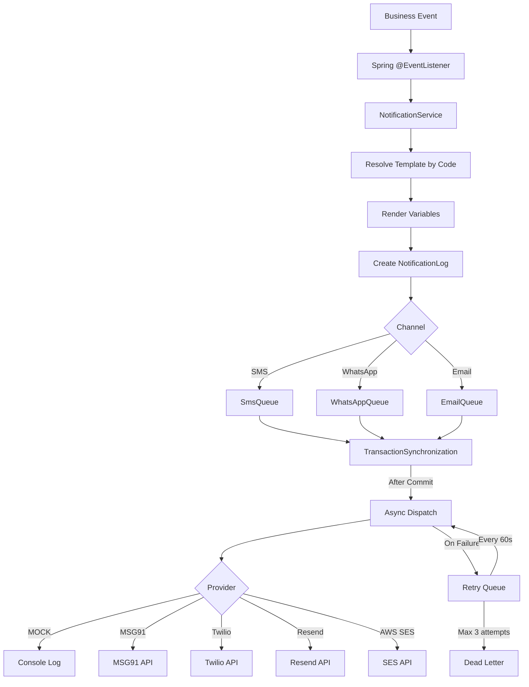
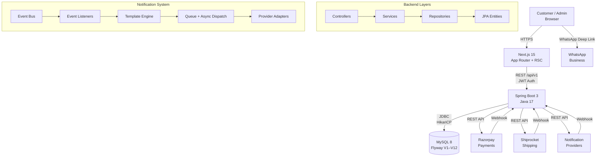
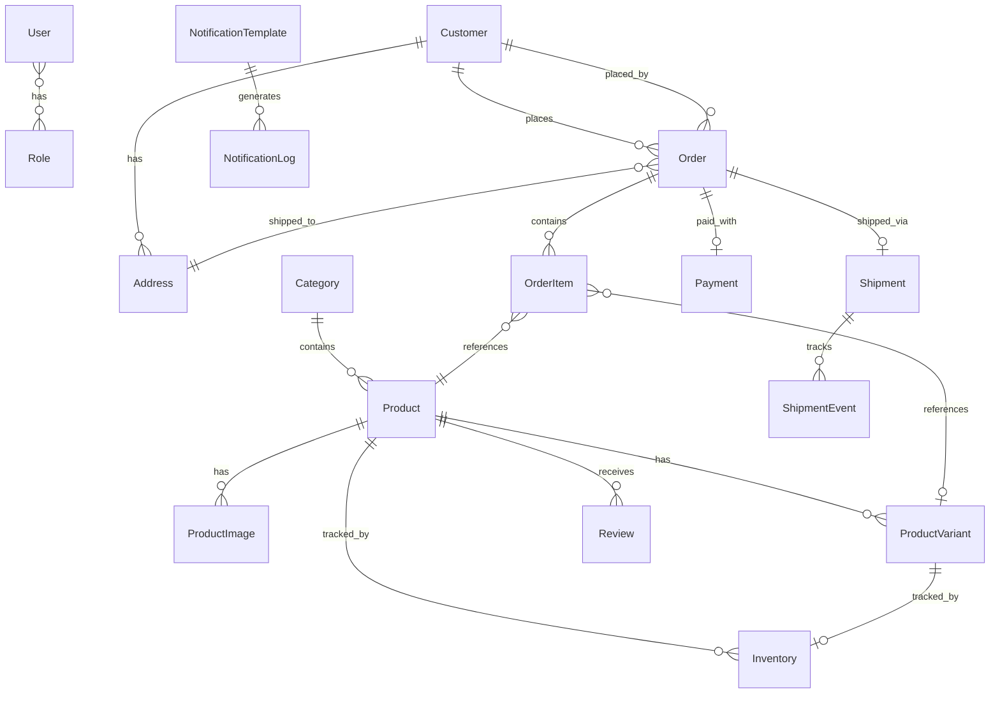
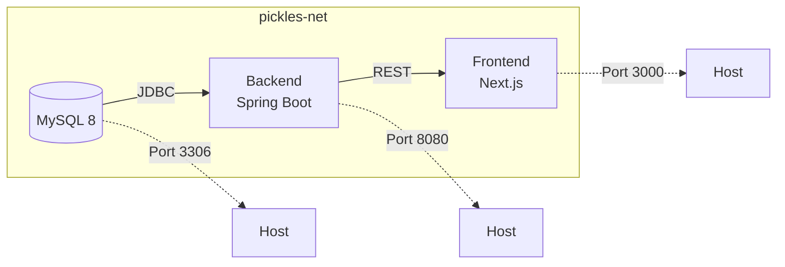

# Product Requirements Document

> **Last Updated:** 2026-07-24
> **Version:** 2.0
> **Status:** Living Document — reflects current implementation and planned roadmap

---

## Table of Contents

- [Product Vision](#product-vision)
- [Project Summary](#project-summary)
- [Business Goals](#business-goals)
- [Success Metrics](#success-metrics)
- [User Personas](#user-personas)
- [Customer Journey](#customer-journey)
- [Functional Requirements](#functional-requirements)
  - [Catalog](#catalog)
  - [Cart](#cart)
  - [Checkout](#checkout)
  - [Orders](#orders)
  - [Payment Flow](#payment-flow)
  - [Shipping Flow](#shipping-flow)
  - [Order Lifecycle](#order-lifecycle)
  - [Inventory Management](#inventory-management)
  - [Product Variants](#product-variants)
  - [Product Media](#product-media)
  - [Search and Filters](#search-and-filters)
  - [Reviews](#reviews)
  - [Contact Management](#contact-management)
  - [Customer Account](#customer-account)
  - [Authentication](#authentication)
  - [Authorization](#authorization)
  - [Roles and Permissions](#roles-and-permissions)
  - [Admin Dashboard](#admin-dashboard)
  - [Notifications](#notifications)
  - [Delivery Estimates](#delivery-estimates)
- [Non-Functional Requirements](#non-functional-requirements)
  - [UX Requirements](#ux-requirements)
  - [UI Requirements](#ui-requirements)
  - [Accessibility (WCAG)](#accessibility-wcag)
  - [SEO Requirements](#seo-requirements)
  - [Security Requirements](#security-requirements)
  - [Performance Requirements](#performance-requirements)
  - [Scalability Requirements](#scalability-requirements)
  - [Reliability and Availability](#reliability-and-availability)
  - [Maintainability](#maintainability)
  - [Monitoring and Logging](#monitoring-and-logging)
- [Architecture Overview](#architecture-overview)
  - [System Architecture](#system-architecture)
  - [Database Requirements](#database-requirements)
  - [Entity Relationships](#entity-relationships)
  - [API Requirements](#api-requirements)
- [Third-Party Integrations](#third-party-integrations)
  - [Razorpay](#razorpay)
  - [Shiprocket](#shiprocket)
  - [WhatsApp](#whatsapp)
  - [Email](#email)
  - [SMS](#sms)
  - [Storage](#storage)
- [Deployment](#deployment)
  - [DevOps](#devops)
  - [Environment Configuration](#environment-configuration)
- [Testing Strategy](#testing-strategy)
- [Implementation Status](#implementation-status)
- [Release Plan](#release-plan)
  - [MVP](#mvp)
  - [Post-MVP](#post-mvp)
  - [Future Roadmap](#future-roadmap)
- [Recommendations](#recommendations)

---

## Product Vision

*"A jar from home, wherever home is."*

Appa & Amma's Pickles is a direct-to-consumer (D2C) ecommerce platform for a homemade Indian pickle brand rooted in family tradition. The platform enables customers to discover, trust, and order small-batch pickles online while giving the business an internal admin system to manage the catalog, orders, reviews, contacts, notifications, payments, and shipping.

The product aims to bridge the gap between authentic homemade food and modern online convenience, turning nostalgia and trust into purchases.

## Project Summary

Appa & Amma's Pickles is a full-stack ecommerce website for a homemade pickle brand based near Bidar, Karnataka. The product's purpose is to help customers discover, trust, and order small-batch pickles online while giving the business an internal admin system to manage catalog, orders, reviews, contacts, notifications, payments, and shipping.

The experience should feel warm, trustworthy, rooted in family tradition, and operationally practical for a small food business.

### Tech Stack

| Layer | Technology | Version |
|-------|-----------|---------|
| Frontend | Next.js (App Router, RSC) | 15.5.20 |
| Frontend Framework | React | 19.2.0 |
| State Management | Zustand | 5.x |
| Styling | Tailwind CSS | 3.4.x |
| Language (Frontend) | TypeScript | 5.6.x |
| Backend | Spring Boot | 3.3.5 |
| Language (Backend) | Java | 17 (toolchain) |
| ORM | Hibernate / Spring Data JPA | — |
| Database | MySQL | 8.0 |
| Migrations | Flyway | — |
| API Docs | Springdoc OpenAPI (Swagger) | 2.6.0 |
| Payments | Razorpay Java SDK | 1.4.6 |
| Mapping | MapStruct | 1.6.3 |
| Build | Gradle (Kotlin DSL) | — |
| Containerization | Docker + Docker Compose | — |

## Business Goals

- Sell handmade pickles directly through a branded web storefront.
- Turn brand story and product trust into purchases.
- Make catalog browsing, checkout, and order tracking simple on mobile.
- Support both customer ordering and business operations from one system.
- Provide a foundation for payments, shipping, reviews, notifications, and admin reporting.
- Achieve ₹43–45 lakh revenue in Year 1 with a ₹2 lakh seed investment.
- Reach break-even by Month 3.
- Achieve ≥30% repeat purchase rate within 90 days.
- Maintain ≥38% gross margin across all SKUs.

### Financial Targets

| Metric | Month 3 | Month 6 | Month 12 |
|--------|---------|---------|----------|
| Cumulative Orders | 150 | 600 | 5,000 |
| Monthly Repeat Rate | 30% | 35% | 40% |
| Monthly Revenue | ₹1.05L | ₹2.96L | ₹6.60L |
| Cumulative Revenue | ₹1.8L | ₹11L | ₹43–45L |
| Customer Count | ~200 | ~1,500 | ~5,000 |
| Average Order Value | ₹700 | ₹780 | ₹880 |
| CAC (First Order) | ≤₹250 | ≤₹200 | ≤₹180 |

### Non-Goals

- Marketplace multi-vendor support.
- Native mobile apps in the first release.
- Complex loyalty programs or referrals in the first release.
- Real-time chat support in the first release.
- Internationalization and multi-currency in the first release.

## Success Metrics

| Category | Metric | Target |
|----------|--------|--------|
| Conversion | Product page → checkout rate | 2–5% |
| Conversion | Checkout completion rate | ≥60% |
| Engagement | Mobile bounce rate (landing + PDP) | <50% |
| Trust | Review submission volume | ≥5 reviews/month |
| Trust | Average product rating | ≥4.2 stars |
| Operations | Contact response turnaround | <4 hours |
| Operations | Order fulfillment accuracy | ≥98% |
| Operations | Admin task completion without spreadsheets | 100% |
| Growth | WhatsApp list size (Month 3) | 500 |
| Growth | Instagram followers (Month 3) | 1,000 |
| Growth | Website conversion rate | 2–5% |
| Revenue | Gross margin | ≥38% |
| Revenue | Repeat purchase rate (90 days) | ≥30% |

## User Personas

### Primary Customers

| Persona | Description | Needs |
|---------|-------------|-------|
| **The Homesick Professional** | 25–40, lives away from home, craves familiar food | Emotional connection, authentic taste, convenient ordering |
| **The Family Buyer** | 30–55, orders for household, values tradition | Trusted quality, combo deals, repeat ordering |
| **The Gift Giver** | 25–45, sends gifts to family/friends | Attractive packaging, reliable delivery, gift combos |
| **The NRI** | 25–50, Indian diaspora overseas | Authentic Indian products, international shipping (future) |

### Secondary Users

| Persona | Description | Needs |
|---------|-------------|-------|
| **Business Admin** | Brand owner managing catalog, orders, inventory | Secure login, dashboard, product/order CRUD |
| **Staff Member** | Handles fulfillment, contacts, shipping | Order status updates, shipment management, contact handling |

## Customer Journey

```mermaid
graph LR
    A[Discovery<br/>Instagram/WhatsApp/Word of Mouth] --> B[Landing<br/>Homepage + Brand Story]
    B --> C[Browse<br/>Products + Categories]
    C --> D[Product Detail<br/>Images, Variants, Reviews]
    D --> E[Add to Cart]
    E --> F[Checkout<br/>OTP + Address + Payment]
    F --> G[Order Confirmation]
    G --> H[Notifications<br/>WhatsApp/Email/SMS]
    H --> I[Delivery + Tracking]
    I --> J[Post-Delivery<br/>Review Request]
    J --> K[Repeat Purchase]
```



### Emotional Journey (Brand-Specific)

```
Quiet ache (craving home)
  → Discovery (Instagram reel or WhatsApp forward)
  → Trust (brand story, real family, real kitchen)
  → Browse (familiar pickle names, honest descriptions)
  → Purchase (simple checkout, no friction)
  → Wait (anticipation like parcel from home)
  → Unbox (handwritten-feel label, warm packaging)
  → First spoon (recognition, memory)
  → Share (WhatsApp photo to family, review)
  → Return (repeat order, part of routine)
```

---

## Functional Requirements

### Catalog

**Status:** ✅ Fully Implemented

The catalog system supports product listing, category browsing, search, featured products, and admin CRUD operations.

#### Requirements

| ID | Requirement | Status | Acceptance Criteria |
|----|-------------|--------|---------------------|
| CAT-01 | System must display paginated product lists | ✅ | **Given** a customer visits `/products`, **When** the page loads, **Then** products are displayed with pagination controls |
| CAT-02 | System must support category-based browsing | ✅ | **Given** categories exist, **When** a customer selects a category filter, **Then** only products in that category are shown |
| CAT-03 | System must support product search by name | ✅ | **Given** a customer enters a search term, **When** results load, **Then** products matching the term appear |
| CAT-04 | System must display featured products on homepage | ✅ | **Given** products are marked as featured, **When** the homepage loads, **Then** featured products are displayed prominently |
| CAT-05 | System must use SEO-friendly slugs for product URLs | ✅ | **Given** a product with slug `mango-pickle`, **When** the URL `/products/mango-pickle` is visited, **Then** the product detail page renders |
| CAT-06 | Admin must be able to create, update, and delete products | ✅ | **Given** an admin is logged in, **When** they submit a product form, **Then** the product is persisted with all fields including variants and images |
| CAT-07 | Admin must be able to manage categories | ✅ | **Given** an admin is logged in, **When** they create/update/delete a category, **Then** the category hierarchy updates |
| CAT-08 | Products must have JSON-LD structured data | ✅ | **Given** a product page loads, **When** search engines crawl it, **Then** Schema.org Product markup is present |

#### Traceability

```
Business Goal: Sell pickles through branded storefront
  ↓
Feature: Product Catalog
  ↓
APIs: GET /api/v1/products, GET /api/v1/products/slug/{slug}, GET /api/v1/products/featured
      POST/PUT/DELETE /api/v1/products (admin)
      GET /api/v1/categories, POST/PUT/DELETE /api/v1/categories (admin)
  ↓
Database: products, product_images, product_variants, categories
  ↓
Frontend: /products, /products/[slug], /admin/(protected)/products (admin CRUD not yet in frontend admin UI)
  ↓
Acceptance: CAT-01 through CAT-08
```

### Cart

**Status:** ✅ Fully Implemented

The cart is client-side only, backed by Zustand with localStorage persistence. It supports multi-tenant ownership (guest vs. authenticated customer) and auto-merges guest cart items when a customer signs in.

#### Requirements

| ID | Requirement | Status | Acceptance Criteria |
|----|-------------|--------|---------------------|
| CRT-01 | Customers must be able to add products to cart | ✅ | **Given** a product page, **When** the customer clicks "Add to Cart", **Then** the item appears in cart with quantity 1 |
| CRT-02 | Customers must be able to update item quantity | ✅ | **Given** an item in cart, **When** the customer adjusts quantity (1–99), **Then** the cart line updates |
| CRT-03 | Customers must be able to remove items | ✅ | **Given** an item in cart, **When** the customer clicks remove, **Then** the item is removed |
| CRT-04 | Cart must persist across page navigations | ✅ | **Given** items in cart, **When** the customer navigates away and returns, **Then** cart items are preserved |
| CRT-05 | Cart icon must show item count badge | ✅ | **Given** items in cart, **When** viewing any page, **Then** the header cart icon shows the total count |
| CRT-06 | Guest cart must merge into customer cart on login | ✅ | **Given** a guest with items in cart, **When** they sign in, **Then** guest items merge into authenticated cart |
| CRT-07 | Cart must support product variants | ✅ | **Given** a product with variants, **When** a specific variant is added, **Then** the variant details (weight, price) are tracked |
| CRT-08 | Cart must display subtotal, shipping, and total | ✅ | **Given** items in cart, **When** viewing cart summary, **Then** subtotal, shipping (₹60 flat, free ≥₹999), and total are shown |

### Checkout

**Status:** ✅ Fully Implemented

Checkout is a multi-step flow: phone verification → address → delivery estimate → order review → payment → confirmation.

#### Requirements

| ID | Requirement | Status | Acceptance Criteria |
|----|-------------|--------|---------------------|
| CHK-01 | Checkout must verify customer phone via OTP | ✅ | **Given** a customer at checkout, **When** they enter their phone, **Then** an OTP is sent and must be verified |
| CHK-02 | Checkout must collect shipping address | ✅ | **Given** an authenticated customer, **When** they proceed to address step, **Then** they can select a saved address or enter a new one |
| CHK-03 | Checkout must show delivery estimate | ✅ | **Given** a valid pincode, **When** address is entered, **Then** estimated delivery days and distance are displayed |
| CHK-04 | Checkout must support COD payment | ✅ | **Given** a customer at payment step, **When** they select COD, **Then** the order is placed without online payment |
| CHK-05 | Checkout must support Razorpay online payment | ✅ | **Given** a customer selects online payment, **When** they complete Razorpay checkout, **Then** payment is verified and order confirmed |
| CHK-06 | Checkout must support UPI direct transfer | ✅ | **Given** a customer selects UPI, **When** they acknowledge, **Then** order is placed with UPI payment method |
| CHK-07 | Successful checkout must clear the cart | ✅ | **Given** a successful order, **When** confirmation page loads, **Then** the cart is empty |
| CHK-08 | Checkout must validate pincode format (6-digit Indian) | ✅ | **Given** an invalid pincode, **When** submitted, **Then** a validation error is shown |
| CHK-09 | Shipping must be free for orders ≥₹999 | ✅ | **Given** cart subtotal ≥₹999, **When** checkout calculates total, **Then** shipping fee is ₹0 |

### Orders

**Status:** ✅ Fully Implemented

#### Requirements

| ID | Requirement | Status | Acceptance Criteria |
|----|-------------|--------|---------------------|
| ORD-01 | Customers must be able to place orders | ✅ | **Given** a valid cart and checkout details, **When** the customer submits, **Then** an order with a unique order number (`AAP-YYYYMMDD-XXXXXXXX`) is created |
| ORD-02 | Customers must receive order confirmation | ✅ | **Given** a placed order, **When** the confirmation page loads, **Then** order number, items, and total are displayed |
| ORD-03 | Public order lookup must work by order number | ✅ | **Given** an order number, **When** a customer visits `/track-order` and enters it, **Then** order status is displayed |
| ORD-04 | Authenticated customers can view order history | ✅ | **Given** a logged-in customer, **When** they visit `/account`, **Then** their past orders are listed |
| ORD-05 | Admin/staff can list and filter orders by status | ✅ | **Given** an admin at `/admin/orders`, **When** they filter by status, **Then** matching orders are displayed |
| ORD-06 | Admin/staff can update order status | ✅ | **Given** an order, **When** admin changes status, **Then** the status updates and notifications may be triggered |
| ORD-07 | System must support both guest and authenticated orders | ✅ | **Given** either a guest or authenticated customer, **When** they complete checkout, **Then** the order is created with customer info |

### Payment Flow

**Status:** ✅ Fully Implemented



#### Requirements

| ID | Requirement | Status | Acceptance Criteria |
|----|-------------|--------|---------------------|
| PAY-01 | System must create Razorpay orders with server-validated amounts | ✅ | **Given** a checkout request, **When** payment order is created, **Then** amount is calculated server-side (never trusted from frontend) |
| PAY-02 | System must verify HMAC-SHA256 payment signatures | ✅ | **Given** a payment response, **When** verification runs, **Then** the signature is validated using Razorpay key secret |
| PAY-03 | System must handle Razorpay webhooks as async fallback | ✅ | **Given** a browser closes after payment, **When** Razorpay sends `payment.captured` webhook, **Then** the order is created from the stored PaymentAttempt |
| PAY-04 | System must reject placeholder/test credentials in production | ✅ | **Given** production environment, **When** credentials contain `dev-`, `dummy`, or `placeholder`, **Then** the request is rejected |
| PAY-05 | System must prevent duplicate orders from same payment | ✅ | **Given** a razorpay_payment_id, **When** used twice, **Then** the second attempt is rejected (idempotency) |
| PAY-06 | System must release inventory on payment failure | ✅ | **Given** a failed payment, **When** cancellation is requested, **Then** reserved inventory is released |
| PAY-07 | System must support COD orders without online payment | ✅ | **Given** a COD order, **When** placed, **Then** the order is created with PENDING status |

#### Traceability

```
Business Goal: Enable secure online payments
  ↓
Feature: Razorpay Payment Integration
  ↓
APIs: POST /api/v1/payments/create-order, POST /api/v1/payments/verify,
      POST /api/v1/payments/cancel-order, POST /api/v1/payments/webhook
  ↓
Database: payments, payment_attempts, orders (razorpay_order_id, payment_method)
  ↓
Frontend: CheckoutForm.tsx, RazorpayScript.tsx
  ↓
Acceptance: PAY-01 through PAY-07
```

### Shipping Flow

**Status:** ✅ Fully Implemented



#### Requirements

| ID | Requirement | Status | Acceptance Criteria |
|----|-------------|--------|---------------------|
| SHP-01 | Admin must be able to create shipments from confirmed orders | ✅ | **Given** a confirmed order, **When** admin creates shipment, **Then** a Shiprocket order is created |
| SHP-02 | System must assign AWB numbers via Shiprocket | ✅ | **Given** a shipment, **When** admin assigns AWB, **Then** courier and tracking number are saved |
| SHP-03 | Admin must be able to schedule pickup | ✅ | **Given** an AWB-assigned shipment, **When** admin schedules pickup, **Then** pickup date is confirmed |
| SHP-04 | System must process Shiprocket tracking webhooks | ✅ | **Given** a shipment status change, **When** Shiprocket sends a webhook, **Then** shipment status and events update |
| SHP-05 | Customers must be able to track orders publicly | ✅ | **Given** a shipped order, **When** customer enters order number, **Then** tracking timeline with events is displayed |
| SHP-06 | System must check pincode serviceability | ✅ | **Given** a delivery pincode, **When** serviceability is checked, **Then** available couriers, rates, and delivery days are returned |
| SHP-07 | Admin must be able to cancel shipments | ✅ | **Given** an active shipment, **When** admin cancels with reason, **Then** Shiprocket order is cancelled |
| SHP-08 | Admin must be able to generate shipping labels | ✅ | **Given** a shipment with AWB, **When** admin requests label, **Then** a label URL is returned |

#### Shiprocket Configuration

| Property | Description | Default |
|----------|-------------|---------|
| `app.shiprocket.email` | Shiprocket account email | — |
| `app.shiprocket.password` | Shiprocket account password | — |
| `app.shiprocket.baseUrl` | API base URL | `https://apiv2.shiprocket.in/v1/external` |
| `app.shiprocket.pickupLocationId` | Pickup location ID | — |
| `app.shiprocket.pickupPincode` | Origin pincode | — |
| `app.shiprocket.defaultWeightKg` | Default package weight | — |
| `app.shiprocket.autoCreateShipment` | Auto-create on order confirm | `false` |
| `app.shiprocket.autoAssignAwb` | Auto-assign AWB | `false` |
| `app.shiprocket.autoSchedulePickup` | Auto-schedule pickup | `false` |
| `app.shiprocket.tokenRefreshHours` | Token refresh interval | 20h |

### Order Lifecycle

**Status:** ✅ Fully Implemented



**Order Statuses:** `PENDING` → `CONFIRMED` → `PACKED` → `SHIPPED` → `OUT_FOR_DELIVERY` → `DELIVERED` | `CANCELLED`

**Order Number Format:** `AAP-YYYYMMDD-XXXXXXXX` (8 random hex characters)

**Order Channels:** `WEBSITE`, `WHATSAPP`, `PHONE`, `INSTAGRAM`, `OTHER`

### Inventory Management

**Status:** ✅ Fully Implemented

#### Requirements

| ID | Requirement | Status | Acceptance Criteria |
|----|-------------|--------|---------------------|
| INV-01 | Admin must view inventory levels for all products | ✅ | **Given** an admin at inventory view, **When** page loads, **Then** all products show available quantity, reorder level, and batch code |
| INV-02 | Admin must be able to update inventory quantities | ✅ | **Given** a product, **When** admin updates quantity, **Then** the new level is persisted |
| INV-03 | System must show low-stock items | ✅ | **Given** products below reorder level, **When** admin views low-stock, **Then** those items are highlighted |
| INV-04 | System must reserve inventory on order placement | ✅ | **Given** an order is placed, **When** items are validated, **Then** inventory is decremented atomically |
| INV-05 | System must release inventory on payment failure | ✅ | **Given** a failed or cancelled payment, **When** cleanup runs, **Then** reserved quantities are restored |
| INV-06 | Inventory must support product variants | ✅ | **Given** a product with variants, **When** inventory is tracked, **Then** each variant has independent stock levels |

### Product Variants

**Status:** ✅ Fully Implemented

Products support multiple variants with independent pricing, weight, SKU, and stock tracking.

| Field | Description |
|-------|-------------|
| `weight` | Variant weight (e.g., "100g", "250g", "500g") |
| `sku` | Stock keeping unit (unique identifier) |
| `price` | Variant-specific price |
| `compareAtPrice` | Original price for showing discounts |
| `displayOrder` | Sort order for frontend display |
| `active` | Whether variant is available for sale |

### Product Media

**Status:** ✅ Fully Implemented

Each product supports multiple images with ordering, alt text, and a primary image flag.

| Field | Description |
|-------|-------------|
| `url` | Image URL (supports AWS S3 and Cloudinary) |
| `altText` | Accessibility text |
| `displayOrder` | Sort order |
| `primary` | Whether this is the main product image |

**Image Upload:** Admin upload endpoint `POST /api/v1/admin/uploads/products` exists for product image management.

**Frontend:** Product gallery component with thumbnail grid and image viewer.

### Search and Filters

**Status:** ✅ Fully Implemented

| ID | Requirement | Status | Acceptance Criteria |
|----|-------------|--------|---------------------|
| SRH-01 | Products must be searchable by name | ✅ | **Given** a search query, **When** submitted, **Then** matching products are returned |
| SRH-02 | Products must be filterable by category | ✅ | **Given** a category selection, **When** applied, **Then** only products in that category are shown |
| SRH-03 | Products must be filterable by featured flag | ✅ | **Given** a featured filter, **When** applied, **Then** only featured products are returned |
| SRH-04 | Results must support pagination | ✅ | **Given** many products, **When** paginated, **Then** page size and page number are respected |

**Note:** Full-text search and search suggestions are not implemented. Current search is LIKE-based name matching.

### Reviews

**Status:** ✅ Fully Implemented

#### Requirements

| ID | Requirement | Status | Acceptance Criteria |
|----|-------------|--------|---------------------|
| REV-01 | Customers must be able to submit reviews | ✅ | **Given** a customer on the reviews page, **When** they submit a review with rating (1–5), title, and body, **Then** the review is created as unapproved |
| REV-02 | Reviews must support moderation | ✅ | **Given** an unapproved review, **When** an admin approves it, **Then** it becomes visible on the storefront |
| REV-03 | Admin must be able to reject reviews | ✅ | **Given** an unapproved review, **When** an admin rejects it, **Then** it is hidden from the storefront |
| REV-04 | Latest approved reviews must appear on homepage | ✅ | **Given** approved reviews exist, **When** homepage loads, **Then** the latest 10 approved reviews are displayed |
| REV-05 | Product-specific reviews must be shown on PDP | ✅ | **Given** a product with approved reviews, **When** PDP loads, **Then** reviews for that product are displayed |

**Limitation:** Review submission is public (no authentication required). Author name and city are self-reported. There is no purchase verification for reviews.

### Contact Management

**Status:** ✅ Fully Implemented

#### Requirements

| ID | Requirement | Status | Acceptance Criteria |
|----|-------------|--------|---------------------|
| CON-01 | Customers must be able to submit contact forms | ✅ | **Given** a customer on `/contact`, **When** they submit name, email, phone, subject, message, **Then** the contact is saved |
| CON-02 | Admin must see contact submissions inbox | ✅ | **Given** admin at `/admin/contacts`, **When** page loads, **Then** all submissions are listed with filter options |
| CON-03 | Admin must be able to mark contacts as handled | ✅ | **Given** an unhandled contact, **When** admin marks it, **Then** status changes to handled |
| CON-04 | Contact page must offer alternative channels | ✅ | **Given** a customer on `/contact`, **When** page loads, **Then** WhatsApp and Instagram links are also shown |

### Customer Account

**Status:** ✅ Fully Implemented

#### Requirements

| ID | Requirement | Status | Acceptance Criteria |
|----|-------------|--------|---------------------|
| ACC-01 | Customers must be able to view their profile | ✅ | **Given** a logged-in customer at `/account`, **When** page loads, **Then** name, email, and phone are displayed |
| ACC-02 | Customers must be able to update their profile | ✅ | **Given** a logged-in customer, **When** they update name/email/phone, **Then** changes are saved |
| ACC-03 | Customers must manage an address book | ✅ | **Given** a logged-in customer, **When** they add/edit/delete addresses, **Then** changes persist |
| ACC-04 | Customers must set a default address | ✅ | **Given** multiple addresses, **When** one is set as default, **Then** it is pre-selected at checkout |
| ACC-05 | Customers must view order history | ✅ | **Given** a customer with past orders, **When** they visit account, **Then** orders are listed with status |

### Authentication

**Status:** ✅ Fully Implemented

The system uses separate authentication flows for customers and admins with independent JWT tokens and signing keys.

#### Customer Authentication (OTP-Based)



| Property | Value |
|----------|-------|
| OTP Length | 6 digits |
| OTP TTL | 10 minutes |
| Max Attempts | 5 per identifier per window |
| Rate Limit | 5 OTPs per 15 minutes per identifier, 25 per IP |
| Token Expiry | 43,200,000 ms (12 hours) |
| Signing Key | `APP_CUSTOMER_JWT_SECRET` (separate from admin) |
| OTP Channel | Configurable: WHATSAPP (default), SMS, EMAIL |
| Debug Mode | `expose-debug-code: true` in dev profile only |

#### Admin Authentication (Email + Password)

| Property | Value |
|----------|-------|
| Flow | Email + password → JWT |
| Token Expiry | 28,800,000 ms (8 hours) |
| Signing Key | `APP_JWT_SECRET` (separate from customer) |
| Password Hash | BCrypt |
| Default Admin | Seeded via Flyway migrations |

### Authorization

**Status:** ✅ Fully Implemented

Authorization is enforced at both middleware (frontend) and Spring Security (backend) levels.

#### Frontend Route Protection

| Route Pattern | Required Cookie | Redirect Target |
|---------------|-----------------|-----------------|
| `/account/*` | `aap-customer-session` | `/auth/login?redirect=…` |
| `/admin/*` (except `/admin/login`) | `aap-admin-auth-v1` | `/admin/login?redirect=…` |

- Session cookies use `SameSite=Strict`
- Redirect targets are sanitized to prevent open redirect attacks
- Client-side `AuthGuard` components provide double-check after hydration

#### Backend Endpoint Security

All endpoints are secured via Spring Security with `@PreAuthorize` annotations and filter-based JWT validation.

### Roles and Permissions

**Status:** ✅ Fully Implemented

| Role | Scope | Permissions |
|------|-------|-------------|
| `ROLE_ADMIN` | Backend | Full access: product CRUD, order management, inventory, payments, shipments, review moderation, contacts, notifications, dashboard |
| `ROLE_STAFF` | Backend | Read access + limited write: order status updates, shipment management, contact handling, dashboard viewing |
| `ROLE_CUSTOMER` | Backend | Own-resource access: place orders, view own orders, manage addresses, submit reviews, profile management |
| Public | Both | Browse catalog, view products/reviews, submit contacts, track orders by number |

### Admin Dashboard

**Status:** ✅ Fully Implemented

The admin dashboard at `/admin/dashboard` provides operational metrics.

#### Dashboard Stats

| Metric | Source |
|--------|--------|
| Total Products | Product count |
| Total Customers | Customer count |
| Total Orders | Order count |
| Pending Orders | Orders with PENDING status |
| Last 30 Days Orders | Orders created after cutoff |
| Last 30 Days Revenue | Sum of totals (excluding CANCELLED) |
| Low Stock Items | Inventory below reorder level |
| Unhandled Contacts | Contacts not marked as handled |
| Pending Reviews | Reviews not yet approved |
| Orders by Status | Breakdown by each OrderStatus |

#### Admin Pages

| Page | Route | Features |
|------|-------|----------|
| Dashboard | `/admin/dashboard` | Stats overview with refresh |
| Orders | `/admin/orders` | List, filter by status, update status |
| Shipments | `/admin/shipments` | List, create, assign AWB, schedule pickup, cancel |
| Shipment Detail | `/admin/shipments/[id]` | Detail view with actions |
| Contacts | `/admin/contacts` | List, filter handled/unhandled, mark handled |

**Note:** Admin product management CRUD exists in the backend API (`POST/PUT/DELETE /api/v1/products`) but the frontend admin UI for product management is not yet built. Products are currently managed via API/Postman.

**Note:** Admin review moderation API exists (`PATCH /api/v1/reviews/{id}/approve`, `PATCH /api/v1/reviews/{id}/reject`) but the frontend admin UI for review moderation is not yet built.

**Note:** Admin inventory management API exists (`GET /api/v1/inventory`, `PUT /api/v1/inventory/{productId}`) but the frontend admin UI for inventory is not yet built.

**Note:** Admin notification log viewing API exists (`GET /api/v1/admin/notifications/logs`) but the frontend admin UI is not yet built.

### Notifications

**Status:** ✅ Fully Implemented (Backend) / 🟡 Partially Implemented (Provider Configuration)



#### Notification Events

| Event | WhatsApp | Email | SMS |
|-------|----------|-------|-----|
| User Registered | — | ✅ `USER_REGISTERED_EMAIL` | — |
| Login OTP Requested | ✅ `LOGIN_OTP_WHATSAPP` | ✅ `LOGIN_OTP_EMAIL` | ✅ `LOGIN_OTP_SMS` |
| Order Placed | ✅ `ORDER_PLACED_WHATSAPP` | ✅ `ORDER_PLACED_EMAIL` | — |
| Payment Success | ✅ `PAYMENT_SUCCESS_WHATSAPP` | — | — |
| Order Packed | ✅ `ORDER_PACKED_WHATSAPP` | — | — |
| Order Shipped | ✅ `ORDER_SHIPPED_WHATSAPP` | — | — |
| Out for Delivery | ✅ `OUT_FOR_DELIVERY_WHATSAPP` | — | — |
| Order Delivered | ✅ `ORDER_DELIVERED_WHATSAPP` | — | — |
| Review Request | — | ✅ `REVIEW_REQUEST_EMAIL` | — |

#### Provider Configuration

| Channel | Dev Provider | Prod Provider(s) |
|---------|-------------|-------------------|
| SMS | MOCK (console) | MSG91, Twilio |
| WhatsApp | MOCK (console) | WhatsApp Business API, MSG91 |
| Email | MOCK (console) | Resend, AWS SES |

**Retry Logic:** Max 3 attempts, 5-minute exponential backoff, dead-letter on exhaustion. Scheduled retry scan every 60 seconds.

### Delivery Estimates

**Status:** ✅ Fully Implemented

| ID | Requirement | Status | Acceptance Criteria |
|----|-------------|--------|---------------------|
| DEL-01 | System must estimate delivery time by pincode | ✅ | **Given** a valid delivery pincode, **When** estimate is requested, **Then** estimated days are returned |
| DEL-02 | Estimate must be shown during checkout | ✅ | **Given** a customer enters address with pincode, **When** address step completes, **Then** estimated delivery time is displayed |

**Configuration:** Store origin location is configured via `app.store-location` properties in application.yml.

---

## Non-Functional Requirements

### UX Requirements

- Mobile-first responsive UI across all pages.
- Fast catalog and landing page experience (target <2s First Contentful Paint).
- Brand-led storytelling that feels family-made, calm, and trustworthy.
- Clear error states and recovery paths during checkout and forms.
- Warm, unhurried visual language — no corporate coldness.
- Conversational empty states and 404 page ("This page has gone for a walk").
- WhatsApp floating action button on all pages as alternative ordering/support channel.

### UI Requirements

**Design System (Implemented)**

| Token | Value | Usage |
|-------|-------|-------|
| Primary Font | Playfair Display | Headings, display text |
| Body Font | Inter | Body copy, UI text |
| Accent Font | Caveat | Handwritten warmth (sparingly) |
| Primary Color | Terracotta/Mango `#D97706` | CTAs, price, accents |
| Secondary Color | Turmeric Gold `#EAB308` | Ratings, badges, highlights |
| Accent Color | Pickle Green `#4D7C0F` | Success, freshness, category |
| Background | Warm Cream `#FAF7F2` | Page surface |
| Text | Earth Brown `#3F2D20` | Body, headings |

**Component Library (CSS-based via Tailwind layers):**
- Buttons: `btn-primary`, `btn-secondary`, `btn-accent`, `btn-ghost`, `btn-whatsapp`
- Cards: `card-warm`, `card-premium`
- Sections: `section-cream`, `section-muted`, `section-spice`, `section-earth`
- Forms: `input-field`, `label-field`
- Badges: `badge-tag`
- Animations: `animate-fade-up`, `animate-soft-float` (respects `prefers-reduced-motion`)

### Accessibility (WCAG)

**Status:** ✅ Implemented (WCAG 2.1 AA target)

| Requirement | Status | Implementation |
|-------------|--------|----------------|
| ARIA attributes on interactive elements | ✅ | Cart icon, mobile nav, pagination, alerts |
| Semantic HTML | ✅ | `<header>`, `<footer>`, `<main>`, `<nav>`, `<article>`, `<section>` |
| Keyboard navigation | ✅ | Tab order, focus rings, Escape closes modals |
| Form labels | ✅ | Connected via `htmlFor` |
| Image alt text | ✅ | Alt text on all product/story images |
| Color contrast | ✅ | Design tokens chosen for contrast |
| Reduced motion | ✅ | `prefers-reduced-motion` sets animation-duration to 1ms |
| Alert roles | ✅ | `role="alert"` on form error messages |
| FAQ accordion | ✅ | Uses native `<details>` element |

### SEO Requirements

**Status:** ✅ Fully Implemented

| Requirement | Status | Implementation |
|-------------|--------|----------------|
| Page metadata (title, description) | ✅ | Template-based titles (`%s | Appa & Amma's Pickles`) |
| Open Graph tags | ✅ | Title, description, URL, locale `en_IN` |
| Twitter cards | ✅ | `summary_large_image` |
| Dynamic sitemap | ✅ | Static routes + all product URLs from API |
| robots.txt | ✅ | Allows all robots, links to sitemap |
| JSON-LD: Product | ✅ | Schema.org Product with price, availability, aggregate rating |
| JSON-LD: FAQPage | ✅ | Question/Answer entities on `/faq` |
| Canonical URLs | ✅ | Set in metadata `alternates.canonical` |
| SEO-friendly slugs | ✅ | `/products/{slug}` routes |
| Keyword meta tags | ✅ | Array of relevant keywords |
| Theme color | ✅ | `#c8542f` |

### Security Requirements

**Status:** ✅ Fully Implemented

| Requirement | Status | Implementation |
|-------------|--------|----------------|
| JWT authentication (stateless) | ✅ | Separate admin and customer tokens with different signing keys |
| Password hashing | ✅ | BCrypt via `BCryptPasswordEncoder` |
| OTP security | ✅ | bcrypt-hashed OTP (never stored in plain text), rate limiting |
| CORS | ✅ | Configurable allowed origins, credentials disabled |
| CSP headers | ✅ | Frontend: script-src, connect-src, frame-src, img-src whitelist |
| X-Content-Type-Options | ✅ | `nosniff` |
| X-Frame-Options | ✅ | Frontend: `SAMEORIGIN`, Backend: `deny` |
| Referrer-Policy | ✅ | Backend: `no-referrer`, Frontend: `strict-origin-when-cross-origin` |
| HSTS | ✅ | Backend: `max-age=31536000; includeSubDomains; preload` |
| Permissions-Policy | ✅ | Camera, microphone, geolocation disabled |
| Payment signature verification | ✅ | HMAC-SHA256 for Razorpay |
| Webhook secret validation | ✅ | Razorpay and Shiprocket webhook secrets |
| Redirect sanitization | ✅ | `sanitizeRedirectTarget()` prevents open redirects |
| Session cookies | ✅ | `SameSite=Strict` |
| No secrets in frontend | ✅ | Only `NEXT_PUBLIC_RAZORPAY_KEY_ID` (public key) exposed |
| Placeholder credential rejection | ✅ | Production rejects `dev-`, `dummy`, `placeholder` values |
| Rate limiting | ✅ | `PublicApiRateLimitFilter` on public endpoints + OTP rate limiting |
| Non-root Docker user | ✅ | Backend Dockerfile runs as `spring:spring` user |
| Production error suppression | ✅ | Prod profile hides stacktraces, binding errors, messages |

### Performance Requirements

| Requirement | Target | Implementation |
|-------------|--------|----------------|
| First Contentful Paint | <2s | Next.js RSC, code splitting |
| Product page load | <1s (cached) | `revalidate: 60` caching |
| API response time (p95) | <500ms | JPA `@EntityGraph` for eager loading, HikariCP connection pooling |
| Image optimization | WebP, responsive | Next.js Image component with `sizes` |
| Shared JS bundle size | <100 kB | Currently ~99.8 kB |
| Compression | Enabled | Server compression in application.yml |
| Connection pool | 10 max, 2 min idle | HikariCP configuration |
| Hibernate batching | 50 batch size | JPA configuration |

**Frontend Caching Strategy:**

| Resource | Revalidation | Cache |
|----------|-------------|-------|
| Products listing | 60s | ISR |
| Featured products | 300s | ISR |
| Categories | 300s | ISR |
| Authenticated requests | — | `no-store` |
| Checkout / payment | — | `no-store` |

### Scalability Requirements

**Current Architecture Supports:**

- Single backend instance (adequate for ~5,000 customers/year)
- MySQL connection pool: 10 connections max
- Notification queue processing: async with configurable thread pool
- Stateless JWT auth: horizontal scaling ready (no server-side sessions)

**Scaling Path (When Needed):**

- Backend can be horizontally scaled behind a load balancer (stateless)
- Database can move to managed MySQL (PlanetScale, AWS RDS)
- Frontend can scale via Vercel (auto-scaling, global CDN)
- Notification queues can be migrated to a dedicated message broker (RabbitMQ, SQS)

### Reliability and Availability

| Aspect | Implementation |
|--------|----------------|
| Health checks | Spring Boot Actuator: `GET /actuator/health` |
| Database health | Docker Compose MySQL health check (`mysqladmin ping`) |
| Service dependency | `depends_on: condition: service_healthy` |
| Restart policy | `unless-stopped` for all containers |
| Payment resilience | Webhook fallback if frontend flow fails |
| Notification retry | 3 attempts with backoff, dead-letter queue |
| Idempotent payments | Prevents duplicate order creation |

### Maintainability

| Aspect | Implementation |
|--------|----------------|
| Database migrations | Flyway (V1–V12), baseline-on-migrate, `hibernate.ddl-auto: validate` |
| API documentation | Springdoc OpenAPI (Swagger UI at `/swagger-ui.html`) |
| Code architecture | Layered: Controller → Service → Repository → Entity |
| DTO boundaries | MapStruct mappers between entities and DTOs |
| Type safety | TypeScript frontend, Java backend with bean validation |
| Configuration | Environment-based profiles (dev, prod) |
| Audit trail | `AuditLog` entity for entity change tracking |
| Base entity | `BaseEntity` with `createdAt`, `updatedAt` (auto-managed) |

### Monitoring and Logging

| Aspect | Implementation |
|--------|----------------|
| Application health | Spring Actuator `/actuator/health` |
| Logging levels | Prod: `root=WARN`, `com.appaamma=INFO`; Dev: more verbose |
| Notification logs | `notification_log` table with status, provider response, failure reasons |
| Audit logs | `audit_logs` table for entity changes |
| Error logging | Global exception handler logs all errors |
| Swagger/API docs | OpenAPI 3 at `/v3/api-docs`, Swagger UI at `/swagger-ui.html` |

**Assumption:** No external monitoring (Datadog, New Relic, Grafana) is currently configured. Recommend adding for production launch.

---

## Architecture Overview

### System Architecture



### Database Requirements

**Engine:** MySQL 8.0
**Charset:** UTF-8 (default)
**Migration Tool:** Flyway (12 migrations, V1–V12)
**ORM:** Hibernate with `ddl-auto: validate` (schema managed by Flyway only)
**Connection Pool:** HikariCP (max 10, min idle 2, timeout 30s)

#### Migration History

| Version | Name | Purpose |
|---------|------|---------|
| V1 | `init_schema` | Users, roles, categories, products, images, customers, orders, order_items, reviews, contacts |
| V2 | `seed_catalog` | Initial product categories and pickle products |
| V3 | `customer_auth` | OTP tokens table with identifier/purpose indices |
| V4 | `product_variants` | Product variants and inventory tables |
| V5 | `payments` | Payment method/Razorpay columns on orders, payments table, payment_attempts |
| V6 | `notification_framework_schema` | Notification log, email/SMS/WhatsApp queues, templates |
| V7 | `payment_attempts` | Payment attempt tracking enhancements |
| V8 | `payment_security_hardening` | Webhook secret validation, payment request JSON storage |
| V9 | `db_security_hardening` | Indexes on frequently queried columns, unique constraints |
| V10 | `brand_voice_notification_templates` | Seeded notification templates with brand voice |
| V11 | `shiprocket_integration` | Shipments, shipment_events tables; AWB tracking |
| V12 | `shiprocket_notification_templates` | Shipping notification templates (shipped, out for delivery, delivered) |

### Entity Relationships



#### Entity Summary

| Entity | Table | Key Fields | Relationships |
|--------|-------|------------|---------------|
| User | `users` | fullName, email, passwordHash, phone, enabled | ManyToMany → Role |
| Role | `roles` | name (ADMIN, STAFF) | ManyToMany → User |
| Customer | `customers` | fullName, email, phone | OneToMany → Address, Order |
| Address | `addresses` | line1, line2, city, state, pincode, landmark, defaultAddress | ManyToOne → Customer |
| Category | `categories` | name, slug, description, active | OneToMany → Product |
| Product | `products` | name, slug, description, ingredients, shelfLife, price, compareAtPrice, weight, active, featured | ManyToOne → Category, OneToMany → Image/Variant |
| ProductImage | `product_images` | url, altText, displayOrder, primary | ManyToOne → Product |
| ProductVariant | `product_variants` | weight, sku, price, compareAtPrice, displayOrder, active | ManyToOne → Product |
| Inventory | `inventory` | quantityAvailable, reorderLevel, batchCode | ManyToOne → Product, ProductVariant |
| Order | `orders` | orderNumber, status, channel, paymentMethod, subtotal, shippingFee, total, notes | ManyToOne → Customer, Address; OneToMany → OrderItem |
| OrderItem | `order_items` | productName, productWeight, quantity, unitPrice, lineTotal | ManyToOne → Order, Product, ProductVariant |
| Payment | `payments` | razorpay_order_id, razorpay_payment_id, razorpay_signature, amount, currency, status | ManyToOne → Order |
| PaymentAttempt | `payment_attempts` | razorpay_order_id, order_number, status, failureReason, orderRequestJson | — |
| Shipment | `shipments` | shiprocket_order_id, awb_number, courier_name, status, labelUrl, estimatedDeliveryDate | ManyToOne → Order; OneToMany → ShipmentEvent |
| ShipmentEvent | `shipment_events` | status, description, location, eventTime | ManyToOne → Shipment |
| Review | `reviews` | authorName, authorCity, rating (1–5), title, body, approved | ManyToOne → Product |
| Contact | `contacts` | fullName, email, phone, subject, message, handled | — |
| OtpToken | `otp_tokens` | identifier, identifierKind, purpose, codeHash, attempts, expiresAt | — |
| NotificationTemplate | `notification_template` | templateCode, channel, subjectTemplate, bodyTemplate, active | — |
| NotificationLog | `notification_log` | templateCode, channel, recipient, status, failureReason | — |
| EmailQueue | `email_queue` | Extends NotificationQueueEntry | ManyToOne → NotificationLog |
| SmsQueue | `sms_queue` | Extends NotificationQueueEntry | ManyToOne → NotificationLog |
| WhatsAppQueue | `whatsapp_queue` | Extends NotificationQueueEntry | ManyToOne → NotificationLog |
| AuditLog | `audit_logs` | actor, action, entityType, entityId, details | — |

### API Requirements

**Base Path:** `/api/v1`
**Documentation:** OpenAPI 3 via Springdoc at `/swagger-ui.html`
**Response Envelope:** `ApiResponse<T>` with `status`, `message`, `data`
**Pagination:** `PageResponse<T>` with `content`, `page`, `size`, `totalElements`, `totalPages`

#### Complete API Endpoint Reference

##### Public Endpoints (No Auth Required)

| Method | Path | Purpose |
|--------|------|---------|
| GET | `/api/v1/products` | List products (search, category, featured, paginated) |
| GET | `/api/v1/products/featured` | Featured products |
| GET | `/api/v1/products/slug/{slug}` | Product detail by slug |
| GET | `/api/v1/categories` | Active categories |
| GET | `/api/v1/categories/slug/{slug}` | Category by slug |
| GET | `/api/v1/reviews` | Reviews (by productId, paginated) |
| GET | `/api/v1/reviews/latest` | Latest 10 approved reviews |
| GET | `/api/v1/reviews/product/{productId}` | Reviews for a product |
| POST | `/api/v1/reviews` | Submit review |
| POST | `/api/v1/contacts` | Submit contact form |
| POST | `/api/v1/orders` | Place order (COD/guest) |
| GET | `/api/v1/orders/number/{orderNumber}` | Public order lookup |
| GET | `/api/v1/tracking/{orderNumber}` | Public order tracking |
| POST | `/api/v1/auth/login` | Admin login |
| POST | `/api/v1/customer-auth/otp/request` | Request customer OTP |
| POST | `/api/v1/customer-auth/otp/resend` | Resend customer OTP |
| POST | `/api/v1/customer-auth/otp/verify` | Verify customer OTP |
| POST | `/api/v1/delivery/estimate` | Delivery estimate by pincode |
| POST | `/api/v1/shipping/serviceability` | Check pincode serviceability |
| POST | `/api/v1/payments/webhook` | Razorpay webhook (HMAC-verified) |
| POST | `/api/v1/webhooks/shiprocket` | Shiprocket webhook (secret-verified) |
| POST | `/api/v1/notifications/webhooks/msg91/whatsapp` | MSG91 WhatsApp webhook |
| GET | `/actuator/health` | Health check |

##### Customer Endpoints (Customer JWT Required)

| Method | Path | Purpose |
|--------|------|---------|
| GET | `/api/v1/customer-auth/me` | Get customer profile |
| PUT | `/api/v1/customer-auth/me` | Update customer profile |
| GET | `/api/v1/address-book` | List addresses |
| POST | `/api/v1/address-book` | Create address |
| PUT | `/api/v1/address-book/{id}` | Update address |
| DELETE | `/api/v1/address-book/{id}` | Delete address |
| PATCH | `/api/v1/address-book/{id}/set-default` | Set default address |
| GET | `/api/v1/orders/my` | Customer order history |
| GET | `/api/v1/orders/my/{orderNumber}` | Customer order detail |
| POST | `/api/v1/payments/create-order` | Create Razorpay payment order |
| POST | `/api/v1/payments/verify` | Verify Razorpay payment |
| POST | `/api/v1/payments/cancel-order` | Cancel unpaid order |

##### Admin/Staff Endpoints (Admin JWT Required)

| Method | Path | Role | Purpose |
|--------|------|------|---------|
| GET | `/api/v1/admin/dashboard/stats` | ADMIN/STAFF | Dashboard statistics |
| GET | `/api/v1/products/{id}` | ADMIN/STAFF | Product by ID |
| GET | `/api/v1/products/admin` | ADMIN/STAFF | Admin product list |
| POST | `/api/v1/products` | ADMIN | Create product |
| PUT | `/api/v1/products/{id}` | ADMIN | Update product |
| DELETE | `/api/v1/products/{id}` | ADMIN | Delete product |
| GET | `/api/v1/categories/{id}` | ADMIN/STAFF | Category by ID |
| POST | `/api/v1/categories` | ADMIN | Create category |
| PUT | `/api/v1/categories/{id}` | ADMIN | Update category |
| DELETE | `/api/v1/categories/{id}` | ADMIN | Delete category |
| GET | `/api/v1/orders` | ADMIN/STAFF | List orders (filter by status) |
| GET | `/api/v1/orders/{id}` | ADMIN/STAFF | Order by ID |
| PATCH | `/api/v1/orders/{id}/status` | ADMIN/STAFF | Update order status |
| GET | `/api/v1/contacts` | ADMIN/STAFF | List contacts |
| PATCH | `/api/v1/contacts/{id}/mark-handled` | ADMIN/STAFF | Mark contact handled |
| PATCH | `/api/v1/reviews/{id}/approve` | ADMIN | Approve review |
| PATCH | `/api/v1/reviews/{id}/reject` | ADMIN | Reject review |
| GET | `/api/v1/inventory` | ADMIN/STAFF | List inventory |
| GET | `/api/v1/inventory/low-stock` | ADMIN/STAFF | Low stock items |
| PUT | `/api/v1/inventory/{productId}` | ADMIN | Update inventory |
| POST | `/api/v1/shipments` | ADMIN/STAFF | Create shipment |
| GET | `/api/v1/shipments` | ADMIN/STAFF | List shipments |
| GET | `/api/v1/shipments/{id}` | ADMIN/STAFF | Shipment detail |
| POST | `/api/v1/shipments/{id}/assign-awb` | ADMIN/STAFF | Assign AWB |
| POST | `/api/v1/shipments/{id}/schedule-pickup` | ADMIN/STAFF | Schedule pickup |
| POST | `/api/v1/shipments/{id}/cancel` | ADMIN/STAFF | Cancel shipment |
| GET | `/api/v1/shipments/{id}/label` | ADMIN/STAFF | Get shipping label |
| GET | `/api/v1/admin/notifications/logs` | ADMIN/STAFF | Notification logs |

---

## Third-Party Integrations

### Razorpay

**Status:** ✅ Fully Implemented

| Aspect | Details |
|--------|---------|
| SDK | Razorpay Java SDK v1.4.6 |
| Supported Methods | UPI, Card, Net Banking, Wallets (via Razorpay Checkout) |
| Currency | INR only |
| Amount | Calculated server-side in paise (₹ × 100) |
| Signature | HMAC-SHA256 verification |
| Webhook | `payment.captured` event handling |
| Idempotency | Duplicate `razorpay_payment_id` rejected |
| Test Mode | Test keys in dev profile |

**Environment Variables:**

| Variable | Description |
|----------|-------------|
| `RAZORPAY_KEY_ID` | Razorpay API Key ID |
| `RAZORPAY_KEY_SECRET` | Razorpay API Key Secret |
| `RAZORPAY_WEBHOOK_SECRET` | Razorpay Webhook Secret |

### Shiprocket

**Status:** ✅ Fully Implemented

| Aspect | Details |
|--------|---------|
| Authentication | Email/password → token with auto-refresh (20h) |
| API Client | Custom `ShiprocketApiClient` with 401 retry logic |
| Operations | Create order, assign AWB, schedule pickup, generate label, track, cancel |
| Webhook | Status change events → `ShipmentEvent` records |
| Serviceability | Pincode-based delivery check with courier options |

### WhatsApp

**Status:** ✅ Fully Implemented (deep links) / 🟡 Partially Implemented (Business API notifications)

| Aspect | Details |
|--------|---------|
| Deep Links | WhatsApp ordering/support entry points on all pages via FAB |
| FAB Button | Fixed bottom-right floating action button |
| Product Links | Pre-filled messages with product names |
| Notification Provider | WhatsApp Business API or MSG91 (configurable) |
| Webhook | MSG91 WhatsApp delivery status webhook |

### Email

**Status:** 🟡 Partially Implemented (templates exist, provider config needed for production)

| Aspect | Details |
|--------|---------|
| Providers | Resend, AWS SES (configurable) |
| Dev Provider | MOCK (console logging) |
| Templates | User registered, login OTP, order placed, review request |
| Rendering | Thymeleaf-compatible variable substitution |

### SMS

**Status:** 🟡 Partially Implemented (templates exist, provider config needed for production)

| Aspect | Details |
|--------|---------|
| Providers | MSG91, Twilio (configurable) |
| Dev Provider | MOCK (console logging) |
| Templates | Login OTP |

### Storage

**Status:** 🟡 Partially Configured (not built into backend)

| Aspect | Details |
|--------|---------|
| Image Sources | AWS S3 (`**.amazonaws.com`), Cloudinary (`**.cloudinary.com`) |
| Frontend Config | `next.config.ts` allows remote image patterns for S3 and Cloudinary |
| Upload Endpoint | `POST /api/v1/admin/uploads/products` exists |
| Current State | Images referenced by URL; no integrated S3/Cloudinary upload SDK in backend |

**Assumption:** Image uploads are currently managed manually or via a separate process. A full storage integration (S3 SDK or Cloudinary SDK) is not yet built into the backend.

---

## Deployment

### DevOps

**Status:** ✅ Fully Implemented (Docker Compose)

#### Docker Compose Architecture



| Service | Image | Port | Health Check |
|---------|-------|------|--------------|
| mysql | `mysql:8.0` | 3306 | `mysqladmin ping` |
| backend | Custom (multi-stage) | 8080 | — |
| frontend | Custom | 3000 | — |

#### Backend Dockerfile

- Multi-stage build: `eclipse-temurin:17-jdk-alpine` (builder) → `eclipse-temurin:17-jre-alpine` (runtime)
- Non-root user: `spring:spring`
- JVM: 75% max RAM, G1GC
- Tests skipped in build (`-x test`)

#### Recommended Production Deployment

| Component | Platform | Notes |
|-----------|----------|-------|
| Frontend | Vercel | Auto SSL, global CDN, auto-scaling |
| Backend | VPS (Hetzner, DigitalOcean, Railway, Render, Fly.io) | Docker or JAR deployment |
| Database | Managed MySQL (PlanetScale, AWS RDS, DigitalOcean) | Automated backups |
| SSL | Let's Encrypt (Nginx/Caddy) or Vercel (auto) | — |

**CI/CD:** Not currently configured. Recommend GitHub Actions for build/test/deploy pipeline.

### Environment Configuration

#### Backend Environment Variables

| Variable | Required | Default | Description |
|----------|----------|---------|-------------|
| `SPRING_PROFILES_ACTIVE` | Yes | `dev` | Active Spring profile |
| `SPRING_DATASOURCE_URL` | Yes | `jdbc:mysql://localhost:3306/appaammas_pickles` | Database JDBC URL |
| `SPRING_DATASOURCE_USERNAME` | Yes | `pickles` | Database username |
| `SPRING_DATASOURCE_PASSWORD` | Yes | `picklespass` | Database password |
| `SERVER_PORT` | No | `8002` | Server port |
| `APP_JWT_SECRET` | Yes (prod) | Dev placeholder | Admin JWT signing key |
| `APP_CUSTOMER_JWT_SECRET` | Yes (prod) | Dev placeholder | Customer JWT signing key |
| `APP_JWT_EXPIRATION_MS` | No | `28800000` | Admin JWT expiry (8h) |
| `APP_CUSTOMER_JWT_EXPIRATION_MS` | No | `43200000` | Customer JWT expiry (12h) |
| `RAZORPAY_KEY_ID` | Yes (prod) | Test key (dev) | Razorpay API key |
| `RAZORPAY_KEY_SECRET` | Yes (prod) | Test key (dev) | Razorpay secret |
| `RAZORPAY_WEBHOOK_SECRET` | Yes (prod) | — | Razorpay webhook secret |
| `APP_CORS_ALLOWED_ORIGINS` | Yes (prod) | `http://localhost:3000` | Allowed CORS origins |
| `APP_SHIPROCKET_EMAIL` | Yes (prod) | — | Shiprocket account email |
| `APP_SHIPROCKET_PASSWORD` | Yes (prod) | — | Shiprocket password |

#### Frontend Environment Variables

| Variable | Required | Default | Description |
|----------|----------|---------|-------------|
| `NEXT_PUBLIC_API_BASE_URL` | Yes | `http://localhost:8002/api/v1` | Backend API base URL |
| `NEXT_PUBLIC_WHATSAPP_NUMBER` | Yes | `919999999999` | WhatsApp business number |
| `NEXT_PUBLIC_INSTAGRAM_HANDLE` | Yes | `appaammas.pickles` | Instagram handle |
| `NEXT_PUBLIC_SITE_URL` | No | — | Site URL for SEO |
| `NEXT_PUBLIC_RAZORPAY_KEY_ID` | No | — | Razorpay public key ID |
| `NEXT_PUBLIC_ENABLE_OTP_AUTH` | No | — | Feature flag for OTP auth |
| `NEXT_PUBLIC_ENABLE_PAYMENTS` | No | — | Feature flag for payments |

---

## Testing Strategy

### Current State

**Status:** 🟡 Minimal

| Area | Status | Details |
|------|--------|---------|
| Backend unit tests | 🟡 | `PicklesApplicationTests.java` context load test exists; comprehensive service/controller tests not found |
| Backend integration tests | 🟡 | Test infrastructure present (Spring Boot Test, MockMvc, H2) but limited test coverage |
| Frontend unit tests | ❌ | No test framework configured (no Jest/Vitest in package.json) |
| Frontend E2E tests | ❌ | No E2E framework (no Playwright/Cypress) |
| API tests | ✅ | Postman collection at `postman/AppaAmmas-Pickles.postman_collection.json` |

### Recommended Testing Strategy

| Layer | Tool | Coverage Target |
|-------|------|-----------------|
| Backend Unit | JUnit 5 + Mockito | Services, validators, mappers |
| Backend Integration | Spring Boot Test + H2 | Controllers, security, repository queries |
| Frontend Unit | Vitest + React Testing Library | Store logic, hooks, form validation |
| Frontend E2E | Playwright | Critical paths: browse → cart → checkout → confirmation |
| API | Postman/Newman (CI) | All endpoints, auth flows, edge cases |
| Performance | k6 or Artillery | Load testing checkout/payment flow |

---

## Implementation Status

### Module Status Overview

| Module | Backend | Frontend | Status |
|--------|---------|----------|--------|
| Product Catalog | ✅ Full CRUD + search + featured | ✅ Listing, PDP, filters | ✅ Fully Implemented |
| Categories | ✅ Full CRUD | ✅ Filter integration | ✅ Fully Implemented |
| Product Variants | ✅ Entity + API | ✅ Variant selector | ✅ Fully Implemented |
| Product Images | ✅ Entity + upload endpoint | ✅ Gallery component | ✅ Fully Implemented |
| Cart | N/A (client-side) | ✅ Zustand + localStorage | ✅ Fully Implemented |
| Checkout | ✅ Order creation API | ✅ Multi-step form | ✅ Fully Implemented |
| Customer Auth (OTP) | ✅ Full flow | ✅ Login form + guards | ✅ Fully Implemented |
| Admin Auth | ✅ Email+password + JWT | ✅ Login form + guards | ✅ Fully Implemented |
| Customer Account | ✅ Profile + address CRUD | ✅ Account page | ✅ Fully Implemented |
| Orders | ✅ Full lifecycle | ✅ Customer + admin views | ✅ Fully Implemented |
| Payments (Razorpay) | ✅ Create + verify + webhook | ✅ Razorpay checkout modal | ✅ Fully Implemented |
| Shipping (Shiprocket) | ✅ Full API client + webhooks | ✅ Admin shipment management | ✅ Fully Implemented |
| Order Tracking | ✅ Tracking API + events | ✅ Tracking timeline | ✅ Fully Implemented |
| Delivery Estimates | ✅ Pincode-based estimate | ✅ Checkout integration | ✅ Fully Implemented |
| Serviceability | ✅ Shiprocket serviceability | ✅ Pincode check widget | ✅ Fully Implemented |
| Inventory | ✅ CRUD + reservation + low-stock | ❌ No admin UI | 🟡 Partially Implemented |
| Reviews | ✅ Submit + moderate API | ✅ Review form + display | 🟡 Partially Implemented (no admin moderation UI) |
| Contacts | ✅ Submit + admin inbox | ✅ Admin contacts board | ✅ Fully Implemented |
| Admin Dashboard | ✅ Stats API | ✅ Dashboard UI | ✅ Fully Implemented |
| Admin Product CRUD | ✅ Full API | ❌ No admin UI | 🟡 Partially Implemented |
| Admin Review Moderation | ✅ Approve/reject API | ❌ No admin UI | 🟡 Partially Implemented |
| Admin Inventory | ✅ List + update API | ❌ No admin UI | 🟡 Partially Implemented |
| Admin Notification Logs | ✅ Logs API | ❌ No admin UI | 🟡 Partially Implemented |
| Notifications (Backend) | ✅ Event-driven + queues + retry | N/A | ✅ Fully Implemented |
| Notification Providers | ✅ MOCK; provider adapters exist | N/A | 🟡 Prod config required |
| SEO | N/A | ✅ Metadata, sitemap, JSON-LD, robots | ✅ Fully Implemented |
| Homepage | N/A | ✅ Hero, featured, reviews, CTAs | ✅ Fully Implemented |
| About Page | N/A | ✅ Brand story with images | ✅ Fully Implemented |
| FAQ Page | N/A | ✅ Accordion + JSON-LD | ✅ Fully Implemented |
| Contact Page | N/A | ✅ Form + WhatsApp/Instagram | ✅ Fully Implemented |
| Bulk Orders Page | N/A | ✅ Info page | ✅ Fully Implemented |
| Track Order Page | N/A | ✅ Order number lookup | ✅ Fully Implemented |
| Label Preview | N/A | ✅ Internal jar label preview | ✅ Fully Implemented |
| Error Handling | ✅ GlobalExceptionHandler | ✅ error.tsx, not-found.tsx | ✅ Fully Implemented |
| Audit Logs | ✅ Entity + service | N/A | ✅ Fully Implemented |
| Docker Deployment | ✅ Dockerfile + Compose | ✅ Dockerfile | ✅ Fully Implemented |

### Features Documented But Not Implemented

| Feature | PRD Status | Implementation | Notes |
|---------|------------|----------------|-------|
| CMS Requirements | Not in original PRD | ❌ Missing | No content management system |
| Reporting | Mentioned in Post-MVP | ❌ Missing | Dashboard stats exist, no detailed reports |
| Advanced Promotions | Mentioned in Post-MVP | ❌ Missing | No coupon/discount system |
| CRM/Lifecycle Messaging | Mentioned in Post-MVP | ❌ Missing | Basic notifications exist, no CRM |

### Features Implemented But Not in Original PRD

| Feature | Implementation | Notes |
|---------|----------------|-------|
| OTP-based customer auth | ✅ Full flow | Phone/email OTP with rate limiting |
| Customer address book | ✅ Full CRUD | Multiple addresses with default |
| Delivery estimates | ✅ Pincode-based | Distance + transit time calculation |
| Shiprocket shipping integration | ✅ Full flow | Order → AWB → Pickup → Tracking |
| Notification event system | ✅ Queue-based | Multi-channel with retry |
| Audit logging | ✅ Entity changes | AuditLog table |
| Payment attempt tracking | ✅ Full lifecycle | Deferred order creation from webhooks |
| Serviceability check | ✅ Pincode check | Courier availability + rates |
| Bulk orders page | ✅ Info page | Wedding/corporate orders |
| Label preview page | ✅ Internal tool | Jar label design preview |

---

## Release Plan

### MVP

**Status:** ✅ Complete

All MVP features are implemented and functional:

- ✅ Brand website and homepage
- ✅ Product catalog and PDPs with SEO
- ✅ Cart and checkout (COD + Razorpay)
- ✅ Customer authentication (OTP-based)
- ✅ Customer account with address book and order history
- ✅ Contact flow with WhatsApp/Instagram alternatives
- ✅ Admin login and dashboard
- ✅ Order management with status updates
- ✅ Payment processing (Razorpay)
- ✅ Shipping integration (Shiprocket)
- ✅ Notification system (multi-channel)
- ✅ Review submission and display
- ✅ Order tracking
- ✅ Delivery estimates
- ✅ Inventory management (API)
- ✅ Docker deployment

### Post-MVP

**Priority items for the next release cycle:**

| Priority | Feature | Effort | Notes |
|----------|---------|--------|-------|
| Critical | Admin product CRUD UI | Medium | Backend API exists; frontend UI needed |
| Critical | Admin review moderation UI | Small | Backend API exists; frontend UI needed |
| Critical | Admin inventory management UI | Small | Backend API exists; frontend UI needed |
| High | Production notification provider setup | Small | Configure MSG91/Twilio/Resend/SES keys |
| High | CI/CD pipeline | Medium | GitHub Actions: build → test → deploy |
| High | Frontend test framework | Medium | Vitest + React Testing Library setup |
| High | Backend test coverage | Large | Unit and integration tests for core flows |
| Medium | Admin notification logs UI | Small | Backend API exists; frontend UI needed |
| Medium | S3/Cloudinary upload integration | Medium | SDK-based image upload in backend |
| Medium | External monitoring setup | Medium | Health checks, alerting, dashboards |

### Future Roadmap

| Phase | Features | Priority |
|-------|----------|----------|
| **Phase 1: Admin Completeness** | Product CRUD UI, review moderation UI, inventory UI, notification logs UI | Critical |
| **Phase 2: Operational Maturity** | CI/CD, monitoring, test coverage, backup strategy | High |
| **Phase 3: Growth Features** | Coupons/discounts, wishlist, recently viewed, search suggestions | Medium |
| **Phase 4: Customer Experience** | Invoice generation, order cancellation flow, refund flow, returns | Medium |
| **Phase 5: Scale Preparation** | Caching (Redis), CDN, image optimization pipeline, API versioning | Medium |
| **Phase 6: Advanced Features** | Blog/content, product recommendations, NRI shipping, subscription model | Low |

---

## Recommendations

### Critical Missing Features

| Feature | Priority | Effort | Rationale |
|---------|----------|--------|-----------|
| Admin product management UI | Critical | Medium | Backend CRUD API exists but no frontend admin interface; products managed via Postman |
| Admin review moderation UI | Critical | Small | Approve/reject API exists but no frontend UI; reviews accumulate without moderation |
| Admin inventory management UI | Critical | Small | Inventory API exists but no frontend UI; stock cannot be managed through browser |
| CI/CD pipeline | Critical | Medium | No automated build/test/deploy; manual deployments are error-prone and slow |
| Production notification providers | Critical | Small | All notifications use MOCK provider in dev; production needs real SMS/WhatsApp/Email providers |

### Security Improvements

| Improvement | Priority | Effort | Rationale |
|-------------|----------|--------|-----------|
| Backend health check authentication | High | Small | `/actuator/health` is public; should restrict `show-details` in prod (currently done) |
| API rate limiting tuning | High | Small | `PublicApiRateLimitFilter` exists but may need production tuning |
| CSRF protection assessment | Medium | Small | CSRF is disabled (stateless JWT); document the rationale explicitly |
| Dependency vulnerability scanning | High | Small | `npm audit` reports vulnerable Next.js 15.0.3 and PostCSS; need regular scanning |
| Secret rotation procedure | Medium | Small | Document process for rotating JWT secrets, Razorpay keys |
| Input sanitization audit | Medium | Medium | Verify all user inputs are sanitized against XSS/injection |

### Performance Improvements

| Improvement | Priority | Effort | Rationale |
|-------------|----------|--------|-----------|
| Redis caching | Medium | Medium | Cache frequently accessed products, categories; reduce DB load |
| CDN for static assets | Medium | Small | Serve images and static files via CDN (Cloudinary, CloudFront) |
| Database query optimization | Medium | Medium | Add missing indexes, analyze slow queries, optimize N+1 patterns |
| Image optimization pipeline | Medium | Medium | Automated WebP conversion, responsive image generation |
| API response compression | Low | Small | Already enabled via `server.compression.enabled` |

### SEO Improvements

| Improvement | Priority | Effort | Rationale |
|-------------|----------|--------|-----------|
| Blog/content section | Medium | Large | Content marketing for organic traffic (recipes, pickle stories) |
| Breadcrumb structured data | Medium | Small | Add BreadcrumbList JSON-LD for product pages |
| Review structured data on PDP | Low | Small | Already implemented via AggregateRating in Product JSON-LD |
| Image alt text audit | Low | Small | Verify all product images have descriptive alt text |
| Local business schema | Medium | Small | Add LocalBusiness JSON-LD for brand presence |

### Accessibility Improvements

| Improvement | Priority | Effort | Rationale |
|-------------|----------|--------|-----------|
| Automated WCAG testing | Medium | Small | Add axe-core or pa11y to CI pipeline |
| Screen reader testing | Medium | Small | Manual testing with NVDA/VoiceOver |
| Skip navigation link | Low | Small | Add "Skip to main content" link for keyboard users |
| Form error focus management | Low | Small | Auto-focus first error field on validation failure |

### Architecture Improvements

| Improvement | Priority | Effort | Rationale |
|-------------|----------|--------|-----------|
| API versioning strategy | Medium | Small | Current `/api/v1` exists; document versioning policy for breaking changes |
| Circuit breaker for external APIs | Medium | Medium | Resilience4j for Razorpay/Shiprocket failures |
| Message broker for notifications | Low | Large | Replace DB queues with RabbitMQ/SQS for better scaling |
| Event sourcing for orders | Low | Large | Full audit trail of order state changes |

### Code Quality Improvements

| Improvement | Priority | Effort | Rationale |
|-------------|----------|--------|-----------|
| Backend test coverage | High | Large | Only context load test exists; need unit + integration tests |
| Frontend test framework | High | Medium | No test framework configured; add Vitest + RTL |
| ESLint/Prettier enforcement | Medium | Small | Lint config exists but enforcement in CI is not set up |
| Code coverage reporting | Medium | Small | Add JaCoCo for backend, coverage reports in CI |

### Operational Improvements

| Improvement | Priority | Effort | Rationale |
|-------------|----------|--------|-----------|
| External monitoring | High | Medium | No Datadog/New Relic/Grafana; need alerting on errors and performance |
| Database backup strategy | High | Small | No automated backup process documented |
| Disaster recovery plan | Medium | Medium | No documented recovery procedures |
| Log aggregation | Medium | Medium | Centralized logging (ELK/Loki) for debugging production issues |
| Runbook documentation | Medium | Small | Operational runbook for common issues |

### Deployment Improvements

| Improvement | Priority | Effort | Rationale |
|-------------|----------|--------|-----------|
| GitHub Actions CI/CD | Critical | Medium | No CI/CD pipeline; manual deployments |
| Staging environment | High | Medium | No staging for pre-production testing |
| Blue-green deployment | Low | Large | Zero-downtime deployments |
| Database migration verification | Medium | Small | Verify Flyway migrations in CI before deploy |
| Environment variable validation | Medium | Small | Fail fast on missing required env vars at startup |

### Future Enhancements

| Enhancement | Priority | Effort | Rationale |
|-------------|----------|--------|-----------|
| Coupon/discount system | Medium | Medium | Common ecommerce expectation for promotions |
| Wishlist/favorites | Medium | Medium | Customer engagement and conversion optimization |
| Guest checkout (without OTP) | Medium | Small | Reduce friction for first-time buyers (COD already supports this) |
| Invoice generation (PDF) | Medium | Medium | Required for business and customer records |
| Order cancellation flow | Medium | Medium | Customer self-service cancellation with refund |
| Returns/refund flow | Medium | Large | Post-delivery return and refund management |
| Low stock alerts | Medium | Small | Automated notifications when inventory drops below threshold |
| Product recommendations | Low | Large | "Customers also bought" and related products |
| Search suggestions/autocomplete | Low | Medium | Type-ahead search for product discovery |
| Recently viewed products | Low | Small | Client-side tracking of recently viewed products |
| FAQ management (admin) | Low | Medium | Admin UI for managing FAQ content |
| Audit log viewer (admin) | Low | Medium | Admin UI for viewing audit trail |
| PWA support | Low | Medium | Offline access and install prompt |
| NRI shipping | Low | Large | International shipping integration for diaspora customers |
| Subscription/repeat orders | Low | Large | Scheduled recurring orders |
| Admin activity logs | Low | Small | Log admin actions for accountability |

---

## Constraints

- Must fit the existing Next.js frontend and Spring Boot backend architecture.
- Must work well for a small business operational team (1–3 people initially).
- Must keep brand trust higher than feature quantity.
- Must avoid overbuilding early phases.
- Seed capital is ₹2 lakh; infrastructure costs must remain minimal.
- Must comply with FSSAI labelling requirements before first sale.
- Must support Indian market specifics: INR currency, Indian pincodes, Indian phone numbers.

---

## Appendix

### A. Postman Collection

API testing collection available at `postman/AppaAmmas-Pickles.postman_collection.json`.

### B. Related Documentation

| Document | Purpose |
|----------|---------|
| [docs/ARCHITECTURE.md](ARCHITECTURE.md) | System architecture and package structure |
| [docs/BRAND_BIBLE.md](BRAND_BIBLE.md) | Brand voice, positioning, customer journey |
| [docs/BUSINESS_PLAN.md](BUSINESS_PLAN.md) | Financial projections, phases, risk mitigation |
| [docs/DEPLOYMENT.md](DEPLOYMENT.md) | Production deployment guide and checklist |
| [docs/DESIGN.md](DESIGN.md) | UI direction and brand personality |
| [docs/PHASES.md](PHASES.md) | Implementation phase roadmap |
| [docs/RAZORPAY_SETUP.md](RAZORPAY_SETUP.md) | Razorpay integration guide |
| [docs/SHIPROCKET_INTEGRATION_PLAN.md](SHIPROCKET_INTEGRATION_PLAN.md) | Shipping integration blueprint |
| [backend/NOTIFICATION_ARCHITECTURE.md](../backend/NOTIFICATION_ARCHITECTURE.md) | Notification system design |
| [frontend/DESIGN_SYSTEM.md](../frontend/DESIGN_SYSTEM.md) | Tailwind design tokens and components |

### C. Key Risks

| Risk | Likelihood | Impact | Mitigation |
|------|-----------|--------|-----------|
| Spoilage / shelf-life failure | Medium | Very High | Lab test every SKU; standardize oil ratio; batch-test before shipping |
| Taste inconsistency batch-to-batch | High | Very High | Weighed masala pre-mixes; written recipe SOP; one head cook (Amma) approves every batch |
| Logistics damage (broken jars) | Medium | Medium | Bubble wrap + corners; shift to PET if breakage >3%; insure shipments >₹2k |
| FSSAI / labelling non-compliance | Low | Very High | Get registration before first sale; audit label with compliance consultant |
| Cash trapped in inventory | High | Medium | Pre-order model for mango season; never carry >45 days inventory; collect upfront D2C |
| Negative review / scare | Low | Very High | Batch traceability; respond <4hrs; refund + replace; never argue publicly |
| Over-dependence on Instagram | High | Medium | Build WhatsApp + email list from day 1; own customer relationship |
| Payment gateway downtime | Low | High | COD fallback available; WhatsApp ordering as alternative |
| Third-party API failures (Shiprocket) | Medium | Medium | Manual shipment creation as fallback; circuit breaker recommended |

### D. Glossary

| Term | Definition |
|------|-----------|
| AWB | Airway Bill — tracking number assigned by courier |
| COD | Cash on Delivery |
| D2C | Direct to Consumer |
| FSSAI | Food Safety and Standards Authority of India |
| JWT | JSON Web Token |
| OTP | One-Time Password |
| PDP | Product Detail Page |
| RSC | React Server Components |
| SKU | Stock Keeping Unit |
| UPI | Unified Payments Interface |