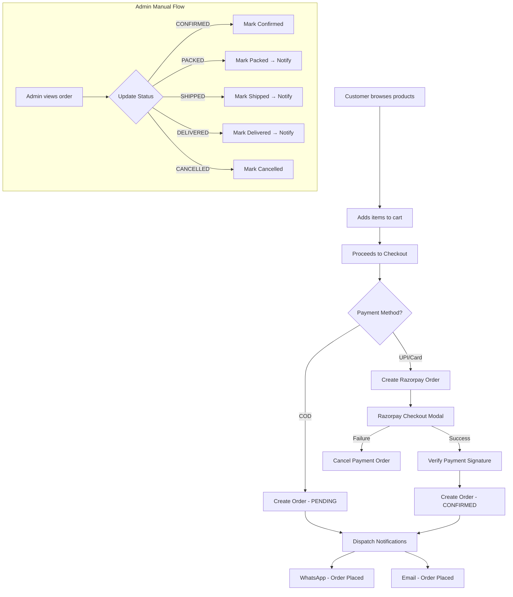
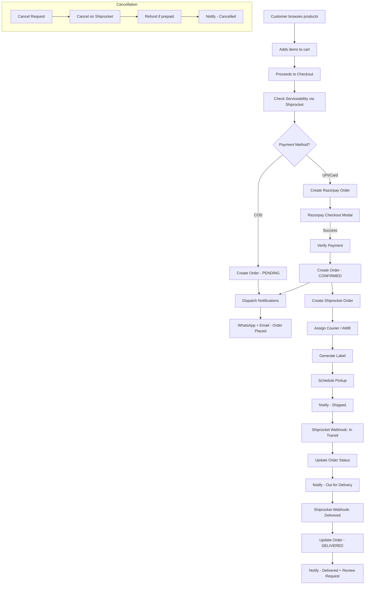
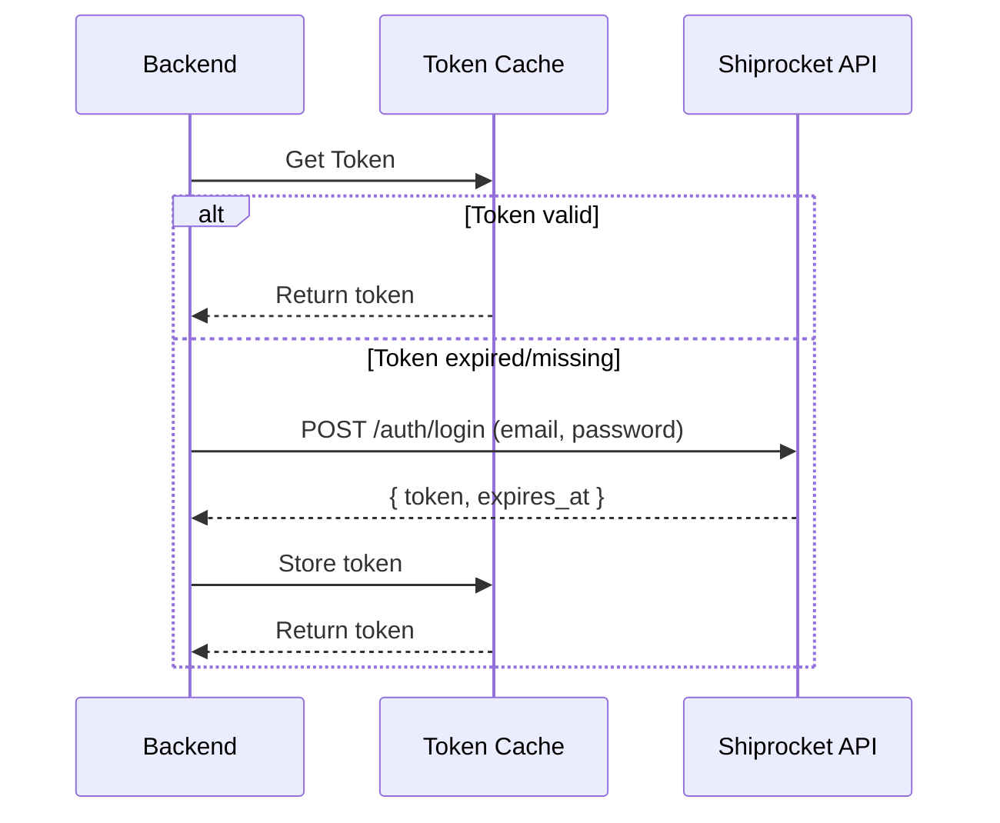
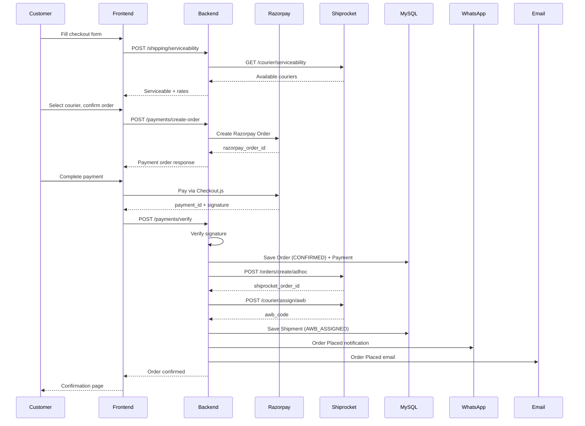
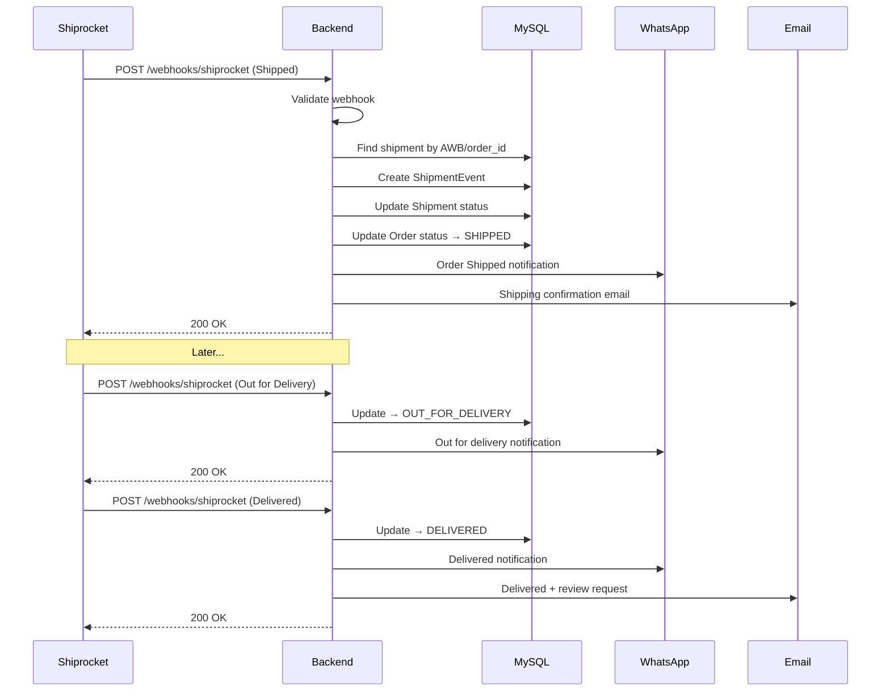
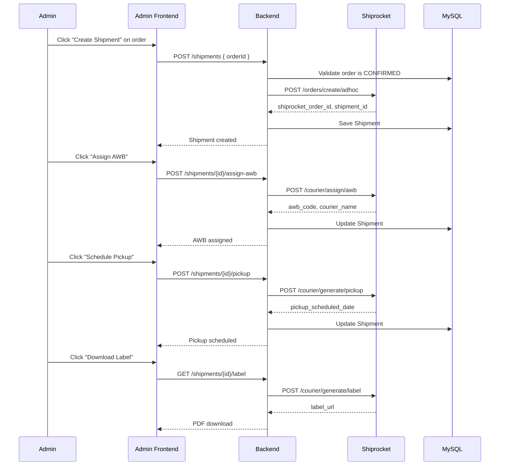
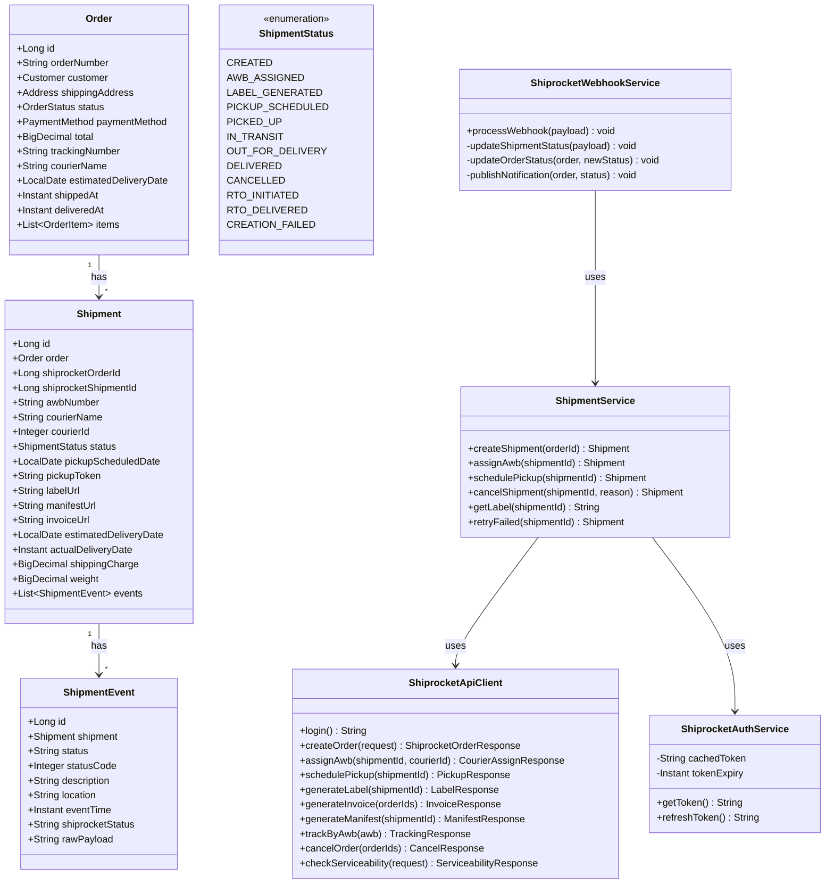

# Shiprocket Integration Plan

> **Project:** Appa & Amma's Pickles — E-commerce Platform  
> **Date:** 2026-07-20  
> **Author:** Architecture Team  
> **Status:** Blueprint / Pre-Implementation

---

## 1. Current Project Overview

### 1.1 Technologies

| Layer       | Technology                                               |
|-------------|----------------------------------------------------------|
| Frontend    | Next.js 15, React 19, TypeScript, Tailwind CSS           |
| Backend     | Java 21, Spring Boot 3, Spring Data JPA, MapStruct, Lombok |
| Database    | MySQL 8 + Flyway migrations                              |
| API Docs    | OpenAPI 3 (springdoc)                                    |
| Auth        | JWT (HS256) — separate tokens for Admin and Customer     |
| Payments    | Razorpay (Orders, Verify, Webhooks)                      |
| Notifications | WhatsApp (Meta Cloud API / MSG91), Email (Resend / SES), SMS (MSG91 / Twilio) |
| Container   | Docker, Docker Compose                                   |

### 1.2 Folder Structure

```
pickle-shopping/
├── backend/
│   └── src/main/java/com/appaamma/pickles/
│       ├── PicklesApplication.java
│       ├── common/            # ApiResponse, PageResponse, BaseEntity
│       ├── config/            # SecurityConfig, RazorpayProperties, NotificationProperties, etc.
│       ├── exception/         # GlobalExceptionHandler, typed exceptions
│       ├── security/          # JWT filters, CustomerPrincipal, rate limiting
│       ├── domain/
│       │   ├── user/          # User, Role, repositories
│       │   ├── product/       # Product, ProductImage, Category, ProductVariant
│       │   ├── customer/      # Customer, Address
│       │   ├── order/         # Order, OrderItem, Payment, PaymentAttempt, enums
│       │   ├── review/        # Review
│       │   ├── contact/       # Contact
│       │   ├── inventory/     # Inventory, InventoryReservationService
│       │   ├── notification/  # NotificationLog, templates, queues (Email/SMS/WhatsApp)
│       │   ├── otp/           # OTP entities
│       │   └── audit/         # AuditLog
│       └── api/v1/
│           ├── auth/          # Admin login + JWT
│           ├── customerauth/  # Customer OTP-based login
│           ├── product/       # Catalog + admin CRUD
│           ├── category/      # Categories
│           ├── order/         # Place + manage orders
│           ├── payment/       # Razorpay integration
│           ├── delivery/      # Delivery estimates (pincode-based)
│           ├── customer/      # Admin customer search
│           ├── customeraddress/ # Customer address CRUD
│           ├── review/        # Submit + moderate reviews
│           ├── contact/       # Contact form
│           ├── inventory/     # Stock tracking
│           ├── notification/  # Notification service, templates, webhooks
│           ├── admin/         # Dashboard stats
│           └── upload/        # File uploads
├── frontend/
│   └── src/
│       ├── app/               # Next.js App Router pages
│       │   ├── checkout/      # Checkout page (Razorpay)
│       │   ├── order/         # Order confirmation
│       │   ├── track-order/   # Public order tracking
│       │   ├── account/       # Customer dashboard
│       │   ├── admin/         # Admin panel (protected)
│       │   └── ...
│       ├── features/          # Feature modules
│       │   ├── checkout/      # Checkout form, Razorpay script, APIs
│       │   ├── order/         # Order list, detail, tracking components
│       │   ├── delivery/      # Delivery estimate API
│       │   ├── admin/         # Admin orders, products, dashboard
│       │   ├── cart/          # Shopping cart
│       │   └── ...
│       └── shared/            # Constants, hooks, layout, lib, types, UI
└── docs/
```

### 1.3 Existing Modules

| Domain        | Backend                           | Frontend                          |
|---------------|-----------------------------------|-----------------------------------|
| Products      | CRUD, variants, categories        | Catalog, detail, filters          |
| Orders        | Place, status transitions, admin  | Checkout, order history, tracking |
| Payments      | Razorpay create/verify/webhook    | Razorpay Checkout.js integration  |
| Delivery      | Distance-based estimate           | Estimate widget in checkout       |
| Notifications | WhatsApp, Email, SMS queues       | —                                 |
| Auth          | Admin JWT + Customer OTP/JWT      | Login, protected routes           |
| Inventory     | Stock reservation, low-stock      | —                                 |
| Reviews       | Submit, moderate                  | Review form, listing              |
| Admin         | Dashboard stats                   | Orders, products, contacts        |

### 1.4 Current Checkout Process

1. Customer fills cart → proceeds to checkout
2. Fills shipping address, selects payment method
3. **COD**: Order created with status `PENDING`
4. **Online (UPI/Razorpay)**: Payment order created → Razorpay Checkout modal → Payment verified → Order created with status `CONFIRMED`
5. Order confirmation page displayed
6. Notifications dispatched (WhatsApp + Email)

### 1.5 Current Payment Process

- `POST /api/v1/payments/create-order` → Creates Razorpay order + PaymentAttempt record
- Frontend opens Razorpay Checkout modal
- `POST /api/v1/payments/verify` → Verifies signature, creates Order + Payment records
- `POST /api/v1/payments/webhook` → Handles async Razorpay webhook events

### 1.6 Current Notification Process

- Event-driven via Spring Application Events
- Events: `OrderPlacedEvent`, `PaymentSuccessEvent`, `OrderPackedEvent`, `OrderShippedEvent`, `OutForDeliveryEvent`, `OrderDeliveredEvent`
- Queued notifications with retry logic (max 3 attempts, 5min backoff)
- Providers: WhatsApp (Meta/MSG91), Email (Resend/SES), SMS (MSG91/Twilio), MOCK
- Templates stored in DB with `NotificationTemplate` entity

---

## 2. Existing Order Flow



### Order Status Transitions

```
PENDING → CONFIRMED → PACKED → SHIPPED → DELIVERED
    ↓         ↓          ↓
CANCELLED  CANCELLED  CANCELLED
```

### Current Limitations

- No actual shipment creation with any courier partner
- No AWB (Air Waybill) generation
- No real-time tracking integration
- No automated shipping label generation
- No pickup scheduling
- Status updates are purely manual (admin clicks button)
- Delivery estimate is heuristic-based (pincode distance), not from carrier APIs
- No shipping rate comparison

---

## 3. Proposed Order Flow (After Shiprocket Integration)



### Key Changes

1. **Serviceability check** during checkout (verify pincode is deliverable)
2. **Automated shipment creation** after order confirmation
3. **AWB assignment** through Shiprocket courier recommendation
4. **Label & invoice generation** for warehouse team
5. **Pickup scheduling** with courier partner
6. **Real-time tracking** via Shiprocket webhooks
7. **Automated status transitions** (no more manual SHIPPED/DELIVERED clicks)
8. **Shipping rate from Shiprocket** instead of flat ₹60

---

## 4. Required Backend Changes

### 4.1 New Controllers

| Controller | Path | Purpose |
|---|---|---|
| `ShipmentController` | `/api/v1/shipments` | Admin CRUD for shipments |
| `ShiprocketWebhookController` | `/api/v1/webhooks/shiprocket` | Process Shiprocket status webhooks |
| `ShippingRateController` | `/api/v1/shipping/rates` | Fetch live shipping rates during checkout |
| `ServiceabilityController` | `/api/v1/shipping/serviceability` | Check if pincode is serviceable |

### 4.2 New Services

| Service | Responsibility |
|---|---|
| `ShiprocketAuthService` | Token management (login, refresh, cache) |
| `ShiprocketApiClient` | HTTP client for all Shiprocket API calls |
| `ShipmentService` | Create shipment, assign AWB, schedule pickup, cancel |
| `ShiprocketWebhookService` | Process incoming webhooks, update order/shipment status |
| `ShippingRateService` | Fetch & compare courier rates |
| `ServiceabilityService` | Check pincode serviceability |
| `ShipmentLabelService` | Generate/download shipping labels & invoices |
| `ShipmentScheduler` | Scheduled jobs for retries, stuck shipment detection |

### 4.3 New Repositories

| Repository | Entity |
|---|---|
| `ShipmentRepository` | `Shipment` |
| `ShipmentEventRepository` | `ShipmentEvent` |
| `ShiprocketTokenRepository` | `ShiprocketToken` (optional, if DB-cached) |

### 4.4 New Entities

| Entity | Purpose |
|---|---|
| `Shipment` | Maps order to Shiprocket shipment (AWB, courier, status) |
| `ShipmentEvent` | Tracks each status change event from Shiprocket |
| `ShiprocketToken` | Stores Shiprocket auth token with expiry (optional) |

### 4.5 New DTOs

| DTO | Purpose |
|---|---|
| `CreateShipmentRequest` | Internal request to create a shipment |
| `ShipmentResponse` | Shipment details for admin |
| `ShiprocketWebhookPayload` | Incoming webhook payload from Shiprocket |
| `ShippingRateRequest` | Request for shipping rates |
| `ShippingRateResponse` | Available couriers with rates and ETAs |
| `ServiceabilityRequest` | Pincode check request |
| `ServiceabilityResponse` | Whether pincode is serviceable + available couriers |
| `ShiprocketOrderRequest` | Outgoing request to Shiprocket Create Order API |
| `ShiprocketOrderResponse` | Response from Shiprocket Create Order API |
| `CourierAssignRequest` | Request to assign AWB |
| `CourierAssignResponse` | Response with AWB number |
| `PickupRequest` | Request to schedule pickup |
| `LabelResponse` | Label/invoice download URL |
| `TrackingResponse` | Enriched tracking info for frontend |

### 4.6 New Configuration

| Class | Purpose |
|---|---|
| `ShiprocketProperties` | Configuration properties for Shiprocket credentials |
| Updates to `SecurityConfig` | Whitelist webhook endpoint |
| Updates to `NotificationEventListener` | Handle new shipping events |

### 4.7 Validation

- Validate Shiprocket webhook payload signature/IP whitelist
- Validate shipment state before AWB assignment
- Validate pincode serviceability before order creation
- Validate order eligibility for shipping (paid + confirmed)

### 4.8 Exception Handling

| Exception | Scenario |
|---|---|
| `ShiprocketApiException` | Any Shiprocket API failure |
| `ShipmentCreationException` | Failed to create shipment |
| `CourierUnavailableException` | No courier available for route |
| `ServiceabilityException` | Pincode not serviceable |

### 4.9 Logging

- Log all Shiprocket API requests/responses at DEBUG level
- Log token refresh events at INFO level
- Log webhook processing at INFO level
- Log failures/retries at WARN level
- Log unrecoverable failures at ERROR level
- Use structured logging (JSON) with correlation IDs (order number)

### 4.10 Caching

- Cache Shiprocket auth token in-memory (expires ~10 days, refresh before expiry)
- Cache serviceability results per pincode (TTL: 24 hours)
- Cache courier rate results per route (TTL: 1 hour)

### 4.11 Utilities

| Utility | Purpose |
|---|---|
| `ShiprocketStatusMapper` | Map Shiprocket status codes to internal `OrderStatus` |
| `WeightCalculator` | Calculate order weight from product weights |
| `DimensionsCalculator` | Estimate package dimensions for shipping |

### 4.12 Interceptors/Filters

- Add Shiprocket webhook endpoint to security whitelist
- IP-based validation for webhook requests (optional; Shiprocket may provide IP ranges)

---

## 5. Database Changes

### 5.1 New Tables

#### `shipments`

```sql
CREATE TABLE shipments (
    id                      BIGINT          NOT NULL AUTO_INCREMENT,
    order_id                BIGINT          NOT NULL,
    shiprocket_order_id     BIGINT          NULL,
    shiprocket_shipment_id  BIGINT          NULL,
    awb_number              VARCHAR(50)     NULL,
    courier_name            VARCHAR(100)    NULL,
    courier_id              INT             NULL,
    status                  VARCHAR(50)     NOT NULL DEFAULT 'CREATED',
    pickup_scheduled_date   DATE            NULL,
    pickup_token            VARCHAR(100)    NULL,
    label_url               VARCHAR(500)    NULL,
    manifest_url            VARCHAR(500)    NULL,
    invoice_url             VARCHAR(500)    NULL,
    estimated_delivery_date DATE            NULL,
    actual_delivery_date    DATETIME(6)     NULL,
    shipping_charge         DECIMAL(10,2)   NULL,
    weight                  DECIMAL(6,3)    NULL,
    length                  DECIMAL(6,2)    NULL,
    breadth                 DECIMAL(6,2)    NULL,
    height                  DECIMAL(6,2)    NULL,
    channel_order_id        VARCHAR(50)     NULL,
    cancellation_reason     VARCHAR(500)    NULL,
    created_at              DATETIME(6)     NOT NULL,
    updated_at              DATETIME(6)     NOT NULL,
    PRIMARY KEY (id),
    KEY idx_shipments_order (order_id),
    KEY idx_shipments_awb (awb_number),
    KEY idx_shipments_status (status),
    KEY idx_shipments_sr_order (shiprocket_order_id),
    CONSTRAINT fk_shipments_order FOREIGN KEY (order_id) REFERENCES orders(id)
) ENGINE=InnoDB DEFAULT CHARSET=utf8mb4 COLLATE=utf8mb4_unicode_ci;
```

#### `shipment_events`

```sql
CREATE TABLE shipment_events (
    id                  BIGINT          NOT NULL AUTO_INCREMENT,
    shipment_id         BIGINT          NOT NULL,
    status              VARCHAR(50)     NOT NULL,
    status_code         INT             NULL,
    description         VARCHAR(500)    NULL,
    location            VARCHAR(200)    NULL,
    event_time          DATETIME(6)     NOT NULL,
    shiprocket_status   VARCHAR(100)    NULL,
    raw_payload         JSON            NULL,
    created_at          DATETIME(6)     NOT NULL,
    updated_at          DATETIME(6)     NOT NULL,
    PRIMARY KEY (id),
    KEY idx_se_shipment (shipment_id),
    KEY idx_se_event_time (event_time),
    CONSTRAINT fk_se_shipment FOREIGN KEY (shipment_id) REFERENCES shipments(id) ON DELETE CASCADE
) ENGINE=InnoDB DEFAULT CHARSET=utf8mb4 COLLATE=utf8mb4_unicode_ci;
```

#### `shiprocket_tokens`

```sql
CREATE TABLE shiprocket_tokens (
    id              BIGINT          NOT NULL AUTO_INCREMENT,
    token           TEXT            NOT NULL,
    expires_at      DATETIME(6)     NOT NULL,
    created_at      DATETIME(6)     NOT NULL,
    updated_at      DATETIME(6)     NOT NULL,
    PRIMARY KEY (id)
) ENGINE=InnoDB DEFAULT CHARSET=utf8mb4 COLLATE=utf8mb4_unicode_ci;
```

### 5.2 Modified Tables

#### `orders` — New columns

| Column | Type | Purpose |
|---|---|---|
| `tracking_number` | VARCHAR(50) | Quick access to AWB without JOIN |
| `courier_name` | VARCHAR(100) | Display courier name |
| `estimated_delivery_date` | DATE | Show ETA to customer |
| `shipped_at` | DATETIME(6) | Timestamp when marked shipped |
| `delivered_at` | DATETIME(6) | Timestamp when delivered |

### 5.3 New OrderStatus Values

Add to `OrderStatus` enum:

- `OUT_FOR_DELIVERY` — between SHIPPED and DELIVERED
- `RTO_INITIATED` — Return to Origin initiated
- `RTO_DELIVERED` — Package returned to seller

Updated transitions:

```
PENDING → CONFIRMED → PACKED → SHIPPED → OUT_FOR_DELIVERY → DELIVERED
                                    ↓
                              RTO_INITIATED → RTO_DELIVERED
```

### 5.4 Migration Script

File: `V11__shiprocket_integration.sql`

---

## 6. API Design

### 6.1 Public APIs (Customer-facing)

| Method | Endpoint | Purpose |
|---|---|---|
| `POST` | `/api/v1/shipping/serviceability` | Check if pincode is deliverable |
| `POST` | `/api/v1/shipping/rates` | Get available couriers & rates for a route |
| `GET` | `/api/v1/tracking/{orderNumber}` | Get real-time tracking details for an order |

### 6.2 Admin APIs

| Method | Endpoint | Purpose |
|---|---|---|
| `POST` | `/api/v1/shipments` | Create a Shiprocket shipment for an order |
| `GET` | `/api/v1/shipments` | List all shipments (paginated, filterable) |
| `GET` | `/api/v1/shipments/{id}` | Get shipment details |
| `GET` | `/api/v1/shipments/order/{orderId}` | Get shipment by order |
| `POST` | `/api/v1/shipments/{id}/assign-awb` | Assign AWB and courier |
| `POST` | `/api/v1/shipments/{id}/pickup` | Schedule pickup |
| `POST` | `/api/v1/shipments/{id}/cancel` | Cancel shipment |
| `GET` | `/api/v1/shipments/{id}/label` | Download shipping label |
| `GET` | `/api/v1/shipments/{id}/invoice` | Download invoice |
| `GET` | `/api/v1/shipments/{id}/manifest` | Download manifest |
| `POST` | `/api/v1/shipments/{id}/retry` | Retry failed shipment creation |
| `GET` | `/api/v1/shipments/{id}/tracking` | Get tracking history from Shiprocket |

### 6.3 Webhook APIs

| Method | Endpoint | Purpose |
|---|---|---|
| `POST` | `/api/v1/webhooks/shiprocket` | Receive Shiprocket status updates |

### 6.4 API Details

#### `POST /api/v1/shipping/serviceability`

```json
// Request
{
  "pickupPincode": "585225",
  "deliveryPincode": "560001",
  "weight": 0.5,
  "cod": false
}

// Response
{
  "serviceable": true,
  "availableCouriers": [
    {
      "courierId": 15,
      "courierName": "Delhivery",
      "rate": 65.00,
      "estimatedDays": 4,
      "cod": true
    }
  ]
}
```

#### `POST /api/v1/webhooks/shiprocket`

```json
// Incoming payload (from Shiprocket)
{
  "order_id": "12345",
  "awb": "1234567890",
  "current_status": "Delivered",
  "status_id": 7,
  "shipment_id": "98765",
  "scans": [...]
}
```

---

## 7. Shiprocket Integration

### 7.1 Authentication

- Shiprocket uses email/password authentication
- `POST https://apiv2.shiprocket.in/v1/external/auth/login`
- Returns a JWT token valid for ~10 days
- Token must be cached and refreshed before expiry



### 7.2 Token Management Strategy

1. Store token in DB (`shiprocket_tokens` table) or in-memory cache
2. Check expiry before each API call
3. Refresh proactively when token has < 1 day remaining
4. Handle 401 responses by forcing re-authentication
5. Use `@Cacheable` with TTL or `ConcurrentHashMap` with expiry

### 7.3 Shipment Creation

1. After order is `CONFIRMED`, create shipment:
   - `POST https://apiv2.shiprocket.in/v1/external/orders/create/adhoc`
2. Required data:
   - Order ID, order date, billing/shipping address
   - Product details (name, SKU, quantity, price, weight)
   - Payment method (Prepaid/COD)
   - Pickup location (warehouse)
3. Response includes `shiprocket_order_id` and `shipment_id`

### 7.4 Courier Assignment (AWB Generation)

1. `POST https://apiv2.shiprocket.in/v1/external/courier/assign/awb`
2. Provide `shipment_id` and optionally preferred `courier_id`
3. Use courier recommendation API to pick optimal courier:
   - `GET https://apiv2.shiprocket.in/v1/external/courier/serviceability`
4. Response includes `awb_code` (tracking number)

### 7.5 Pickup Scheduling

1. `POST https://apiv2.shiprocket.in/v1/external/courier/generate/pickup`
2. Provide `shipment_id`
3. Response includes pickup date and token

### 7.6 Label Generation

- `POST https://apiv2.shiprocket.in/v1/external/courier/generate/label`
- Input: `shipment_id`
- Response: PDF label URL

### 7.7 Invoice Generation

- `POST https://apiv2.shiprocket.in/v1/external/orders/print/invoice`
- Input: `order_ids[]`
- Response: PDF invoice URL

### 7.8 Manifest Generation

- `POST https://apiv2.shiprocket.in/v1/external/manifests/generate`
- Input: `shipment_id`
- Response: Manifest URL

### 7.9 Tracking

- `GET https://apiv2.shiprocket.in/v1/external/courier/track/awb/{awb}`
- Returns full tracking history with scans

### 7.10 Cancellation

- `POST https://apiv2.shiprocket.in/v1/external/orders/cancel`
- Input: `order_ids[]`
- Must be called before pickup for clean cancellation

### 7.11 Webhook Processing

Shiprocket sends webhooks on status changes:

| Status ID | Status | Internal Mapping |
|---|---|---|
| 1 | AWB Assigned | — (no change) |
| 2 | Label Generated | — (no change) |
| 3 | Pickup Scheduled | — (no change) |
| 4 | Pickup Queued | — (no change) |
| 5 | Manifest Generated | — (no change) |
| 6 | Shipped | SHIPPED |
| 7 | Delivered | DELIVERED |
| 8 | Cancelled | CANCELLED |
| 9 | RTO Initiated | RTO_INITIATED |
| 10 | RTO Delivered | RTO_DELIVERED |
| 17 | Out for Delivery | OUT_FOR_DELIVERY |
| 18 | In Transit | SHIPPED (maintain) |
| 38 | Reached Destination Hub | SHIPPED (maintain) |

### 7.12 Retry Strategy

- Failed Shiprocket API calls: exponential backoff (1s, 2s, 4s, 8s, max 3 retries)
- Failed shipment creation: mark as `CREATION_FAILED`, allow admin retry
- Token 401: immediate re-auth and retry once
- Webhook processing failure: idempotent processing, log and alert

---

## 8. Frontend Changes

### 8.1 Customer Pages

#### Checkout Page (`/checkout`)

- **New**: Serviceability check when pincode entered
- **New**: Show available courier options with ETAs
- **Modified**: Display dynamic shipping rate (replace flat ₹60)
- **New**: Show estimated delivery date based on courier selection

#### Order Tracking Page (`/track-order`)

- **Enhanced**: Show real-time tracking timeline from Shiprocket
- **New**: Show courier name, AWB number
- **New**: Show estimated delivery date
- **New**: Show tracking URL (link to courier tracking page)
- **New**: Display scan events (location + timestamp)

#### Account - My Orders (`/account/orders`)

- **Enhanced**: Show tracking number and courier for shipped orders
- **New**: "Track Shipment" button linking to detailed tracking
- **New**: Show estimated delivery date

#### Order Confirmation (`/checkout/confirmation`)

- **Enhanced**: Show estimated delivery date
- **New**: Note about shipment being created

### 8.2 Admin Pages

#### New: Shipment Dashboard (`/admin/shipments`)

- List all shipments with status, courier, AWB
- Filter by status (Created, AWB Assigned, Picked Up, In Transit, Delivered, Cancelled, RTO)
- Search by AWB or order number
- Bulk actions (generate labels, schedule pickups)

#### New: Shipment Detail (`/admin/shipments/[id]`)

- Full shipment info (AWB, courier, dimensions, weight)
- Tracking timeline
- Action buttons:
  - Assign AWB
  - Schedule Pickup
  - Download Label
  - Download Invoice
  - Download Manifest
  - Cancel Shipment
  - Retry (for failed)

#### Modified: Order Detail (admin)

- Show linked shipment info
- Quick action: Create Shipment (if none exists)
- Show shipping tracking inline

#### New: Shipping Settings (`/admin/settings/shipping`)

- Configure warehouse/pickup address
- View Shiprocket connection status
- Manage default courier preferences

### 8.3 New Frontend Feature Modules

```
frontend/src/features/
├── shipping/
│   ├── api.ts                    # Shiprocket-related API calls
│   ├── types.ts                  # Shipping types
│   └── components/
│       ├── ServiceabilityCheck.tsx
│       ├── ShippingRateSelector.tsx
│       ├── TrackingTimeline.tsx
│       └── ShipmentStatusBadge.tsx
├── admin/
│   └── shipments/
│       ├── api.ts
│       ├── types.ts
│       └── components/
│           ├── ShipmentList.tsx
│           ├── ShipmentDetail.tsx
│           ├── ShipmentActions.tsx
│           └── LabelDownload.tsx
```

---

## 9. Notification Changes

### 9.1 New Notification Events

| Event | Trigger | Channels |
|---|---|---|
| `ShipmentCreatedEvent` | Shipment created on Shiprocket | WhatsApp, Email |
| `PickupScheduledEvent` | Pickup scheduled | WhatsApp |
| `OrderShippedEvent` (enhanced) | AWB assigned + picked up | WhatsApp, Email |
| `OutForDeliveryEvent` (enhanced) | Webhook: Out for Delivery | WhatsApp |
| `OrderDeliveredEvent` (enhanced) | Webhook: Delivered | WhatsApp, Email |
| `ShipmentCancelledEvent` | Shipment cancelled | WhatsApp, Email |
| `RTOInitiatedEvent` | RTO started | WhatsApp, Email |

### 9.2 Enhanced Notification Variables

Add to `NotificationOrderContext`:

```java
String awbNumber;
String courierName;
String estimatedDeliveryDate;
String trackingUrl;
String currentLocation;
```

### 9.3 New Notification Templates

| Template Code | Channel | Content |
|---|---|---|
| `SHIPMENT_CREATED_WHATSAPP` | WhatsApp | "Your order {orderId} has been prepared for shipping!" |
| `SHIPMENT_CREATED_EMAIL` | Email | Shipment details with tracking link |
| `PICKUP_SCHEDULED_WHATSAPP` | WhatsApp | "Courier will pick up your order on {date}" |
| `ORDER_SHIPPED_WHATSAPP` (update) | WhatsApp | Include AWB, courier name, tracking URL |
| `ORDER_SHIPPED_EMAIL` (new) | Email | Detailed shipping info with tracking |
| `OUT_FOR_DELIVERY_WHATSAPP` (update) | WhatsApp | Include courier name |
| `ORDER_DELIVERED_EMAIL` (new) | Email | Delivery confirmation + review CTA |
| `SHIPMENT_CANCELLED_WHATSAPP` | WhatsApp | Cancellation reason + refund info |
| `SHIPMENT_CANCELLED_EMAIL` | Email | Detailed cancellation |
| `RTO_INITIATED_WHATSAPP` | WhatsApp | "Your package is being returned" |

### 9.4 Migration for Templates

File: `V12__shiprocket_notification_templates.sql`

---

## 10. Security Considerations

### 10.1 Credential Storage

- **NEVER** hardcode Shiprocket email/password in source code
- Store in environment variables: `SHIPROCKET_EMAIL`, `SHIPROCKET_PASSWORD`
- In production: use secrets manager (AWS Secrets Manager / Vault)
- Token stored in DB should be encrypted at rest

### 10.2 Webhook Security

- Validate incoming webhook requests:
  - IP whitelisting (if Shiprocket provides static IPs)
  - Verify `X-Shiprocket-Signature` header if available
  - Alternatively, use a shared secret token in webhook URL path
- Rate-limit webhook endpoint to prevent abuse
- Log all webhook payloads for audit

### 10.3 API Security

- All admin shipment endpoints require `ADMIN` or `STAFF` role
- Public tracking endpoint: rate-limited, returns minimal data
- Shiprocket token never exposed to frontend
- All Shiprocket API calls happen server-side only

### 10.4 Data Protection

- Mask customer PII in Shiprocket logs
- Do not log full webhook payloads at INFO level (use DEBUG)
- Audit all shipment creation/cancellation actions

---

## 11. Configuration

### 11.1 New Environment Variables

```properties
# Shiprocket Credentials
SHIPROCKET_EMAIL=your-email@domain.com
SHIPROCKET_PASSWORD=your-shiprocket-password
SHIPROCKET_BASE_URL=https://apiv2.shiprocket.in/v1/external

# Token Management
SHIPROCKET_TOKEN_REFRESH_HOURS=216   # Refresh when < 24h remaining (token valid ~10 days)

# Webhook
SHIPROCKET_WEBHOOK_SECRET=your-webhook-secret-token

# Pickup Location
SHIPROCKET_PICKUP_LOCATION_ID=
SHIPROCKET_PICKUP_PINCODE=585225

# Defaults
SHIPROCKET_DEFAULT_WEIGHT_KG=0.5
SHIPROCKET_DEFAULT_LENGTH_CM=20
SHIPROCKET_DEFAULT_BREADTH_CM=15
SHIPROCKET_DEFAULT_HEIGHT_CM=10

# Feature Flags
SHIPROCKET_AUTO_CREATE_SHIPMENT=true
SHIPROCKET_AUTO_ASSIGN_AWB=true
SHIPROCKET_AUTO_SCHEDULE_PICKUP=false
```

### 11.2 New `application.yml` Section

```yaml
app:
  shiprocket:
    email: ${SHIPROCKET_EMAIL:}
    password: ${SHIPROCKET_PASSWORD:}
    base-url: ${SHIPROCKET_BASE_URL:https://apiv2.shiprocket.in/v1/external}
    token-refresh-hours: ${SHIPROCKET_TOKEN_REFRESH_HOURS:216}
    webhook-secret: ${SHIPROCKET_WEBHOOK_SECRET:}
    pickup-location-id: ${SHIPROCKET_PICKUP_LOCATION_ID:}
    pickup-pincode: ${SHIPROCKET_PICKUP_PINCODE:585225}
    default-weight-kg: ${SHIPROCKET_DEFAULT_WEIGHT_KG:0.5}
    default-length-cm: ${SHIPROCKET_DEFAULT_LENGTH_CM:20}
    default-breadth-cm: ${SHIPROCKET_DEFAULT_BREADTH_CM:15}
    default-height-cm: ${SHIPROCKET_DEFAULT_HEIGHT_CM:10}
    auto-create-shipment: ${SHIPROCKET_AUTO_CREATE_SHIPMENT:true}
    auto-assign-awb: ${SHIPROCKET_AUTO_ASSIGN_AWB:true}
    auto-schedule-pickup: ${SHIPROCKET_AUTO_SCHEDULE_PICKUP:false}
```

### 11.3 `ShiprocketProperties.java`

```java
@Validated
@ConfigurationProperties(prefix = "app.shiprocket")
public record ShiprocketProperties(
    @NotBlank String email,
    @NotBlank String password,
    @NotBlank String baseUrl,
    int tokenRefreshHours,
    String webhookSecret,
    String pickupLocationId,
    String pickupPincode,
    BigDecimal defaultWeightKg,
    BigDecimal defaultLengthCm,
    BigDecimal defaultBreadthCm,
    BigDecimal defaultHeightCm,
    boolean autoCreateShipment,
    boolean autoAssignAwb,
    boolean autoSchedulePickup
) {}
```

---

## 12. Sequence Diagrams

### 12.1 Order Placement + Shipment Creation (Prepaid)



### 12.2 Webhook Processing (Status Updates)



### 12.3 Admin: Manual Shipment Creation



---

## 13. Class Diagram



---

## 14. Folder Structure (After Integration)

```
backend/src/main/java/com/appaamma/pickles/
├── api/v1/
│   ├── shipping/                          # NEW
│   │   ├── ShipmentController.java
│   │   ├── ShippingRateController.java
│   │   ├── ServiceabilityController.java
│   │   ├── ShiprocketWebhookController.java
│   │   ├── ShipmentService.java
│   │   ├── ShippingRateService.java
│   │   ├── ServiceabilityService.java
│   │   ├── ShiprocketWebhookService.java
│   │   ├── ShiprocketApiClient.java
│   │   ├── ShiprocketAuthService.java
│   │   ├── ShipmentMapper.java
│   │   ├── ShiprocketStatusMapper.java
│   │   ├── WeightCalculator.java
│   │   └── dto/
│   │       ├── CreateShipmentRequest.java
│   │       ├── ShipmentResponse.java
│   │       ├── ShippingRateRequest.java
│   │       ├── ShippingRateResponse.java
│   │       ├── ServiceabilityRequest.java
│   │       ├── ServiceabilityResponse.java
│   │       ├── ShiprocketWebhookPayload.java
│   │       ├── ShiprocketOrderRequest.java
│   │       ├── ShiprocketOrderResponse.java
│   │       ├── CourierAssignResponse.java
│   │       ├── PickupResponse.java
│   │       ├── LabelResponse.java
│   │       └── TrackingResponse.java
│   ├── order/                             # MODIFIED
│   ├── payment/                           # UNCHANGED
│   ├── notification/                      # MODIFIED (new events)
│   └── ...
├── config/
│   ├── ShiprocketProperties.java          # NEW
│   └── SecurityConfig.java                # MODIFIED (webhook whitelist)
├── domain/
│   ├── order/
│   │   ├── Order.java                     # MODIFIED (new fields)
│   │   └── OrderStatus.java              # MODIFIED (new enum values)
│   └── shipping/                          # NEW
│       ├── Shipment.java
│       ├── ShipmentEvent.java
│       ├── ShipmentStatus.java
│       ├── ShipmentRepository.java
│       ├── ShipmentEventRepository.java
│       └── ShiprocketToken.java
├── exception/
│   ├── ShiprocketApiException.java        # NEW
│   ├── ShipmentCreationException.java     # NEW
│   ├── CourierUnavailableException.java   # NEW
│   └── ServiceabilityException.java       # NEW
└── ...

frontend/src/
├── app/
│   ├── admin/(protected)/
│   │   ├── shipments/                     # NEW
│   │   │   ├── page.tsx
│   │   │   └── [id]/page.tsx
│   │   └── orders/                        # MODIFIED
│   ├── track-order/page.tsx               # MODIFIED (enhanced tracking)
│   ├── checkout/page.tsx                  # MODIFIED (serviceability + rates)
│   └── account/orders/                    # MODIFIED (tracking info)
├── features/
│   ├── shipping/                          # NEW
│   │   ├── api.ts
│   │   ├── types.ts
│   │   └── components/
│   │       ├── ServiceabilityCheck.tsx
│   │       ├── ShippingRateSelector.tsx
│   │       ├── TrackingTimeline.tsx
│   │       └── ShipmentStatusBadge.tsx
│   ├── admin/
│   │   └── shipments/                     # NEW
│   │       ├── api.ts
│   │       ├── types.ts
│   │       └── components/
│   │           ├── ShipmentList.tsx
│   │           ├── ShipmentDetail.tsx
│   │           ├── ShipmentActions.tsx
│   │           └── LabelDownload.tsx
│   ├── checkout/                          # MODIFIED
│   └── order/                             # MODIFIED
└── ...
```

---

## 15. Implementation Phases

### Phase 1: Database & Domain (2-3 days)

- [ ] Create Flyway migration `V11__shiprocket_integration.sql`
- [ ] Add `Shipment` entity
- [ ] Add `ShipmentEvent` entity
- [ ] Add `ShipmentStatus` enum
- [ ] Add `ShipmentRepository` and `ShipmentEventRepository`
- [ ] Update `OrderStatus` enum (add `OUT_FOR_DELIVERY`, `RTO_INITIATED`, `RTO_DELIVERED`)
- [ ] Add new columns to `Order` entity
- [ ] Update `OrderStatus.canTransitionTo()` map
- [ ] Create `ShiprocketProperties` configuration class

### Phase 2: Shiprocket Authentication (1 day)

- [ ] Implement `ShiprocketAuthService` (login, token caching, refresh)
- [ ] Implement `ShiprocketApiClient` base HTTP client (RestTemplate/WebClient)
- [ ] Add error handling for 401 (auto-refresh)
- [ ] Write unit tests for token management
- [ ] Add configuration to `application.yml`

### Phase 3: Core Shipment APIs (3-4 days)

- [ ] Implement `ShipmentService` (create, assign AWB, pickup, cancel)
- [ ] Implement `ShipmentController` (admin endpoints)
- [ ] Implement `ShippingRateService` + `ShippingRateController`
- [ ] Implement `ServiceabilityService` + `ServiceabilityController`
- [ ] Implement `ShipmentMapper` (entity ↔ DTO)
- [ ] Implement `ShiprocketStatusMapper` (Shiprocket status → internal status)
- [ ] Implement `WeightCalculator`
- [ ] Add new exceptions to `GlobalExceptionHandler`
- [ ] Wire auto-shipment creation into `OrderService` / `PaymentService` flow
- [ ] Update `SecurityConfig` to whitelist new public/webhook endpoints

### Phase 4: Webhook Processing (2 days)

- [ ] Implement `ShiprocketWebhookController`
- [ ] Implement `ShiprocketWebhookService`
- [ ] Implement idempotent status update logic
- [ ] Wire webhook events to order status transitions
- [ ] Wire webhook events to notification events
- [ ] Add webhook validation (secret/IP)
- [ ] Write integration tests

### Phase 5: Notification Enhancement (1-2 days)

- [ ] Add new notification events (`ShipmentCreatedEvent`, `RTOInitiatedEvent`, etc.)
- [ ] Update `NotificationEventListener` with new handlers
- [ ] Update `NotificationOrderContext` with shipping fields
- [ ] Create Flyway migration for new templates `V12__shiprocket_notification_templates.sql`
- [ ] Test all notification flows

### Phase 6: Frontend — Customer (2-3 days)

- [ ] Create `features/shipping/` module (API, types, components)
- [ ] Integrate `ServiceabilityCheck` into checkout form
- [ ] Integrate `ShippingRateSelector` into checkout form
- [ ] Update `OrderPricingService` to use real rates (or pass through)
- [ ] Enhance `TrackOrderForm` / tracking page with timeline, AWB, courier
- [ ] Enhance order history cards with tracking info
- [ ] Update order confirmation page

### Phase 7: Frontend — Admin (2-3 days)

- [ ] Create `features/admin/shipments/` module
- [ ] Create shipment list page (`/admin/shipments`)
- [ ] Create shipment detail page (`/admin/shipments/[id]`)
- [ ] Add "Create Shipment" action to order detail
- [ ] Add label/invoice download buttons
- [ ] Add shipment status badges
- [ ] Wire admin navigation

### Phase 8: Testing & QA (2-3 days)

- [ ] Unit tests for all services
- [ ] Integration tests with mocked Shiprocket APIs
- [ ] Webhook processing tests
- [ ] End-to-end flow testing
- [ ] Failure scenario testing
- [ ] Load testing webhook endpoint

---

## 16. Testing Strategy

### 16.1 Unit Tests

| Component | Test Focus |
|---|---|
| `ShiprocketAuthService` | Token caching, refresh logic, 401 handling |
| `ShipmentService` | Shipment creation, state transitions, error handling |
| `ShiprocketStatusMapper` | All status code mappings |
| `WeightCalculator` | Weight calculation from products |
| `ShiprocketWebhookService` | Payload parsing, idempotency |
| `ServiceabilityService` | Pincode validation, rate filtering |

### 16.2 Integration Tests

| Test | Scope |
|---|---|
| Shipment creation flow | Mock Shiprocket API → verify DB state |
| Webhook processing | Simulate webhook → verify order status + notifications |
| Token refresh | Simulate expired token → verify re-auth |
| Payment → Shipment | Full flow from payment verify to shipment creation |

### 16.3 Webhook Tests

- Valid payload → status updated correctly
- Duplicate webhook (same AWB + status) → idempotent (no duplicate events)
- Invalid signature → 401 returned
- Unknown AWB → logged and ignored (no crash)
- Malformed payload → 400 returned, error logged

### 16.4 API Tests (Postman / REST Assured)

- `POST /shipments` → 201 with valid order
- `POST /shipments` → 400 with non-confirmed order
- `POST /shipments/{id}/assign-awb` → 200
- `POST /webhooks/shiprocket` → 200 with valid payload
- `GET /shipping/serviceability` → correct response for known pincodes
- `GET /tracking/{orderNumber}` → tracking timeline

### 16.5 Manual Tests

- Place order (prepaid) → verify shipment auto-created on Shiprocket dashboard
- Place order (COD) → verify shipment created after admin confirmation
- Track order → verify real-time tracking displayed
- Cancel shipment → verify status updated, notifications sent
- Admin label download → verify PDF generated

### 16.6 Failure Scenarios

| Scenario | Expected Behavior |
|---|---|
| Shiprocket API down | Order created, shipment marked CREATION_FAILED, admin alerted |
| Token expired mid-request | Auto-refresh, retry once |
| Duplicate shipment creation | Idempotent — return existing shipment |
| Invalid pincode | Serviceability check prevents checkout |
| Courier unavailable | Show alternative couriers or COD-only message |
| Webhook received before shipment in DB | Queue and retry after delay |

---

## 17. Risks

| Risk | Impact | Mitigation |
|---|---|---|
| Shiprocket token expires during high traffic | Failed shipment creation | Proactive refresh, retry with fresh token |
| Webhook delivery failure | Order status not updated | Scheduled job polls tracking API for stale shipments |
| Duplicate shipments created | Extra charges | Idempotency check (one shipment per order) |
| Payment captured but shipment fails | Customer charged, no delivery | Alert admin, fallback to manual shipment |
| Courier unavailable for pincode | Customer cannot complete order | Fail gracefully, suggest alternative or COD |
| Shiprocket API rate limits | Bulk operations fail | Queue + throttle shipment creation |
| Pincode serviceability changes | Previously serviceable pincode becomes unavailable | Revalidate at order creation, not just checkout |
| RTO (Return to Origin) | Lost revenue + shipping cost | Notify admin immediately, process refund |
| Weight/dimension mismatch | Extra charges from courier | Admin verification step before shipment |
| Webhook replay attacks | False status updates | Validate webhook secret, idempotent processing |

---

## 18. Future Enhancements

| Enhancement | Description | Priority |
|---|---|---|
| Shipping estimates on product page | Show "Delivers in X days to your city" | Medium |
| Multiple pickup locations | Support multiple warehouses/kitchens | Low |
| International shipping | Integrate Shiprocket international APIs | Low |
| Return management | Customer-initiated returns with reverse pickup | High |
| Exchange workflow | Replace damaged products | Medium |
| Analytics dashboard | Shipping cost analytics, courier performance | Medium |
| Shipping cost optimization | Auto-select cheapest courier meeting SLA | High |
| NDR (Non-Delivery Report) handling | Automated re-attempts for failed deliveries | Medium |
| Bulk shipping label generation | Print all today's labels in one PDF | Medium |
| SMS tracking updates | Send SMS for non-WhatsApp customers | Low |
| Estimated delivery on product listing | Show ETA while browsing | Low |
| COD to prepaid conversion | Offer discount for switching to prepaid | Medium |
| Weight-based pricing | Dynamic shipping based on order weight | High |
| Insurance for high-value orders | Add shipping insurance option | Low |

---

## Appendix A: Shiprocket API Reference

| API | Method | Endpoint |
|---|---|---|
| Login | POST | `/auth/login` |
| Create Order | POST | `/orders/create/adhoc` |
| Cancel Order | POST | `/orders/cancel` |
| Assign AWB | POST | `/courier/assign/awb` |
| Check Serviceability | GET | `/courier/serviceability` |
| Generate Label | POST | `/courier/generate/label` |
| Generate Manifest | POST | `/manifests/generate` |
| Print Invoice | POST | `/orders/print/invoice` |
| Schedule Pickup | POST | `/courier/generate/pickup` |
| Track by AWB | GET | `/courier/track/awb/{awb}` |
| Track by Order | GET | `/courier/track/shipment/{shipment_id}` |

Base URL: `https://apiv2.shiprocket.in/v1/external`

---

## Appendix B: Shiprocket Status Code Reference

| ID | Status | Description |
|---|---|---|
| 1 | AWB Assigned | Tracking number generated |
| 2 | Label Generated | Shipping label ready |
| 3 | Pickup Scheduled | Courier pickup scheduled |
| 4 | Pickup Queued | Awaiting pickup |
| 5 | Manifest Generated | Manifest ready |
| 6 | Shipped | In transit with courier |
| 7 | Delivered | Successfully delivered |
| 8 | Cancelled | Order/shipment cancelled |
| 9 | RTO Initiated | Return to origin started |
| 10 | RTO Delivered | Returned to seller |
| 12 | Lost | Package lost in transit |
| 13 | Pickup Error | Courier couldn't pick up |
| 14 | RTO Acknowledged | Seller acknowledged return |
| 15 | Pickup Rescheduled | New pickup date assigned |
| 17 | Out for Delivery | Last-mile delivery |
| 18 | In Transit | Moving between hubs |
| 19 | Out for Pickup | Courier en route to seller |
| 20 | Pickup Exception | Issue during pickup |
| 38 | Reached Destination Hub | At final sorting center |

---

## Appendix C: Environment Configuration Template

```env
# === Shiprocket ===
SHIPROCKET_EMAIL=
SHIPROCKET_PASSWORD=
SHIPROCKET_BASE_URL=https://apiv2.shiprocket.in/v1/external
SHIPROCKET_TOKEN_REFRESH_HOURS=216
SHIPROCKET_WEBHOOK_SECRET=
SHIPROCKET_PICKUP_LOCATION_ID=
SHIPROCKET_PICKUP_PINCODE=585225
SHIPROCKET_DEFAULT_WEIGHT_KG=0.5
SHIPROCKET_DEFAULT_LENGTH_CM=20
SHIPROCKET_DEFAULT_BREADTH_CM=15
SHIPROCKET_DEFAULT_HEIGHT_CM=10
SHIPROCKET_AUTO_CREATE_SHIPMENT=true
SHIPROCKET_AUTO_ASSIGN_AWB=true
SHIPROCKET_AUTO_SCHEDULE_PICKUP=false
```

---

*End of Shiprocket Integration Plan*
