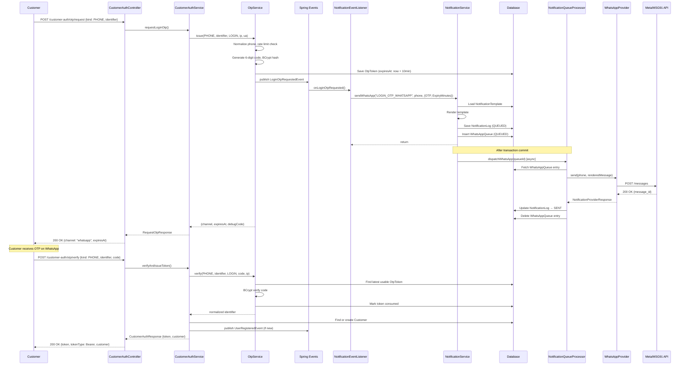
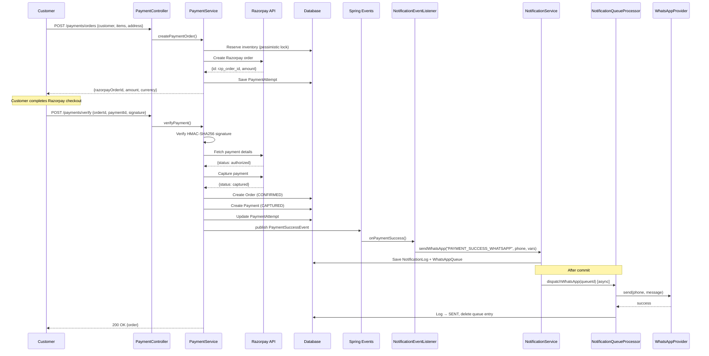
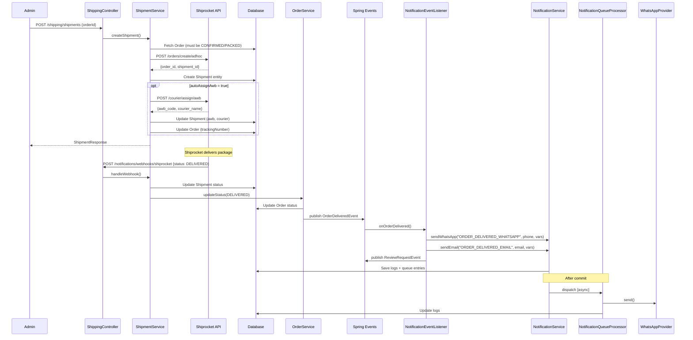
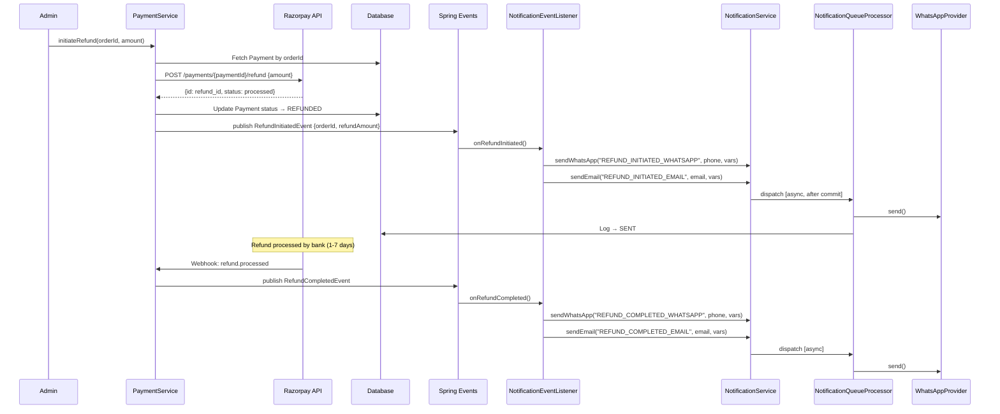
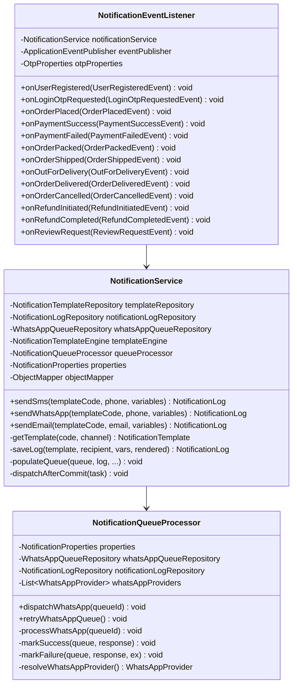
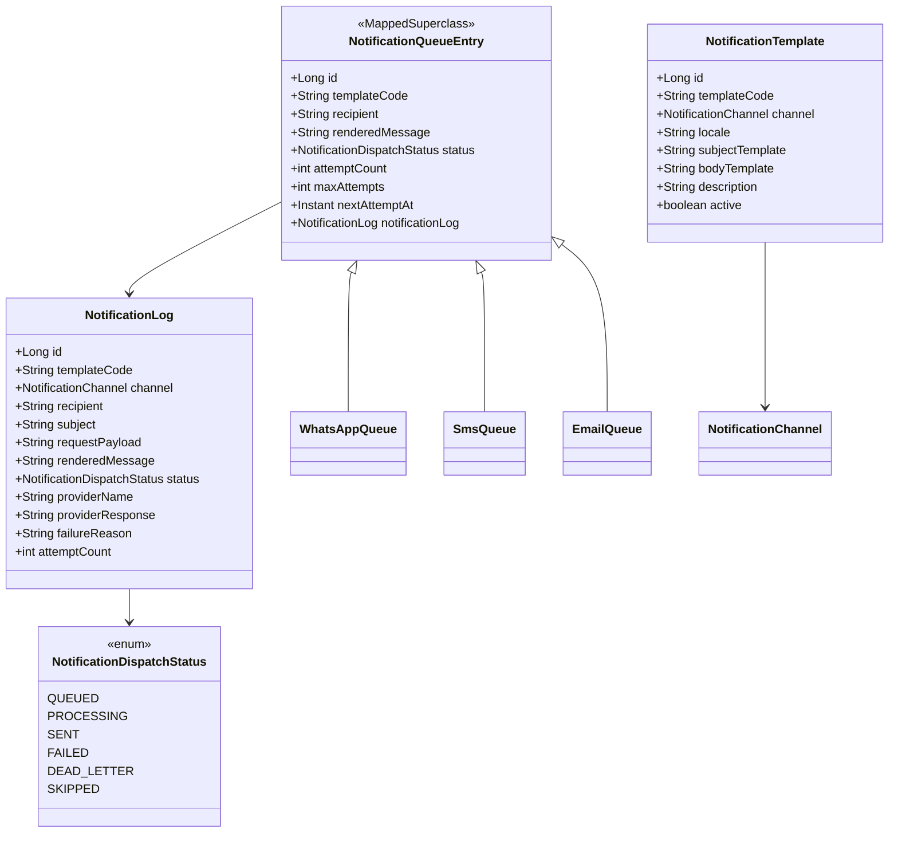

# WhatsApp Notification Implementation Guide

## Appa & Amma's Pickles — Engineering Documentation

**Version:** 1.0  
**Date:** August 2026  
**Authors:** Engineering Team  
**Status:** Approved for Implementation  
**Project:** `com.appaamma.pickles` — Spring Boot 3.3.5 / Java 17

---

## Table of Contents

1. [Introduction](#1-introduction)
2. [Provider Comparison](#2-provider-comparison)
3. [Project Analysis — Current State](#3-project-analysis--current-state)
4. [Project Changes](#4-project-changes)
5. [Dependencies](#5-dependencies)
6. [Configuration](#6-configuration)
7. [Folder Structure](#7-folder-structure)
8. [Database Changes](#8-database-changes)
9. [Notification Templates](#9-notification-templates)
10. [Complete Flows](#10-complete-flows)
11. [Sequence Diagrams](#11-sequence-diagrams)
12. [Class Diagrams](#12-class-diagrams)
13. [API Design](#13-api-design)
14. [Event-Driven Design](#14-event-driven-design)
15. [Retry Strategy](#15-retry-strategy)
16. [Logging](#16-logging)
17. [Error Handling](#17-error-handling)
18. [Security](#18-security)
19. [Testing](#19-testing)
20. [Deployment](#20-deployment)
21. [Monitoring](#21-monitoring)
22. [Future Improvements](#22-future-improvements)
23. [Implementation Roadmap](#23-implementation-roadmap)

---

## 1. Introduction

### 1.1 Why WhatsApp Notifications

WhatsApp has a 98% open rate in India compared to 20% for email and 22% for SMS. For a direct-to-consumer artisan brand like Appa & Amma's Pickles, where the customer relationship is personal and trust-based, WhatsApp is the natural communication channel. Customers already expect WhatsApp updates for OTPs, order confirmations, and delivery tracking from Indian ecommerce brands.

The application already supports WhatsApp as a notification channel through the existing `NotificationService`, `WhatsAppQueue`, and two WhatsApp providers (`WhatsAppBusinessApiProvider` and `Msg91WhatsAppProvider`). The OTP flow already defaults to WhatsApp delivery (`APP_OTP_PHONE_CHANNEL: WHATSAPP`). This guide details how to harden the existing implementation, fill coverage gaps, and prepare for production deployment with Meta's WhatsApp Business API.

### 1.2 Benefits

| Benefit | Description |
|---------|-------------|
| **Higher engagement** | 98% open rate vs. 20% email; customers see OTPs and updates immediately |
| **Brand trust** | Green-tick verified business profile builds authenticity for a family brand |
| **Rich media** | Images of pickle jars, delivery photos, and interactive buttons in future |
| **Two-way communication** | Customer replies can be routed to support (future phase) |
| **Delivery receipts** | Read/delivered receipts via webhooks confirm message arrival |
| **Unified notification system** | Already shares infrastructure with SMS and email in the existing codebase |
| **Reduced SMS cost** | WhatsApp Business API utility templates are cheaper than transactional SMS in India |

### 1.3 Architecture Overview

The application follows a layered event-driven notification architecture:

```
Business Service (OrderService, PaymentService, OtpService)
        │
        ▼  publishes Spring ApplicationEvent
NotificationEventListener
        │
        ▼  calls NotificationService.sendWhatsApp()
NotificationService
        │
        ├── Loads NotificationTemplate from DB
        ├── Renders template with NotificationTemplateEngine
        ├── Saves NotificationLog (status: QUEUED)
        ├── Inserts WhatsAppQueue entry
        └── Registers afterCommit → async dispatch
                │
                ▼
NotificationQueueProcessor.dispatchWhatsApp()   (@Async on notificationExecutor)
        │
        ▼  resolves provider from config
WhatsAppProvider.send(phoneNumber, message)
        │
        ├── WhatsAppBusinessApiProvider  (Meta Cloud API)
        ├── Msg91WhatsAppProvider        (MSG91)
        ├── MockWhatsAppProvider         (dev/test)
        └── LogWhatsAppProvider          (dev/test)
                │
                ▼
NotificationLog updated to SENT / FAILED / DEAD_LETTER
WhatsAppQueue entry deleted on success, retried on failure
```

### 1.4 Notification Lifecycle

Every WhatsApp notification follows this lifecycle:

1. **Trigger** — A domain event is published (`OrderPlacedEvent`, `LoginOtpRequestedEvent`, etc.).
2. **Capture** — `NotificationEventListener` receives the event, constructs template variables, decides channel.
3. **Resolve** — `NotificationService.sendWhatsApp()` loads `NotificationTemplate` by `template_code` from the database.
4. **Render** — `NotificationTemplateEngine.render()` replaces `{{placeholders}}` with variable values.
5. **Persist** — A `NotificationLog` row (status `QUEUED`) and a `WhatsAppQueue` row are written inside the business transaction.
6. **Dispatch** — After the transaction commits, `NotificationQueueProcessor.dispatchWhatsApp()` runs asynchronously on the `notificationExecutor` thread pool (core 4, max 8, queue 200).
7. **Send** — The resolved `WhatsAppProvider` makes an HTTP call to the external API (Meta Graph API or MSG91).
8. **Record** — On success: `NotificationLog` → `SENT`, `WhatsAppQueue` row deleted. On failure: attempt count incremented, `nextAttemptAt` set with exponential backoff (`PT5M × attempt`), up to `maxAttempts` (default 3).
9. **Retry** — A `@Scheduled` job scans `WhatsAppQueue` every 60 seconds for rows with `status IN (QUEUED, FAILED) AND nextAttemptAt <= NOW()`, dispatching up to 50 at a time.
10. **Dead Letter** — After `maxAttempts` exhausted, status becomes `DEAD_LETTER`, log updated, queue row deleted.

---

## 2. Provider Comparison

### 2.1 Provider Matrix

| Criteria | MSG91 | Meta Cloud API | Twilio | Interakt | Gupshup | AiSensy |
|----------|-------|----------------|--------|----------|---------|---------|
| **Pricing (per message, India utility)** | ₹0.30–0.50 | Free (first 1000/mo) then ~₹0.30 | ~₹0.90 | ₹0.50–0.75 | ₹0.30–0.45 | ₹0.35–0.55 |
| **Reliability** | High (India-focused) | Very High (Meta infrastructure) | Very High | Medium-High | High | Medium-High |
| **Template approval** | Via MSG91 dashboard | Via Meta Business Manager | Via Twilio Console | Via Interakt dashboard | Via Gupshup dashboard | Via AiSensy dashboard |
| **OTP support** | Yes (dedicated OTP API) | Yes (authentication templates) | Yes | Limited | Yes | Yes |
| **Ease of integration** | Easy (REST API) | Moderate (OAuth, webhooks, Graph API) | Easy (SDK + REST) | Easy (REST) | Moderate (REST) | Easy (REST) |
| **Documentation** | Good | Excellent | Excellent | Good | Good | Average |
| **Rate limits** | 1000 msg/sec per WABA | 80 msg/sec per phone number, tier-based daily limits (250→100K+) | Account-based | Account-based | Account-based | Account-based |
| **Webhook support** | Yes | Yes (native) | Yes | Yes | Yes | Limited |
| **Green tick verification** | Via Meta (BSP) | Direct | Via Meta (BSP) | Via Meta (BSP) | Via Meta (BSP) | Via Meta (BSP) |
| **Indian DLT compliance** | Built-in | N/A (WhatsApp only) | N/A | N/A | N/A | N/A |
| **Multi-channel (SMS + WhatsApp)** | Yes (single dashboard) | No (WhatsApp only) | Yes | No | Yes | No |

### 2.2 Detailed Pros and Cons

#### MSG91

**Pros:**
- Already integrated in the project (`Msg91WhatsAppProvider`, `Msg91SmsProvider`).
- Single vendor for both SMS and WhatsApp.
- Indian company with INR billing.
- DLT registration handled.
- Good dashboard for template management.
- `sendTemplate()` method already exists with variable support.

**Cons:**
- Acts as a BSP (Business Solution Provider) — adds a middleman between the app and Meta.
- Template approval happens through MSG91, not directly with Meta.
- Slightly higher per-message cost than direct Meta API.
- Less granular webhook/delivery status compared to direct Meta API.
- Vendor lock-in risk.

#### Meta Cloud API (Direct)

**Pros:**
- Already integrated in the project (`WhatsAppBusinessApiProvider`).
- No middleman — direct Meta infrastructure.
- Free tier: 1000 conversations/month (service conversations).
- Most granular webhook support (sent, delivered, read, failed).
- Best documentation.
- Green tick applied directly.
- Lowest per-message cost at scale.

**Cons:**
- Requires Facebook Business Manager, Meta app, and System User setup.
- Access token management (60-day expiry for system user tokens; permanent tokens possible).
- Template approval directly with Meta (1–24 hour review).
- Webhook endpoint must be publicly accessible with HTTPS.
- Requires `phone_number_id` and `WABA_ID` configuration.
- Current `WhatsAppBusinessApiProvider` sends free-form text, not approved templates — this must be changed for production (Meta requires pre-approved templates for business-initiated messages).

#### Twilio

**Pros:**
- Battle-tested enterprise platform.
- Excellent SDK and documentation.
- Multi-channel (SMS, WhatsApp, Voice, Email via SendGrid).
- Built-in message scheduling and content templates.
- Good monitoring and analytics dashboard.

**Cons:**
- Highest per-message cost (~₹0.90 for India utility).
- USD billing — exchange rate fluctuations.
- Overkill for a single-brand ecommerce use case.
- Not currently integrated in the project for WhatsApp (only SMS via `TwilioSmsProvider`).

#### Interakt

**Pros:**
- Indian BSP with easy onboarding.
- Template builder UI.
- Campaign and broadcast features.

**Cons:**
- Less developer-friendly API.
- Limited webhook support.
- Not integrated in the project.
- Higher cost than direct API.
- Suited more for marketing teams than developers.

#### Gupshup

**Pros:**
- Large Indian BSP with extensive WhatsApp experience.
- Good template management.
- Bot builder for interactive messages.

**Cons:**
- API documentation can be inconsistent.
- Integration complexity moderate.
- Not integrated in the project.
- BSP middleman overhead.

#### AiSensy

**Pros:**
- Affordable pricing for Indian market.
- No-code campaign builder.
- Shopify/WooCommerce integrations.

**Cons:**
- Weakest documentation.
- Limited developer API.
- Not suitable for programmatic integration.
- Not integrated in the project.

### 2.3 Recommendation

**Primary: MSG91** (for initial production launch)

**Rationale:**
1. MSG91 is already integrated — `Msg91WhatsAppProvider` and `Msg91SmsProvider` are production-ready in the codebase.
2. Single vendor for SMS + WhatsApp simplifies billing and credential management.
3. The `sendTemplate()` method in `Msg91WhatsAppProvider` already supports template names and variables.
4. Indian company with INR billing, local support, and DLT compliance.
5. Template approval is managed through MSG91's dashboard.

**Long-term: Meta Cloud API** (Phase 2)

**Rationale:**
1. `WhatsAppBusinessApiProvider` is already integrated but needs to be upgraded from free-form text to template-based messages.
2. Lowest cost at scale (free first 1000 conversations/month).
3. Most granular delivery tracking (sent → delivered → read).
4. Direct relationship with Meta eliminates BSP dependency.
5. Required for interactive messages (buttons, lists) in future phases.

**Migration Path:** MSG91 for launch → dual-provider testing → Meta Cloud API as primary once volume exceeds 5000 messages/month and the team is comfortable with Meta Business Manager operations.

---

## 3. Project Analysis — Current State

### 3.1 Project Architecture

| Layer | Package | Responsibility |
|-------|---------|---------------|
| API/Controller | `com.appaamma.pickles.api.v1.*` | REST endpoints, request validation, DTOs |
| Domain | `com.appaamma.pickles.domain.*` | JPA entities, repositories, enums |
| Config | `com.appaamma.pickles.config` | `@ConfigurationProperties` records, security filters |
| Security | `com.appaamma.pickles.security` | JWT providers, auth filters, rate limiting |
| Exception | `com.appaamma.pickles.exception` | Custom exceptions, `GlobalExceptionHandler` |
| Common | `com.appaamma.pickles.common` | Shared base entities (audit fields) |

**Build:** Gradle (Kotlin DSL), Spring Boot 3.3.5, Java 17  
**Database:** MySQL 8.0 with Flyway migrations (V1–V12)  
**ORM:** Spring Data JPA + Hibernate  
**Mapping:** MapStruct 1.6.3  
**Security:** Spring Security + dual JWT (Admin + Customer)  
**Payment:** Razorpay (`razorpay-java:1.4.6`)  
**Shipping:** Shiprocket (REST client via `RestClient.Builder`)  

### 3.2 Notification Flow — Current State

The notification subsystem is fully architected and operational:

| Component | Class | Status |
|-----------|-------|--------|
| Template storage | `NotificationTemplate` entity + `notification_template` table | ✅ Complete |
| Audit trail | `NotificationLog` entity + `notification_log` table | ✅ Complete |
| WhatsApp queue | `WhatsAppQueue` entity + `whatsapp_queue` table | ✅ Complete |
| SMS queue | `SmsQueue` entity + `sms_queue` table | ✅ Complete |
| Email queue | `EmailQueue` entity + `email_queue` table | ✅ Complete |
| Template engine | `NotificationTemplateEngine` | ✅ Complete |
| Service layer | `NotificationService` | ✅ Complete |
| Async dispatch | `NotificationQueueProcessor` with `@Async("notificationExecutor")` | ✅ Complete |
| Retry/dead-letter | `@Scheduled` retry scan every 60s, backoff PT5M × attempt, max 3 attempts | ✅ Complete |
| Event listeners | `NotificationEventListener` handles all domain events | ✅ Complete |
| WhatsApp providers | `WhatsAppBusinessApiProvider`, `Msg91WhatsAppProvider`, `MockWhatsAppProvider`, `LogWhatsAppProvider` | ✅ Complete |
| SMS providers | `Msg91SmsProvider`, `TwilioSmsProvider`, `MockWhatsAppProvider`, `LogSmsProvider` | ✅ Complete |
| Email providers | `ResendEmailProvider`, `AmazonSesEmailProvider`, `MockEmailProvider`, `LogEmailProvider` | ✅ Complete |
| Configuration | `NotificationProperties` record with SMS/WhatsApp/Email sub-records | ✅ Complete |
| Thread pool | `AsyncConfig` — core 4, max 8, queue 200 | ✅ Complete |
| Admin API | `NotificationController` — template CRUD, log listing | ✅ Complete |
| Webhooks | MSG91 WhatsApp webhook + Shiprocket webhook endpoints | ✅ Complete |

### 3.3 Authentication Flow — Current State

**Admin:** Email/password → `AuthService.login()` → `JwtTokenProvider.generateToken()` → Bearer JWT (8-hour expiry, HMAC-SHA 256-bit key).

**Customer:** OTP-based. `POST /customer-auth/otp/request` → `OtpService.issue()` → publishes `LoginOtpRequestedEvent` → `NotificationEventListener.onLoginOtpRequested()` → sends OTP via WhatsApp (default), SMS, or email depending on `APP_OTP_PHONE_CHANNEL` config and `OtpIdentifierKind`.

OTP is hashed with bcrypt, stored in `otp_tokens` table with 10-minute TTL, rate-limited per IP (20 req/15 min) and per identifier (5 req/15 min). Verification: `POST /customer-auth/otp/verify` → auto-creates customer if new → issues customer JWT (12-hour expiry, separate signing key).

### 3.4 User Entity

`Customer` entity (`com.appaamma.pickles.domain.customer`):
- Fields: `id`, `fullName`, `email` (unique), `phone` (unique)
- Relations: `OneToMany → Address`
- Note: No `passwordHash` — customers authenticate via OTP only.

`User` entity (`com.appaamma.pickles.domain.user`):
- Fields: `id`, `fullName`, `email` (unique), `passwordHash`, `phone`, `enabled`
- Relations: `ManyToMany → Role` (ROLE_ADMIN, ROLE_STAFF)

### 3.5 Order Entity

`Order` entity (`com.appaamma.pickles.domain.order`):
- Fields: `id`, `orderNumber` (unique, format `AAP-YYYYMMDD-XXXXXXXX`), `customer_id`, `shippingAddress_id`, `status`, `channel` (WEBSITE/WHATSAPP), `paymentMethod` (COD/UPI/RAZORPAY), `razorpayOrderId`, `subtotal`, `shippingFee`, `total`, `notes`, `trackingNumber`, `courierName`, `estimatedDeliveryDate`, `shippedAt`, `deliveredAt`
- Relations: `ManyToOne ← Customer`, `ManyToOne ← Address`, `OneToMany → OrderItem`
- State machine: `OrderStatus.canTransitionTo()` validates transitions.
- States: PENDING → CONFIRMED → PACKED → SHIPPED → OUT_FOR_DELIVERY → DELIVERED | CANCELLED | RTO_INITIATED → RTO_DELIVERED

### 3.6 Payment Flow

1. `POST /payments/orders` → `PaymentService.createPaymentOrder()` → validates customer auth → reserves inventory → calls `RazorpayClient.orders.create()` → stores `PaymentAttempt` → returns `razorpayOrderId`.
2. Frontend completes Razorpay checkout.
3. `POST /payments/verify` → `PaymentService.verifyPayment()` → verifies HMAC-SHA256 signature → fetches payment from Razorpay → auto-captures if AUTHORIZED → creates `Order` (CONFIRMED) + `Payment` → publishes `PaymentSuccessEvent`.
4. `POST /payments/webhook` → handles async Razorpay events idempotently.

### 3.7 Existing WhatsApp Templates (in database)

| Template Code | Channel | Variables | Trigger |
|---------------|---------|-----------|---------|
| `LOGIN_OTP_WHATSAPP` | WHATSAPP | `CustomerName`, `OTP`, `ExpiryMinutes` | `LoginOtpRequestedEvent` (phone + WHATSAPP channel) |
| `ORDER_PLACED_WHATSAPP` | WHATSAPP | `CustomerName`, `OrderId`, `Amount`, `Items` | `OrderPlacedEvent` |
| `PAYMENT_SUCCESS_WHATSAPP` | WHATSAPP | `CustomerName`, `OrderId`, `Amount` | `PaymentSuccessEvent` |
| `ORDER_PACKED_WHATSAPP` | WHATSAPP | `CustomerName`, `OrderId` | `OrderPackedEvent` |
| `ORDER_SHIPPED_WHATSAPP` | WHATSAPP | `CustomerName`, `OrderId`, `TrackingNumber`, `CourierName`, `EstimatedDeliveryDate`, `TrackingUrl` | `OrderShippedEvent` |
| `OUT_FOR_DELIVERY_WHATSAPP` | WHATSAPP | `CustomerName`, `OrderId`, `CourierName` | `OutForDeliveryEvent` |
| `ORDER_DELIVERED_WHATSAPP` | WHATSAPP | `CustomerName`, `OrderId` | `OrderDeliveredEvent` |
| `REVIEW_REQUEST_WHATSAPP` | WHATSAPP | `CustomerName`, `OrderId`, `ReviewLink` | `ReviewRequestEvent` |
| `SHIPMENT_CREATED_WHATSAPP` | WHATSAPP | `CustomerName`, `OrderId` | Shipment creation |
| `SHIPMENT_CANCELLED_WHATSAPP` | WHATSAPP | `CustomerName`, `OrderId`, `CancellationReason` | Shipment cancellation |
| `RTO_INITIATED_WHATSAPP` | WHATSAPP | `CustomerName`, `OrderId` | RTO event from Shiprocket |

### 3.8 Coverage Gaps — What Is Missing

| Gap | Current State | Required |
|-----|---------------|----------|
| **Signup OTP** | No separate signup OTP event — customer auto-created on first verify | Add `SIGNUP_OTP_WHATSAPP` template or reuse `LOGIN_OTP_WHATSAPP` |
| **Password Reset OTP** | `PASSWORD_RESET_OTP` template exists but is EMAIL channel only; customers use OTP-only auth (no passwords) | Add WhatsApp variant if admin password reset is needed |
| **Payment Failed WhatsApp** | `PAYMENT_FAILED` template exists but is EMAIL only | Add `PAYMENT_FAILED_WHATSAPP` template + event handler |
| **Order Cancelled WhatsApp** | `ORDER_CANCELLED` template exists but is EMAIL only | Add `ORDER_CANCELLED_WHATSAPP` template + event handler |
| **Refund Initiated** | No template or event exists | Add `REFUND_INITIATED_WHATSAPP` template + `RefundInitiatedEvent` |
| **Refund Completed** | No template or event exists | Add `REFUND_COMPLETED_WHATSAPP` template + `RefundCompletedEvent` |
| **WhatsApp template-based API calls** | `WhatsAppBusinessApiProvider.send()` sends free-form text, not Meta-approved templates | Upgrade to template-based message structure |
| **Webhook delivery status** | MSG91 webhook endpoint exists but status updates are not persisted to `NotificationLog` | Add webhook processing for read/delivered/failed statuses |
| **Phone number normalization** | `Msg91WhatsAppProvider` validates `^\d{10,15}$` but no E.164 normalization | Add utility for consistent `91XXXXXXXXXX` formatting |

---

## 4. Project Changes

### 4.1 Files to Modify

| File | Change Type | Description |
|------|-------------|-------------|
| `application.yml` | Modify | Add WhatsApp template name mappings, webhook secret config |
| `application-prod.yml` | Modify | Set production WhatsApp provider and credentials |
| `NotificationProperties.java` | Modify | Add `templateNameMapping` map and `webhookVerifyToken` to `WhatsApp` record |
| `NotificationService.java` | Modify | Add `sendWhatsAppTemplate()` method for template-based sending |
| `NotificationEventListener.java` | Modify | Add handlers for `OrderCancelledEvent`, `PaymentFailedEvent`, `RefundInitiatedEvent`, `RefundCompletedEvent` |
| `NotificationQueueProcessor.java` | Modify | Enhance `processWhatsApp()` to support template-based dispatch |
| `WhatsAppBusinessApiProvider.java` | Modify | Upgrade `send()` to use Meta template messages instead of free-form text |
| `Msg91WhatsAppProvider.java` | No change needed | Already supports `sendTemplate()` |
| `OrderService.java` | Modify | Publish `OrderCancelledEvent` when order is cancelled |
| `PaymentService.java` | Modify | Publish `PaymentFailedEvent` on payment failure |
| `NotificationController.java` | Modify | Add webhook delivery status processing |
| `GlobalExceptionHandler.java` | No change | Already handles all relevant exceptions |

### 4.2 Files to Create

| File | Package | Description |
|------|---------|-------------|
| `OrderCancelledEvent.java` | `api.v1.notification.event` | Domain event for order cancellation |
| `PaymentFailedEvent.java` | `api.v1.notification.event` | Domain event for payment failure |
| `RefundInitiatedEvent.java` | `api.v1.notification.event` | Domain event for refund initiation |
| `RefundCompletedEvent.java` | `api.v1.notification.event` | Domain event for refund completion |
| `PhoneNumberUtil.java` | `api.v1.notification` | E.164 phone number normalization utility |
| `WhatsAppWebhookService.java` | `api.v1.notification` | Process Meta/MSG91 delivery status webhooks |
| `V13__whatsapp_notification_gap_fill.sql` | `db/migration` | New templates for gaps + `webhook_verify_token` metadata |

### 4.3 Files That Require No Changes

| File | Reason |
|------|--------|
| `NotificationTemplate` entity | Schema already supports WhatsApp channel |
| `NotificationLog` entity | Already tracks all fields needed |
| `WhatsAppQueue` entity | Already extends `NotificationQueueEntry` |
| `NotificationTemplateEngine` | `{{placeholder}}` rendering works for all channels |
| `AsyncConfig.java` | Thread pool (4/8/200) is adequate for current volume |
| `SecurityConfig.java` | Webhook endpoints already in public path list |
| `MockWhatsAppProvider` / `LogWhatsAppProvider` | Dev/test providers unchanged |

---

## 5. Dependencies

### 5.1 Current Dependencies (No Changes Needed)

The project already has all required dependencies. No new Maven/Gradle dependencies need to be added.

| Dependency | Version | Purpose | Already Present |
|------------|---------|---------|-----------------|
| `spring-boot-starter-web` | 3.3.5 | REST controllers, `RestClient.Builder` for external API calls | ✅ Yes |
| `spring-boot-starter-data-jpa` | 3.3.5 | JPA repositories, entity management, `@Transactional` | ✅ Yes |
| `spring-boot-starter-validation` | 3.3.5 | `@Valid`, `@NotBlank`, JSR-380 annotations | ✅ Yes |
| `spring-boot-starter-actuator` | 3.3.5 | Health checks, custom metrics | ✅ Yes |
| `jackson-databind` | (managed) | JSON serialization for API payloads, webhook parsing | ✅ Yes (via starter-web) |
| `mysql-connector-j` | (managed) | Database driver | ✅ Yes |
| `flyway-core` + `flyway-mysql` | (managed) | Database migrations for new templates | ✅ Yes |
| `lombok` | 1.18.34 | `@Slf4j`, `@RequiredArgsConstructor`, `@Builder` | ✅ Yes |
| `mapstruct` | 1.6.3 | DTO mapping | ✅ Yes |

### 5.2 Optional Future Dependencies

These are NOT required for the initial implementation but may be added in future phases:

| Dependency | Purpose | When to Add |
|------------|---------|-------------|
| `micrometer-registry-prometheus` | Export notification metrics to Prometheus/Grafana | Phase 7 (Monitoring) |
| `spring-boot-starter-amqp` | RabbitMQ for notification queue (replace DB queue) | Only if message volume exceeds 10K/day |
| `libphonenumber` (`com.googlecode.libphonenumber:libphonenumber`) | Robust E.164 phone number validation and formatting | If international customers are supported |

---

## 6. Configuration

### 6.1 Current WhatsApp Configuration in `application.yml`

```yaml
app:
  notification:
    whatsapp:
      provider: ${APP_NOTIFICATION_WHATSAPP_PROVIDER:MOCK}
      base-url: ${APP_NOTIFICATION_WHATSAPP_BASE_URL:https://graph.facebook.com/v20.0/${APP_NOTIFICATION_WHATSAPP_PHONE_NUMBER_ID}/messages}
      access-token: ${APP_NOTIFICATION_WHATSAPP_ACCESS_TOKEN:}
      phone-number-id: ${APP_NOTIFICATION_WHATSAPP_PHONE_NUMBER_ID:}
      sender-name: ${APP_NOTIFICATION_WHATSAPP_SENDER_NAME:Appa & Amma's Pickles}
      msg91-base-url: ${APP_NOTIFICATION_WHATSAPP_MSG91_BASE_URL:https://api.msg91.com/api/v5/whatsapp/whatsapp-outbound-message/bulk/}
      msg91-auth-key: ${APP_NOTIFICATION_WHATSAPP_MSG91_AUTH_KEY:${APP_NOTIFICATION_SMS_MSG91_AUTH_KEY:}}
      msg91-integrated-number: ${APP_NOTIFICATION_WHATSAPP_MSG91_INTEGRATED_NUMBER:919880193310}
```

### 6.2 Proposed Configuration Additions

Add the following properties under `app.notification.whatsapp`:

```yaml
app:
  notification:
    whatsapp:
      # --- Existing properties (unchanged) ---
      provider: ${APP_NOTIFICATION_WHATSAPP_PROVIDER:MOCK}
      base-url: ${APP_NOTIFICATION_WHATSAPP_BASE_URL:https://graph.facebook.com/v20.0/${APP_NOTIFICATION_WHATSAPP_PHONE_NUMBER_ID}/messages}
      access-token: ${APP_NOTIFICATION_WHATSAPP_ACCESS_TOKEN:}
      phone-number-id: ${APP_NOTIFICATION_WHATSAPP_PHONE_NUMBER_ID:}
      sender-name: ${APP_NOTIFICATION_WHATSAPP_SENDER_NAME:Appa & Amma's Pickles}
      msg91-base-url: ${APP_NOTIFICATION_WHATSAPP_MSG91_BASE_URL:https://api.msg91.com/api/v5/whatsapp/whatsapp-outbound-message/bulk/}
      msg91-auth-key: ${APP_NOTIFICATION_WHATSAPP_MSG91_AUTH_KEY:${APP_NOTIFICATION_SMS_MSG91_AUTH_KEY:}}
      msg91-integrated-number: ${APP_NOTIFICATION_WHATSAPP_MSG91_INTEGRATED_NUMBER:919880193310}

      # --- New properties ---
      webhook-verify-token: ${APP_NOTIFICATION_WHATSAPP_WEBHOOK_VERIFY_TOKEN:}
      waba-id: ${APP_NOTIFICATION_WHATSAPP_WABA_ID:}
      default-country-code: ${APP_NOTIFICATION_WHATSAPP_DEFAULT_COUNTRY_CODE:91}
```

### 6.3 Property Reference

| Property | Environment Variable | Default | Required | Description |
|----------|---------------------|---------|----------|-------------|
| `app.notification.whatsapp.provider` | `APP_NOTIFICATION_WHATSAPP_PROVIDER` | `MOCK` | Yes | Active provider: `MOCK`, `LOG`, `WHATSAPP_BUSINESS_API`, `MSG91` |
| `app.notification.whatsapp.base-url` | `APP_NOTIFICATION_WHATSAPP_BASE_URL` | Meta Graph API URL | For Meta API | Meta Cloud API endpoint (includes `phone_number_id`) |
| `app.notification.whatsapp.access-token` | `APP_NOTIFICATION_WHATSAPP_ACCESS_TOKEN` | — | For Meta API | System User permanent access token |
| `app.notification.whatsapp.phone-number-id` | `APP_NOTIFICATION_WHATSAPP_PHONE_NUMBER_ID` | — | For Meta API | WhatsApp Business phone number ID from Meta dashboard |
| `app.notification.whatsapp.sender-name` | `APP_NOTIFICATION_WHATSAPP_SENDER_NAME` | `Appa & Amma's Pickles` | No | Display name (informational) |
| `app.notification.whatsapp.msg91-base-url` | `APP_NOTIFICATION_WHATSAPP_MSG91_BASE_URL` | MSG91 bulk API | For MSG91 | MSG91 WhatsApp API endpoint |
| `app.notification.whatsapp.msg91-auth-key` | `APP_NOTIFICATION_WHATSAPP_MSG91_AUTH_KEY` | Falls back to SMS auth key | For MSG91 | MSG91 authentication key |
| `app.notification.whatsapp.msg91-integrated-number` | `APP_NOTIFICATION_WHATSAPP_MSG91_INTEGRATED_NUMBER` | `919880193310` | For MSG91 | WhatsApp number registered with MSG91 |
| `app.notification.whatsapp.webhook-verify-token` | `APP_NOTIFICATION_WHATSAPP_WEBHOOK_VERIFY_TOKEN` | — | For webhooks | Token for Meta webhook verification challenge |
| `app.notification.whatsapp.waba-id` | `APP_NOTIFICATION_WHATSAPP_WABA_ID` | — | For Meta API | WhatsApp Business Account ID |
| `app.notification.whatsapp.default-country-code` | `APP_NOTIFICATION_WHATSAPP_DEFAULT_COUNTRY_CODE` | `91` | No | Default country code for phone number normalization |

### 6.4 Secret Management

**DO NOT hardcode secrets.** All sensitive values must be injected via environment variables.

| Secret | Environment Variable | Where to Store |
|--------|---------------------|----------------|
| Meta access token | `APP_NOTIFICATION_WHATSAPP_ACCESS_TOKEN` | Railway secrets / Docker env |
| MSG91 auth key | `APP_NOTIFICATION_WHATSAPP_MSG91_AUTH_KEY` | Railway secrets / Docker env |
| Webhook verify token | `APP_NOTIFICATION_WHATSAPP_WEBHOOK_VERIFY_TOKEN` | Railway secrets / Docker env |

**Railway deployment:** Set in Railway dashboard → Service → Variables tab.

**Docker:** Pass via `docker-compose.yml` environment section (reference `.env` file, never commit `.env`):

```yaml
services:
  backend:
    environment:
      - APP_NOTIFICATION_WHATSAPP_PROVIDER=MSG91
      - APP_NOTIFICATION_WHATSAPP_MSG91_AUTH_KEY=${WHATSAPP_MSG91_AUTH_KEY}
      - APP_NOTIFICATION_WHATSAPP_ACCESS_TOKEN=${WHATSAPP_ACCESS_TOKEN}
```

**Local development:** Use `MOCK` or `LOG` provider — no real credentials needed.

---

## 7. Folder Structure

### 7.1 Current Notification Package Structure

```
com.appaamma.pickles.api.v1.notification/
├── NotificationController.java
├── NotificationEventListener.java
├── NotificationService.java
├── NotificationQueueProcessor.java
├── NotificationTemplateEngine.java
├── RenderedTemplate.java
├── dto/
│   ├── NotificationTemplateRequest.java
│   ├── NotificationTemplateResponse.java
│   ├── NotificationLogResponse.java
│   └── Msg91WhatsAppWebhookPayload.java
├── event/
│   ├── LoginOtpRequestedEvent.java
│   ├── UserRegisteredEvent.java
│   ├── OrderPlacedEvent.java
│   ├── PaymentSuccessEvent.java
│   ├── OrderPackedEvent.java
│   ├── OrderShippedEvent.java
│   ├── OutForDeliveryEvent.java
│   ├── OrderDeliveredEvent.java
│   ├── ReviewRequestEvent.java
│   └── NotificationOrderContext.java
└── provider/
    ├── SmsProvider.java (interface)
    ├── WhatsAppProvider.java (interface)
    ├── EmailProvider.java (interface)
    ├── NotificationProviderResponse.java (record)
    ├── MockSmsProvider.java
    ├── LogSmsProvider.java
    ├── Msg91SmsProvider.java
    ├── TwilioSmsProvider.java
    ├── MockWhatsAppProvider.java
    ├── LogWhatsAppProvider.java
    ├── WhatsAppBusinessApiProvider.java
    ├── Msg91WhatsAppProvider.java
    ├── MockEmailProvider.java
    ├── LogEmailProvider.java
    ├── ResendEmailProvider.java
    └── AmazonSesEmailProvider.java
```

### 7.2 Proposed Additions

```
com.appaamma.pickles.api.v1.notification/
├── ... (all existing files unchanged)
├── PhoneNumberUtil.java                        ← NEW: E.164 normalization
├── WhatsAppWebhookService.java                 ← NEW: Delivery status webhook processing
├── event/
│   ├── ... (all existing events unchanged)
│   ├── OrderCancelledEvent.java                ← NEW
│   ├── PaymentFailedEvent.java                 ← NEW
│   ├── RefundInitiatedEvent.java               ← NEW
│   └── RefundCompletedEvent.java               ← NEW
└── provider/
    └── ... (all existing providers unchanged)
```

The existing structure is well-organized and does not need restructuring. New files integrate cleanly into the existing `event/` sub-package and the service layer.

---

## 8. Database Changes

### 8.1 Current Schema (No Table Changes Needed)

The existing notification schema fully supports WhatsApp integration:

- `notification_template` — stores template content by `template_code` + `channel`. Already has WhatsApp templates.
- `notification_log` — immutable audit trail with `recipient`, `status`, `provider_name`, `provider_response`, `failure_reason`, `attempt_count`.
- `whatsapp_queue` — dispatch queue with `status`, `next_attempt_at`, `max_attempts`, `attempt_count`, foreign key to `notification_log`.

**No new tables are required.** The existing schema handles all notification types, retry logic, and audit trailing.

### 8.2 New Migration: Template Gap Fill

A new Flyway migration is needed to add missing WhatsApp templates.

**File:** `V13__whatsapp_notification_gap_fill.sql`

```sql
-- ============================================================
-- V13: Fill WhatsApp notification template gaps
-- ============================================================

-- Payment Failed — WhatsApp variant (currently EMAIL only)
INSERT INTO notification_template
  (template_code, channel, locale, subject_template, body_template, description, active, created_at, updated_at)
VALUES
  ('PAYMENT_FAILED_WHATSAPP', 'WHATSAPP', 'en_IN', NULL,
   'Hello {{CustomerName}}, payment for order {{OrderId}} could not be completed. '
   'If you would like, you can try again or reach out to us for help.\n\n'
   '— Appa & Amma''s Pickles',
   'Payment failed notification over WhatsApp', b'1', NOW(6), NOW(6))
ON DUPLICATE KEY UPDATE updated_at = NOW(6);

-- Order Cancelled — WhatsApp variant (currently EMAIL only)
INSERT INTO notification_template
  (template_code, channel, locale, subject_template, body_template, description, active, created_at, updated_at)
VALUES
  ('ORDER_CANCELLED_WHATSAPP', 'WHATSAPP', 'en_IN', NULL,
   'Hello {{CustomerName}}, your order {{OrderId}} has been cancelled. '
   'If you need help placing it again, please reply and we will help personally.\n\n'
   '— Appa & Amma''s Pickles',
   'Order cancelled WhatsApp notification in brand voice', b'1', NOW(6), NOW(6))
ON DUPLICATE KEY UPDATE updated_at = NOW(6);

-- Refund Initiated
INSERT INTO notification_template
  (template_code, channel, locale, subject_template, body_template, description, active, created_at, updated_at)
VALUES
  ('REFUND_INITIATED_WHATSAPP', 'WHATSAPP', 'en_IN', NULL,
   'Hello {{CustomerName}}, a refund of {{RefundAmount}} for order {{OrderId}} has been initiated. '
   'It will be credited to your account within 5–7 business days.\n\n'
   '— Appa & Amma''s Pickles',
   'Refund initiated WhatsApp notification', b'1', NOW(6), NOW(6))
ON DUPLICATE KEY UPDATE updated_at = NOW(6);

-- Refund Completed
INSERT INTO notification_template
  (template_code, channel, locale, subject_template, body_template, description, active, created_at, updated_at)
VALUES
  ('REFUND_COMPLETED_WHATSAPP', 'WHATSAPP', 'en_IN', NULL,
   'Hello {{CustomerName}}, your refund of {{RefundAmount}} for order {{OrderId}} has been credited '
   'to your account. Thank you for your patience.\n\n'
   '— Appa & Amma''s Pickles',
   'Refund completed WhatsApp notification', b'1', NOW(6), NOW(6))
ON DUPLICATE KEY UPDATE updated_at = NOW(6);

-- Refund Initiated — Email variant
INSERT INTO notification_template
  (template_code, channel, locale, subject_template, body_template, description, active, created_at, updated_at)
VALUES
  ('REFUND_INITIATED_EMAIL', 'EMAIL', 'en_IN',
   'Refund initiated for order {{OrderId}}',
   'Hello {{CustomerName}}, a refund of {{RefundAmount}} for order {{OrderId}} has been initiated. '
   'It will be credited to your account within 5–7 business days.',
   'Refund initiated email notification', b'1', NOW(6), NOW(6))
ON DUPLICATE KEY UPDATE updated_at = NOW(6);

-- Refund Completed — Email variant
INSERT INTO notification_template
  (template_code, channel, locale, subject_template, body_template, description, active, created_at, updated_at)
VALUES
  ('REFUND_COMPLETED_EMAIL', 'EMAIL', 'en_IN',
   'Refund completed for order {{OrderId}}',
   'Hello {{CustomerName}}, your refund of {{RefundAmount}} for order {{OrderId}} has been credited to your account.',
   'Refund completed email notification', b'1', NOW(6), NOW(6))
ON DUPLICATE KEY UPDATE updated_at = NOW(6);

-- Signup Welcome — WhatsApp variant (currently EMAIL only)
INSERT INTO notification_template
  (template_code, channel, locale, subject_template, body_template, description, active, created_at, updated_at)
VALUES
  ('USER_REGISTERED_WHATSAPP', 'WHATSAPP', 'en_IN', NULL,
   'Hello {{CustomerName}}, welcome to Appa & Amma''s Pickles! '
   'We are glad you chose to let us send a little piece of home to your table.\n\n'
   '— Appa & Amma''s Pickles',
   'Customer welcome WhatsApp notification in brand voice', b'1', NOW(6), NOW(6))
ON DUPLICATE KEY UPDATE updated_at = NOW(6);
```

### 8.3 Template Code Inventory After Migration

| Template Code | Channel | Variables | Event |
|---------------|---------|-----------|-------|
| `LOGIN_OTP_SMS` | SMS | `CustomerName`, `OTP`, `ExpiryMinutes` | `LoginOtpRequestedEvent` |
| `LOGIN_OTP_WHATSAPP` | WHATSAPP | `CustomerName`, `OTP`, `ExpiryMinutes` | `LoginOtpRequestedEvent` |
| `LOGIN_OTP_EMAIL` | EMAIL | `CustomerName`, `OTP`, `ExpiryMinutes` | `LoginOtpRequestedEvent` |
| `PASSWORD_RESET_OTP` | EMAIL | `CustomerName`, `OTP`, `ExpiryMinutes` | (Admin password reset) |
| `USER_REGISTERED_EMAIL` | EMAIL | `CustomerName` | `UserRegisteredEvent` |
| `USER_REGISTERED_WHATSAPP` | WHATSAPP | `CustomerName` | `UserRegisteredEvent` **← NEW** |
| `ORDER_PLACED_WHATSAPP` | WHATSAPP | `CustomerName`, `OrderId`, `Amount`, `Items` | `OrderPlacedEvent` |
| `ORDER_PLACED_EMAIL` | EMAIL | `CustomerName`, `OrderId`, `Amount`, `Items` | `OrderPlacedEvent` |
| `PAYMENT_SUCCESS_WHATSAPP` | WHATSAPP | `CustomerName`, `OrderId`, `Amount` | `PaymentSuccessEvent` |
| `PAYMENT_FAILED` | EMAIL | `CustomerName`, `OrderId` | `PaymentFailedEvent` |
| `PAYMENT_FAILED_WHATSAPP` | WHATSAPP | `CustomerName`, `OrderId` | `PaymentFailedEvent` **← NEW** |
| `ORDER_PACKED_WHATSAPP` | WHATSAPP | `CustomerName`, `OrderId` | `OrderPackedEvent` |
| `ORDER_SHIPPED_WHATSAPP` | WHATSAPP | `CustomerName`, `OrderId`, `TrackingNumber`, `CourierName`, `EstimatedDeliveryDate`, `TrackingUrl` | `OrderShippedEvent` |
| `ORDER_SHIPPED_EMAIL` | EMAIL | `CustomerName`, `OrderId`, `TrackingNumber`, `CourierName`, `EstimatedDeliveryDate`, `TrackingUrl` | `OrderShippedEvent` |
| `OUT_FOR_DELIVERY_WHATSAPP` | WHATSAPP | `CustomerName`, `OrderId`, `CourierName` | `OutForDeliveryEvent` |
| `ORDER_DELIVERED_WHATSAPP` | WHATSAPP | `CustomerName`, `OrderId` | `OrderDeliveredEvent` |
| `ORDER_DELIVERED_EMAIL` | EMAIL | `CustomerName`, `OrderId`, `ReviewUrl` | `OrderDeliveredEvent` |
| `REVIEW_REQUEST_WHATSAPP` | WHATSAPP | `CustomerName`, `OrderId`, `ReviewLink` | `ReviewRequestEvent` |
| `ORDER_CANCELLED` | EMAIL | `CustomerName`, `OrderId` | `OrderCancelledEvent` |
| `ORDER_CANCELLED_WHATSAPP` | WHATSAPP | `CustomerName`, `OrderId` | `OrderCancelledEvent` **← NEW** |
| `REFUND_INITIATED_WHATSAPP` | WHATSAPP | `CustomerName`, `OrderId`, `RefundAmount` | `RefundInitiatedEvent` **← NEW** |
| `REFUND_INITIATED_EMAIL` | EMAIL | `CustomerName`, `OrderId`, `RefundAmount` | `RefundInitiatedEvent` **← NEW** |
| `REFUND_COMPLETED_WHATSAPP` | WHATSAPP | `CustomerName`, `OrderId`, `RefundAmount` | `RefundCompletedEvent` **← NEW** |
| `REFUND_COMPLETED_EMAIL` | EMAIL | `CustomerName`, `OrderId`, `RefundAmount` | `RefundCompletedEvent` **← NEW** |
| `SHIPMENT_CREATED_WHATSAPP` | WHATSAPP | `CustomerName`, `OrderId` | Shipment creation |
| `SHIPMENT_CANCELLED_WHATSAPP` | WHATSAPP | `CustomerName`, `OrderId`, `CancellationReason` | Shipment cancellation |
| `RTO_INITIATED_WHATSAPP` | WHATSAPP | `CustomerName`, `OrderId` | RTO event |

### 8.4 Index Analysis

Existing indexes are sufficient:

| Table | Index | Purpose |
|-------|-------|---------|
| `notification_template` | `uk_notification_template_code` (UNIQUE) | Fast lookup by `template_code` |
| `notification_template` | `idx_notification_template_channel_active` | Filter by channel + active status |
| `notification_log` | `idx_notification_log_template` | Filter by `template_code` |
| `notification_log` | `idx_notification_log_channel_status` | Filter by channel + status |
| `notification_log` | `idx_notification_log_recipient` | Lookup logs by phone/email |
| `whatsapp_queue` | `idx_whatsapp_queue_status_next` | Retry scanner query |

No additional indexes are needed.

---

## 9. Notification Templates

### 9.1 WhatsApp Template Design Principles

1. **Brand voice** — Warm, personal, homemade feel. Reference "kitchen near Bidar", "a place on your table".
2. **Concise** — WhatsApp messages should be under 1024 characters.
3. **Actionable** — Include tracking links, review links, or next-step guidance where applicable.
4. **Compliant** — Meta requires templates to be pre-approved. Marketing and utility categories have different rules.
5. **Variable placeholders** — Use `{{1}}`, `{{2}}` notation for Meta template submission; the application stores `{{CustomerName}}` style and the provider maps them.

### 9.2 Template Designs

#### LOGIN_OTP_WHATSAPP (Authentication Category)

```
Hello {{CustomerName}}, your login OTP is {{OTP}}.

It expires in {{ExpiryMinutes}} minutes. Do not share this code with anyone.

— Appa & Amma's Pickles
```

**Meta Template Name:** `login_otp`  
**Category:** Authentication  
**Variables:** `{{1}}` = CustomerName, `{{2}}` = OTP, `{{3}}` = ExpiryMinutes  
**Notes:** Authentication templates have special rate limits and cannot include marketing content or links. Meta auto-appends an expiry disclaimer.

---

#### USER_REGISTERED_WHATSAPP (Utility)

```
Hello {{CustomerName}}, welcome to Appa & Amma's Pickles!

We are glad you chose to let us send a little piece of home to your table.

— Appa & Amma's Pickles
```

**Meta Template Name:** `welcome_message`  
**Category:** Utility  
**Variables:** `{{1}}` = CustomerName

---

#### ORDER_PLACED_WHATSAPP (Utility)

```
Hello {{CustomerName}}, your order {{OrderId}} is in.

We are preparing {{Items}} with care from our kitchen near Bidar.
Total: {{Amount}}.

We'll let you know when it begins its journey to you.
```

**Meta Template Name:** `order_confirmation`  
**Category:** Utility  
**Variables:** `{{1}}` = CustomerName, `{{2}}` = OrderId, `{{3}}` = Items, `{{4}}` = Amount

---

#### PAYMENT_SUCCESS_WHATSAPP (Utility)

```
Hello {{CustomerName}}, we received your payment of {{Amount}} for order {{OrderId}}.

Thank you for trusting us with a place on your table.
```

**Meta Template Name:** `payment_success`  
**Category:** Utility  
**Variables:** `{{1}}` = CustomerName, `{{2}}` = Amount, `{{3}}` = OrderId

---

#### PAYMENT_FAILED_WHATSAPP (Utility)

```
Hello {{CustomerName}}, payment for order {{OrderId}} could not be completed.

If you would like, you can try again or reach out to us for help.

— Appa & Amma's Pickles
```

**Meta Template Name:** `payment_failed`  
**Category:** Utility  
**Variables:** `{{1}}` = CustomerName, `{{2}}` = OrderId

---

#### ORDER_PACKED_WHATSAPP (Utility)

```
Hello {{CustomerName}}, your order {{OrderId}} has been packed and is almost ready to leave our kitchen.
```

**Meta Template Name:** `order_packed`  
**Category:** Utility  
**Variables:** `{{1}}` = CustomerName, `{{2}}` = OrderId

---

#### ORDER_SHIPPED_WHATSAPP (Utility)

```
Hello {{CustomerName}}, your order {{OrderId}} has left our kitchen and is on its way to you.

Courier: {{CourierName}}
Tracking: {{TrackingNumber}}
Expected by: {{EstimatedDeliveryDate}}

Track here: {{TrackingUrl}}
```

**Meta Template Name:** `order_shipped`  
**Category:** Utility  
**Variables:** `{{1}}` = CustomerName, `{{2}}` = OrderId, `{{3}}` = CourierName, `{{4}}` = TrackingNumber, `{{5}}` = EstimatedDeliveryDate, `{{6}}` = TrackingUrl

---

#### OUT_FOR_DELIVERY_WHATSAPP (Utility)

```
Hello {{CustomerName}}, your order {{OrderId}} is out for delivery today!

Courier: {{CourierName}}

Please keep your phone handy.

— Appa & Amma's Pickles
```

**Meta Template Name:** `out_for_delivery`  
**Category:** Utility  
**Variables:** `{{1}}` = CustomerName, `{{2}}` = OrderId, `{{3}}` = CourierName

---

#### ORDER_DELIVERED_WHATSAPP (Utility)

```
Hello {{CustomerName}}, your order {{OrderId}} has been delivered.

We hope the first spoon brings back a good memory.
```

**Meta Template Name:** `order_delivered`  
**Category:** Utility  
**Variables:** `{{1}}` = CustomerName, `{{2}}` = OrderId

---

#### ORDER_CANCELLED_WHATSAPP (Utility)

```
Hello {{CustomerName}}, your order {{OrderId}} has been cancelled.

If you need help placing it again, please reply and we will help personally.

— Appa & Amma's Pickles
```

**Meta Template Name:** `order_cancelled`  
**Category:** Utility  
**Variables:** `{{1}}` = CustomerName, `{{2}}` = OrderId

---

#### REFUND_INITIATED_WHATSAPP (Utility)

```
Hello {{CustomerName}}, a refund of {{RefundAmount}} for order {{OrderId}} has been initiated.

It will be credited to your account within 5–7 business days.

— Appa & Amma's Pickles
```

**Meta Template Name:** `refund_initiated`  
**Category:** Utility  
**Variables:** `{{1}}` = CustomerName, `{{2}}` = RefundAmount, `{{3}}` = OrderId

---

#### REFUND_COMPLETED_WHATSAPP (Utility)

```
Hello {{CustomerName}}, your refund of {{RefundAmount}} for order {{OrderId}} has been credited to your account.

Thank you for your patience.

— Appa & Amma's Pickles
```

**Meta Template Name:** `refund_completed`  
**Category:** Utility  
**Variables:** `{{1}}` = CustomerName, `{{2}}` = RefundAmount, `{{3}}` = OrderId

---

#### REVIEW_REQUEST_WHATSAPP (Marketing)

```
Hello {{CustomerName}}, if this jar brought back something familiar, we would be grateful if you shared a note here: {{ReviewLink}}
```

**Meta Template Name:** `review_request`  
**Category:** Marketing (requires opt-in)  
**Variables:** `{{1}}` = CustomerName, `{{2}}` = ReviewLink  
**Note:** Marketing templates have stricter limits. Only send to customers who have opted in. Consider delaying 24–48 hours after delivery.

---

### 9.3 Meta Template Approval Checklist

Before submitting templates to Meta Business Manager:

1. Templates must not violate Meta Commerce Policy.
2. Use `{{1}}`, `{{2}}` placeholders (Meta format), not `{{CustomerName}}`.
3. Authentication category templates cannot include URLs or marketing text.
4. Utility templates must be transactional (order updates, payment confirmations).
5. Marketing templates require explicit customer opt-in.
6. Sample values must be provided during submission.
7. Templates are reviewed within 1–24 hours.
8. Rejected templates can be re-submitted after modification.

---

## 10. Complete Flows

### 10.1 Login OTP Flow (WhatsApp)

```
Customer submits phone number
        │
        ▼
POST /api/v1/customer-auth/otp/request
{kind: "PHONE", identifier: "9876543210"}
        │
        ▼
CustomerAuthService.requestLoginOtp()
        │
        ▼
OtpService.issue(PHONE, "9876543210", LOGIN, ipAddress, userAgent)
        │
        ├── Normalize identifier → "9876543210" (strip non-digits)
        ├── Rate limit check: IP ≤ 20/15min, identifier ≤ 5/15min
        ├── Generate 6-digit code (e.g. "482917")
        ├── BCrypt hash the code
        ├── Store OtpToken {identifier, purpose: LOGIN, codeHash, expiresAt: now+10min}
        └── Publish LoginOtpRequestedEvent {kind: PHONE, recipient: "9876543210",
                                            otp: "482917", expiryMinutes: 10}
        │
        ▼
NotificationEventListener.onLoginOtpRequested()
        │
        ├── Check OtpProperties.phoneChannel() → WHATSAPP (default)
        └── Call notificationService.sendWhatsApp(
                "LOGIN_OTP_WHATSAPP", "9876543210",
                {CustomerName: "Customer", OTP: "482917", ExpiryMinutes: 10})
        │
        ▼
NotificationService.sendWhatsApp()
        │
        ├── Load template: LOGIN_OTP_WHATSAPP (channel: WHATSAPP)
        ├── Render: "Hello Customer, your login OTP is 482917. It expires in 10 minutes."
        ├── Save NotificationLog (QUEUED)
        ├── Insert WhatsAppQueue entry (QUEUED, nextAttemptAt: now)
        └── Register afterCommit → dispatchWhatsApp(queueId)
        │
        ▼ (Transaction commits)
        │
NotificationQueueProcessor.dispatchWhatsApp(queueId)    @Async
        │
        ├── Fetch WhatsAppQueue entry
        ├── Set status: PROCESSING
        ├── Resolve provider: Msg91WhatsAppProvider (prod) or MockWhatsAppProvider (dev)
        └── provider.send("9876543210", renderedMessage)
        │
        ▼
Msg91WhatsAppProvider.send()
        │
        ├── Validate phone format: ^\d{10,15}$
        ├── POST https://api.msg91.com/api/v5/whatsapp/whatsapp-outbound-message/bulk/
        │   Header: authkey: <msg91-auth-key>
        │   Body: {integrated_number, content_type: "template", payload: {...}}
        └── Return NotificationProviderResponse
        │
        ▼
NotificationQueueProcessor.markSuccess()
        │
        ├── Update NotificationLog: status → SENT, provider_response → response JSON
        └── Delete WhatsAppQueue entry
        │
        ▼
Response to customer: {channel: "whatsapp", expiresAt: "2026-08-04T10:10:00Z"}
Customer receives WhatsApp message with OTP
```

### 10.2 Order Confirmation Flow

```
Customer places order (COD)
        │
        ▼
POST /api/v1/orders
{customer, items, shippingAddress, paymentMethod: "COD"}
        │
        ▼
OrderService.createOrder()
        │
        ├── Resolve/create Customer
        ├── Resolve/create Address
        ├── Reserve inventory (pessimistic lock)
        ├── Calculate pricing (subtotal, shipping, total)
        ├── Create Order entity (status: PENDING)
        └── Publish OrderPlacedEvent {context: NotificationOrderContext}
                │
                ├── customerName: "Lakshmi Devi"
                ├── phone: "9876543210"
                ├── email: "lakshmi@example.com"
                ├── orderId: "AAP-20260804-X7K2M9PQ"
                ├── amount: "₹599.00"
                └── items: "Mango Pickle (500g) × 2"
        │
        ▼
NotificationEventListener.onOrderPlaced()
        │
        ├── Build variables map {CustomerName, OrderId, Amount, Items, ...}
        ├── Phone present? → sendWhatsApp("ORDER_PLACED_WHATSAPP", phone, variables)
        └── Email present? → sendEmail("ORDER_PLACED_EMAIL", email, variables)
        │
        ▼
NotificationService.sendWhatsApp("ORDER_PLACED_WHATSAPP", "9876543210", variables)
        │
        ├── Load template: ORDER_PLACED_WHATSAPP
        ├── Render: "Hello Lakshmi Devi, your order AAP-20260804-X7K2M9PQ is in. We are preparing
        │           Mango Pickle (500g) × 2 with care from our kitchen near Bidar. Total: ₹599.00."
        ├── Save NotificationLog (QUEUED)
        ├── Insert WhatsAppQueue entry
        └── afterCommit → dispatchWhatsApp(queueId) [async]
        │
        ▼
WhatsApp message delivered to customer
Simultaneously, email sent via NotificationService.sendEmail() → EmailQueue → EmailProvider
```

### 10.3 Payment Success Flow (Online Payment)

```
Customer completes Razorpay checkout
        │
        ▼
POST /api/v1/payments/verify
{razorpayOrderId, razorpayPaymentId, razorpaySignature}
        │
        ▼
PaymentService.verifyPayment()
        │
        ├── Verify HMAC-SHA256 signature
        ├── Fetch payment from Razorpay API
        ├── Auto-capture if AUTHORIZED
        ├── Create Order entity (CONFIRMED)
        ├── Create Payment entity (CAPTURED)
        ├── Update PaymentAttempt status
        └── Publish PaymentSuccessEvent {context: NotificationOrderContext}
        │
        ▼
NotificationEventListener.onPaymentSuccess()
        │
        └── Phone present? → sendWhatsApp("PAYMENT_SUCCESS_WHATSAPP", phone, variables)
        │
        ▼
Customer receives: "Hello Lakshmi Devi, we received your payment of ₹599.00 for
                    order AAP-20260804-X7K2M9PQ. Thank you for trusting us with
                    a place on your table."
```

### 10.4 Payment Failed Flow

```
Razorpay payment fails (timeout, insufficient funds, etc.)
        │
        ▼
PaymentService detects failure (during verify or via webhook)
        │
        └── Publish PaymentFailedEvent {context: NotificationOrderContext}     ← NEW
        │
        ▼
NotificationEventListener.onPaymentFailed()                                   ← NEW
        │
        ├── Phone present? → sendWhatsApp("PAYMENT_FAILED_WHATSAPP", phone, variables)
        └── Email present? → sendEmail("PAYMENT_FAILED", email, variables)
        │
        ▼
Customer receives: "Hello Lakshmi Devi, payment for order AAP-20260804-X7K2M9PQ
                    could not be completed. If you would like, you can try again
                    or reach out to us for help."
```

### 10.5 Order Status Update Flows

```
Admin packs order
        │
        ▼
PATCH /api/v1/orders/{id}/status  {status: "PACKED"}
        │
        ▼
OrderService.updateStatus()
        │
        ├── Validate transition: CONFIRMED → PACKED ✓
        ├── Update order.status = PACKED
        └── publishOrderStatusEvent() → Publish OrderPackedEvent
        │
        ▼
NotificationEventListener.onOrderPacked()
        │
        └── sendWhatsApp("ORDER_PACKED_WHATSAPP", phone, variables)

Customer receives: "Hello Lakshmi Devi, your order AAP-20260804-X7K2M9PQ has been
                    packed and is almost ready to leave our kitchen."
```

```
Shiprocket assigns AWB and ships
        │
        ▼
ShipmentService.assignAwb() / Shiprocket webhook
        │
        └── Order status → SHIPPED, Publish OrderShippedEvent
        │
        ▼
NotificationEventListener.onOrderShipped()
        │
        └── sendWhatsApp("ORDER_SHIPPED_WHATSAPP", phone, variables)

Customer receives: "Hello Lakshmi Devi, your order AAP-20260804-X7K2M9PQ has left
                    our kitchen. Courier: Delhivery, Tracking: 1234567890,
                    Expected by: Aug 8. Track here: https://..."
```

### 10.6 Order Cancellation Flow

```
Admin cancels order
        │
        ▼
PATCH /api/v1/orders/{id}/status  {status: "CANCELLED"}
        │
        ▼
OrderService.updateStatus()
        │
        ├── Validate transition: PENDING/CONFIRMED → CANCELLED ✓
        ├── Update order.status = CANCELLED
        └── Publish OrderCancelledEvent {context: NotificationOrderContext}     ← NEW
        │
        ▼
NotificationEventListener.onOrderCancelled()                                   ← NEW
        │
        ├── Phone present? → sendWhatsApp("ORDER_CANCELLED_WHATSAPP", phone, variables)
        └── Email present? → sendEmail("ORDER_CANCELLED", email, variables)
        │
        ▼
Customer receives: "Hello Lakshmi Devi, your order AAP-20260804-X7K2M9PQ has been
                    cancelled. If you need help placing it again, please reply and
                    we will help personally."
```

### 10.7 Refund Flow

```
Admin initiates refund via Razorpay dashboard or API
        │
        ▼
PaymentService or admin action triggers
        │
        └── Publish RefundInitiatedEvent {context, refundAmount}               ← NEW
        │
        ▼
NotificationEventListener.onRefundInitiated()                                  ← NEW
        │
        ├── Phone present? → sendWhatsApp("REFUND_INITIATED_WHATSAPP", phone, variables)
        └── Email present? → sendEmail("REFUND_INITIATED_EMAIL", email, variables)

---

Razorpay webhook confirms refund processed
        │
        └── Publish RefundCompletedEvent {context, refundAmount}               ← NEW
        │
        ▼
NotificationEventListener.onRefundCompleted()                                  ← NEW
        │
        ├── Phone present? → sendWhatsApp("REFUND_COMPLETED_WHATSAPP", phone, variables)
        └── Email present? → sendEmail("REFUND_COMPLETED_EMAIL", email, variables)
```

### 10.8 Delivery + Review Request Flow

```
Shiprocket webhook: status = DELIVERED
        │
        ▼
ShiprocketWebhookService → Order status = DELIVERED
        │
        └── Publish OrderDeliveredEvent
        │
        ▼
NotificationEventListener.onOrderDelivered()
        │
        ├── sendWhatsApp("ORDER_DELIVERED_WHATSAPP", phone, variables)
        ├── sendEmail("ORDER_DELIVERED_EMAIL", email, variables)
        └── Publish ReviewRequestEvent                    ← auto-triggered
        │
        ▼
NotificationEventListener.onReviewRequest()
        │
        └── sendWhatsApp("REVIEW_REQUEST_WHATSAPP", phone, variables)

Customer receives two WhatsApp messages:
1. "Hello Lakshmi Devi, your order AAP-20260804-X7K2M9PQ has been delivered.
    We hope the first spoon brings back a good memory."
2. "Hello Lakshmi Devi, if this jar brought back something familiar, we would
    be grateful if you shared a note here: https://appaammas.in/reviews"
```

---

## 11. Sequence Diagrams

### 11.1 OTP Flow



### 11.2 Order + Payment Flow



### 11.3 Shipping Flow



### 11.4 Refund Flow



---

## 12. Class Diagrams

### 12.1 Notification Core



### 12.2 WhatsApp Providers

```mermaid
classDiagram
    class WhatsAppProvider {
        <<interface>>
        +type() WhatsAppProviderType
        +send(phoneNumber, message) NotificationProviderResponse
    }

    class WhatsAppBusinessApiProvider {
        -NotificationProperties properties
        -RestClient.Builder restClientBuilder
        +type() WhatsAppProviderType
        +send(phoneNumber, message) NotificationProviderResponse
    }

    class Msg91WhatsAppProvider {
        -NotificationProperties properties
        -RestClient.Builder restClientBuilder
        +type() WhatsAppProviderType
        +send(phoneNumber, message) NotificationProviderResponse
        +sendTemplate(phone, templateName, variables) NotificationProviderResponse
    }

    class MockWhatsAppProvider {
        +type() WhatsAppProviderType
        +send(phoneNumber, message) NotificationProviderResponse
    }

    class LogWhatsAppProvider {
        +type() WhatsAppProviderType
        +send(phoneNumber, message) NotificationProviderResponse
    }

    class NotificationProviderResponse {
        <<record>>
        +String providerName
        +String messageId
        +String rawResponse
    }

    class WhatsAppProviderType {
        <<enum>>
        MOCK
        LOG
        WHATSAPP_BUSINESS_API
        MSG91
    }

    WhatsAppProvider <|.. WhatsAppBusinessApiProvider
    WhatsAppProvider <|.. Msg91WhatsAppProvider
    WhatsAppProvider <|.. MockWhatsAppProvider
    WhatsAppProvider <|.. LogWhatsAppProvider
    WhatsAppProvider ..> NotificationProviderResponse
    WhatsAppProvider ..> WhatsAppProviderType
```



### 12.3 Notification Domain Entities



### 12.4 Domain Events

```mermaid
classDiagram
    class NotificationOrderContext {
        <<record>>
        +String customerName
        +String phone
        +String email
        +String orderId
        +String amount
        +String items
        +String trackingNumber
        +String trackingUrl
        +String reviewLink
    }

    class LoginOtpRequestedEvent {
        <<record>>
        +OtpIdentifierKind kind
        +String recipient
        +String customerName
        +String otp
        +long expiryMinutes
    }

    class UserRegisteredEvent {
        <<record>>
        +String email
        +String phone
        +String customerName
    }

    class OrderPlacedEvent {
        <<record>>
        +NotificationOrderContext context
    }

    class PaymentSuccessEvent {
        <<record>>
        +NotificationOrderContext context
    }

    class PaymentFailedEvent {
        <<record>>
        +NotificationOrderContext context
    }

    class OrderPackedEvent {
        <<record>>
        +NotificationOrderContext context
    }

    class OrderShippedEvent {
        <<record>>
        +NotificationOrderContext context
    }

    class OutForDeliveryEvent {
        <<record>>
        +NotificationOrderContext context
    }

    class OrderDeliveredEvent {
        <<record>>
        +NotificationOrderContext context
    }

    class OrderCancelledEvent {
        <<record>>
        +NotificationOrderContext context
    }

    class RefundInitiatedEvent {
        <<record>>
        +NotificationOrderContext context
        +String refundAmount
    }

    class RefundCompletedEvent {
        <<record>>
        +NotificationOrderContext context
        +String refundAmount
    }

    class ReviewRequestEvent {
        <<record>>
        +NotificationOrderContext context
    }

    OrderPlacedEvent --> NotificationOrderContext
    PaymentSuccessEvent --> NotificationOrderContext
    PaymentFailedEvent --> NotificationOrderContext
    OrderPackedEvent --> NotificationOrderContext
    OrderShippedEvent --> NotificationOrderContext
    OutForDeliveryEvent --> NotificationOrderContext
    OrderDeliveredEvent --> NotificationOrderContext
    OrderCancelledEvent --> NotificationOrderContext
    RefundInitiatedEvent --> NotificationOrderContext
    RefundCompletedEvent --> NotificationOrderContext
    ReviewRequestEvent --> NotificationOrderContext
```



---

## 13. API Design

### 13.1 Existing Notification APIs (No Changes)

| Method | Path | Access | Request | Response |
|--------|------|--------|---------|----------|
| GET | `/api/v1/notifications/logs` | Admin | `?page=0&size=20` | `Page<NotificationLogResponse>` |
| POST | `/api/v1/notifications/templates` | Admin | `NotificationTemplateRequest` | `NotificationTemplateResponse` |
| GET | `/api/v1/notifications/templates` | Admin | — | `List<NotificationTemplateResponse>` |
| POST | `/api/v1/notifications/webhooks/msg91/whatsapp` | Public | MSG91 webhook payload | `200 OK` |
| POST | `/api/v1/notifications/webhooks/shiprocket` | Public | Shiprocket webhook payload | `200 OK` |

### 13.2 Proposed New Endpoint: Meta Webhook Verification

Meta requires a `GET` endpoint for webhook verification (challenge-response):

| Method | Path | Access | Request | Response |
|--------|------|--------|---------|----------|
| GET | `/api/v1/notifications/webhooks/meta/whatsapp` | Public | Query params: `hub.mode`, `hub.verify_token`, `hub.challenge` | `hub.challenge` (plain text) or 403 |
| POST | `/api/v1/notifications/webhooks/meta/whatsapp` | Public | Meta webhook JSON payload | `200 OK` |

### 13.3 Webhook Verification Request

```
GET /api/v1/notifications/webhooks/meta/whatsapp
    ?hub.mode=subscribe
    &hub.verify_token=<configured_verify_token>
    &hub.challenge=<random_string>
```

**Validation:**
1. `hub.mode` must be `subscribe`.
2. `hub.verify_token` must match `app.notification.whatsapp.webhook-verify-token`.
3. If valid, return `hub.challenge` as plain text with 200.
4. If invalid, return 403 Forbidden.

### 13.4 Webhook Status Update Payload (Meta)

```json
{
  "object": "whatsapp_business_account",
  "entry": [{
    "id": "WABA_ID",
    "changes": [{
      "value": {
        "messaging_product": "whatsapp",
        "metadata": {"phone_number_id": "...", "display_phone_number": "..."},
        "statuses": [{
          "id": "wamid.xxx",
          "status": "delivered",
          "timestamp": "1722787200",
          "recipient_id": "919876543210"
        }]
      },
      "field": "messages"
    }]
  }]
}
```

**Processing:**
1. Parse the `statuses` array.
2. For each status update, find the `NotificationLog` by `provider_response` containing the `message_id` (wamid).
3. Log the delivery status (sent → delivered → read → failed).
4. Update `NotificationLog.providerResponse` with the latest status.

### 13.5 DTOs

#### NotificationLogResponse (Existing — No Changes)

```java
public record NotificationLogResponse(
    Long id,
    String templateCode,
    NotificationChannel channel,
    String recipient,
    NotificationDispatchStatus status,
    String providerName,
    String failureReason,
    int attemptCount,
    Instant createdAt
) {}
```

#### Error Responses

All errors follow the existing `ErrorResponse` structure from `GlobalExceptionHandler`:

```json
{
  "status": 400,
  "error": "Bad Request",
  "message": "Invalid mobile number format for WhatsApp: abc",
  "path": "/api/v1/notifications/webhooks/meta/whatsapp",
  "timestamp": "2026-08-04T10:00:00Z"
}
```

| Scenario | HTTP Status | Error Message |
|----------|-------------|---------------|
| Missing template | 404 | `NotificationTemplate not found with templateCode: XXX` |
| Wrong channel | 400 | `Template XXX is not configured for channel WHATSAPP` |
| Invalid phone | 400 | `Invalid mobile number format for WhatsApp: ...` |
| Missing config | 400 | `Missing notification provider config: app.notification.whatsapp.access-token` |
| Provider auth failure | 500 (runtime) | `MSG91 WhatsApp authentication failed: invalid authkey` |
| Rate limited by provider | 500 (runtime) | `MSG91 WhatsApp rate limited: ...` |
| Webhook verify failed | 403 | Forbidden |

---

## 14. Event-Driven Design

### 14.1 Current Architecture: Spring Application Events

The project uses Spring's built-in `ApplicationEventPublisher` for event-driven notification dispatch. This is the correct choice for the current scale.

**How it works:**
1. Business services (e.g., `OrderService`, `PaymentService`, `OtpService`) publish domain events using `applicationEventPublisher.publishEvent()`.
2. `NotificationEventListener` receives events via `@EventListener` methods.
3. `NotificationService` enqueues messages into the database queue within the same transaction.
4. `NotificationQueueProcessor` dispatches messages asynchronously after transaction commit.

### 14.2 Recommendation: Stay with Spring Events

| Option | Pros | Cons | Verdict |
|--------|------|------|---------|
| **Spring Events (current)** | Zero infrastructure overhead; same JVM; transactional consistency; already implemented | No cross-service delivery; lost if JVM crashes between publish and queue insert | ✅ **Keep** |
| **RabbitMQ** | Durable message broker; cross-service; dead-letter exchanges; acknowledgments | Requires RabbitMQ server; operational overhead; overkill for single-service app | ❌ Not needed now |
| **Kafka** | High throughput; event sourcing; replay capability | Heavy infrastructure; complex consumer groups; extreme overkill for <1000 orders/day | ❌ Not needed |

**Rationale:**

1. This is a **single Spring Boot application** — events never cross service boundaries.
2. The **database queue (`whatsapp_queue`)** already provides durability — if the JVM crashes after commit, the `@Scheduled` retry scanner picks up queued entries.
3. The `notificationExecutor` thread pool (4 core, 8 max, 200 queue) can handle the projected volume (50–200 notifications/day initially).
4. RabbitMQ/Kafka should be considered only when daily message volume exceeds 10,000 or the application is split into microservices.

### 14.3 Event Flow Integrity

The existing design ensures notifications are never lost:

1. **Transactional write** — `NotificationLog` and `WhatsAppQueue` are written in the same `@Transactional` as the business operation (order creation, payment capture).
2. **After-commit dispatch** — `dispatchAfterCommit()` uses `TransactionSynchronizationManager.registerSynchronization()` to trigger async dispatch only after the DB transaction commits.
3. **Retry scanner** — If the async dispatch fails or the JVM crashes after commit but before dispatch, the `@Scheduled` retry job (every 60 seconds) scans for `QUEUED`/`FAILED` entries with `nextAttemptAt <= NOW()`.
4. **Idempotency** — `processWhatsApp()` checks `if (status == SENT || status == DEAD_LETTER) return;` to prevent duplicate sends.

### 14.4 New Events to Add

| Event | Record Fields | Published By | Handled By |
|-------|---------------|--------------|------------|
| `OrderCancelledEvent` | `NotificationOrderContext context` | `OrderService.updateStatus()` when status → CANCELLED | `NotificationEventListener.onOrderCancelled()` |
| `PaymentFailedEvent` | `NotificationOrderContext context` | `PaymentService.verifyPayment()` on failure | `NotificationEventListener.onPaymentFailed()` |
| `RefundInitiatedEvent` | `NotificationOrderContext context`, `String refundAmount` | `PaymentService` or admin refund action | `NotificationEventListener.onRefundInitiated()` |
| `RefundCompletedEvent` | `NotificationOrderContext context`, `String refundAmount` | `PaymentService.handleWebhook()` on `refund.processed` | `NotificationEventListener.onRefundCompleted()` |

---

## 15. Retry Strategy

### 15.1 Current Implementation (Already Complete)

The retry strategy is fully implemented in `NotificationQueueProcessor`:

| Parameter | Value | Config Property |
|-----------|-------|-----------------|
| Max attempts | 3 | `app.notification.max-attempts` |
| Retry backoff | 5 minutes × attempt count | `app.notification.retry-backoff` (default `PT5M`) |
| Retry scan interval | 60 seconds | `app.notification.retry-scan-interval` (default `60000`) |
| Batch size per scan | 50 | Hardcoded in repository query |
| Thread pool | 4 core, 8 max, 200 queue | `AsyncConfig.notificationExecutor()` |

### 15.2 Retry Timeline

| Attempt | Time After First Try | Backoff |
|---------|---------------------|---------|
| 1 | Immediate | — |
| 2 | +5 minutes | PT5M × 1 |
| 3 | +15 minutes | PT5M × 2 |
| Dead Letter | After attempt 3 | No more retries |

### 15.3 Dead Letter Queue Behavior

When `attemptCount >= maxAttempts`:

1. `NotificationLog.status` → `DEAD_LETTER`
2. `NotificationLog.failureReason` → last error message
3. `WhatsAppQueue` entry is **deleted** (not kept in queue — the log preserves the audit trail)
4. An admin can query `GET /api/v1/notifications/logs?status=DEAD_LETTER` to review failures

### 15.4 Idempotency and Duplicate Prevention

1. **Status check before processing:** `processWhatsApp()` returns immediately if `status == SENT || status == DEAD_LETTER`.
2. **Status set to PROCESSING:** Before calling the provider, the status is set to `PROCESSING`, preventing the retry scanner from picking it up concurrently.
3. **Database queue as source of truth:** The `WhatsAppQueue` entry is deleted after successful send, so the retry scanner cannot re-process it.

### 15.5 Proposed Improvement: Exponential Backoff with Jitter

The current linear backoff (`PT5M × attempt`) is adequate but can cause thundering herd if many messages fail simultaneously. Consider adding jitter:

```
nextAttemptAt = now + (retryBackoff × attempt) + random(0, 30 seconds)
```

This is a minor enhancement and can be addressed in Phase 8 (Production Hardening).

---

## 16. Logging

### 16.1 Current Logging Configuration

```yaml
logging:
  level:
    root: ERROR           # prod: WARN
    com.appaamma: DEBUG   # prod: INFO
    org.hibernate.SQL: DEBUG  # prod: removed
```

**Logger:** SLF4J with Logback (`logback-spring.xml` present in resources).

### 16.2 Notification-Specific Logging

The existing providers already log key events:

| Log Level | Location | What is Logged |
|-----------|----------|----------------|
| `INFO` | `Msg91WhatsAppProvider.send()` | `MSG91 WhatsApp sent to {phone}: response={response}` |
| `INFO` | `Msg91WhatsAppProvider.sendTemplate()` | `MSG91 WhatsApp template '{name}' sent to {phone}: response={response}` |
| `WARN` | `Msg91WhatsAppProvider` | Rate limited (429) |
| `ERROR` | `Msg91WhatsAppProvider` | Auth failure (401), server error (5xx), connection timeout |
| `WARN` | `NotificationQueueProcessor.markFailure()` | `Notification dispatch failed for template {} to {}: {}` |

### 16.3 Recommended Logging Enhancements

#### 16.3.1 Request/Response Logging

Add structured logging for all outbound WhatsApp API calls:

```
[notification-1] INFO  WhatsAppBusinessApiProvider - Sending WhatsApp message
  template=ORDER_PLACED_WHATSAPP recipient=91XXXXXXXXXX provider=whatsapp-business-api

[notification-1] INFO  WhatsAppBusinessApiProvider - WhatsApp message sent
  template=ORDER_PLACED_WHATSAPP recipient=91XXXXXXXXXX messageId=wamid.xxx latency=342ms
```

#### 16.3.2 Correlation IDs

Add a correlation ID to link the business event to the notification log entry:

- Use `NotificationLog.id` as the correlation ID.
- Pass it through the `WhatsAppQueue.notificationLogId` (already stored as a foreign key).
- Include it in log statements: `logId={notificationLogId}`.

#### 16.3.3 PII Masking

In production logs, mask phone numbers and email addresses:

| Field | Raw Value | Masked Value |
|-------|-----------|-------------|
| Phone | `9876543210` | `98XXXXXX10` |
| Email | `lakshmi@example.com` | `la****@example.com` |
| OTP | `482917` | `XXXXXX` |

The existing `Msg91WhatsAppProvider` logs raw phone numbers. In production, consider masking:

```java
private String maskPhone(String phone) {
    if (phone == null || phone.length() < 4) return "****";
    return phone.substring(0, 2) + "X".repeat(phone.length() - 4) + phone.substring(phone.length() - 2);
}
```

#### 16.3.4 Audit Logs

The `AuditLogService` already logs business events (`ORDER_PLACED`, `PAYMENT_CAPTURED`, etc.). Notification dispatch outcomes can be correlated through `NotificationLog` entries. No separate audit logging is needed for notifications — the `notification_log` table serves as the immutable audit trail.

---

## 17. Error Handling

### 17.1 Failure Categories

| Failure | Cause | Detection | Recovery |
|---------|-------|-----------|----------|
| **Network timeout** | API server unreachable, DNS failure | `ResourceAccessException` in `Msg91WhatsAppProvider` | Retry with backoff (automatic) |
| **Invalid template** | Template code not in DB, wrong channel | `ResourceNotFoundException` in `NotificationService.getTemplate()` | Fail immediately, no retry (code bug) |
| **Invalid phone number** | Non-numeric, wrong length | `BadRequestException` in `Msg91WhatsAppProvider` (regex `^\d{10,15}$`) | Fail immediately, no retry |
| **API authentication failure** | Expired/invalid auth key or access token | HTTP 401 → `RuntimeException` | Fail, alert admin, check credentials |
| **Rate limited by provider** | Too many messages in time window | HTTP 429 → `RuntimeException` | Retry with backoff (automatic) |
| **Provider server error** | MSG91/Meta internal issue | HTTP 5xx → `RuntimeException` | Retry with backoff (automatic) |
| **Expired access token** | Meta access token expired (60 days for short-lived) | HTTP 401 from Meta API | Fail, log error, admin must refresh token |
| **Template not approved** | Meta template not yet approved or rejected | HTTP 400 from Meta with error code | Fail, admin must fix template in Meta Business Manager |
| **Webhook signature mismatch** | Tampered or replayed webhook payload | Verification fails in webhook handler | Return 403, log warning |
| **Database failure** | MySQL connection lost during notification save | `DataAccessException` | Transaction rolls back, notification not queued (business operation also rolls back) |
| **Retry exhausted** | Max 3 attempts all failed | `attemptCount >= maxAttempts` | Status → `DEAD_LETTER`, admin review via notification logs |
| **Queue overflow** | Thread pool queue (200) full | `RejectedExecutionException` | Retry scanner will pick up queued entries on next scan |
| **Missing config** | Provider env var not set | `BadRequestException("Missing notification provider config: ...")` | Startup validation or fail on first send |

### 17.2 Error Flow in NotificationQueueProcessor

```
processWhatsApp(queueId)
    │
    ├── Queue entry not found? → return (no-op)
    ├── Status is SENT or DEAD_LETTER? → return (idempotent)
    │
    ├── Set status = PROCESSING
    ├── Call provider.send()
    │
    ├── Success:
    │   ├── Update NotificationLog → SENT
    │   └── Delete WhatsAppQueue entry
    │
    └── RuntimeException:
        ├── Increment attemptCount
        ├── Set failureReason = ex.getMessage()
        │
        ├── attemptCount >= maxAttempts?
        │   ├── Yes: Set status = DEAD_LETTER
        │   │       Delete queue entry
        │   │       NotificationLog → DEAD_LETTER
        │   │
        │   └── No:  Set status = FAILED
        │            Set nextAttemptAt = now + (PT5M × attemptCount)
        │            Save queue entry (will be retried)
        │            NotificationLog → FAILED
        │
        └── Log warning
```

### 17.3 How Existing GlobalExceptionHandler Handles Notification Errors

Notification dispatch errors do **not** propagate to the API response because:

1. `NotificationService.sendWhatsApp()` runs inside the business transaction.
2. `dispatchAfterCommit()` triggers the actual API call **after** the transaction commits.
3. `@Async("notificationExecutor")` runs on a separate thread.
4. Exceptions in the async dispatch are caught by `markFailure()` and logged, never propagating to the HTTP request thread.

If the template lookup or queue insertion fails (inside the transaction), the entire business operation rolls back (e.g., order creation fails). This is correct behavior — if notifications cannot be queued, the business operation should not proceed silently.

---

## 18. Security

### 18.1 Secret Management

| Secret | Storage | Access |
|--------|---------|--------|
| Meta WhatsApp access token | Environment variable `APP_NOTIFICATION_WHATSAPP_ACCESS_TOKEN` | `NotificationProperties.whatsapp().accessToken()` |
| MSG91 auth key | Environment variable `APP_NOTIFICATION_WHATSAPP_MSG91_AUTH_KEY` | `NotificationProperties.whatsapp().msg91AuthKey()` |
| Webhook verify token | Environment variable `APP_NOTIFICATION_WHATSAPP_WEBHOOK_VERIFY_TOKEN` | `NotificationProperties.whatsapp().webhookVerifyToken()` |
| Razorpay webhook secret | Environment variable `RAZORPAY_WEBHOOK_SECRET` | `RazorpayProperties.webhookSecret()` |
| Shiprocket webhook secret | Environment variable `SHIPROCKET_WEBHOOK_SECRET` | `ShiprocketProperties.webhookSecret()` |

**Rules:**
1. Never hardcode secrets in `application.yml` — use `${ENV_VAR:}` with empty default.
2. Never log secrets — the `NotificationProperties` record fields are not logged by default.
3. Never return secrets in API responses — no endpoint exposes notification credentials.
4. In Railway: use the Variables tab (secrets are encrypted at rest).
5. In Docker: use `.env` file (excluded from `.gitignore`).

### 18.2 Environment Variables

All WhatsApp secrets are injected via environment variables. The `application.yml` maps them:

```yaml
app:
  notification:
    whatsapp:
      access-token: ${APP_NOTIFICATION_WHATSAPP_ACCESS_TOKEN:}     # empty default = safe
      msg91-auth-key: ${APP_NOTIFICATION_WHATSAPP_MSG91_AUTH_KEY:}  # empty default = safe
```

The `WhatsAppBusinessApiProvider.require()` method throws `BadRequestException` if a required config is missing, preventing silent failures.

### 18.3 Phone Number Validation

Current validation in `Msg91WhatsAppProvider`:

```java
if (phoneNumber == null || !phoneNumber.matches("^\\d{10,15}$")) {
    throw new BadRequestException("Invalid mobile number format for WhatsApp: " + phoneNumber);
}
```

**Proposed enhancement** — centralize in `PhoneNumberUtil`:

1. Strip non-digit characters.
2. If 10 digits (Indian mobile), prepend `91`.
3. If 12 digits starting with `91`, accept as-is.
4. Reject numbers shorter than 10 digits or longer than 15 digits.
5. Validate against known Indian mobile prefixes (`[6-9]` for first digit after country code).

### 18.4 Webhook Signature Validation

#### Meta WhatsApp Webhooks

Meta signs webhook payloads with SHA-256 HMAC using the app secret:

```
X-Hub-Signature-256: sha256=<hex_signature>
```

**Validation steps:**
1. Extract `X-Hub-Signature-256` header.
2. Compute HMAC-SHA256 of the raw request body using the app secret.
3. Compare with constant-time comparison to prevent timing attacks.
4. Reject if mismatch → return 403.

#### MSG91 WhatsApp Webhooks

The existing `POST /notifications/webhooks/msg91/whatsapp` endpoint accepts MSG91 delivery status callbacks. The `Msg91WhatsAppWebhookPayload` DTO is already defined.

### 18.5 Replay Attack Prevention

1. Meta webhook payloads include a `timestamp` field. Reject payloads older than 5 minutes.
2. Store processed webhook message IDs (the `wamid` from the status update) and reject duplicates.
3. The existing Razorpay webhook handler already implements idempotency checks (`if already CAPTURED → skip`).

### 18.6 Rate Limiting

The existing `RequestRateLimiter` and `PublicApiRateLimitFilter` protect public endpoints. Webhook endpoints should be rate-limited separately:

| Endpoint | Recommended Limit | Rationale |
|----------|-------------------|-----------|
| `POST /notifications/webhooks/meta/whatsapp` | 100 req/min | Meta can send bursts of status updates |
| `POST /notifications/webhooks/msg91/whatsapp` | 100 req/min | MSG91 delivery reports |
| `POST /notifications/webhooks/shiprocket` | 50 req/min | Shiprocket status updates |

### 18.7 OTP Security (Already Implemented)

| Control | Implementation |
|---------|---------------|
| OTP expiry | 10 minutes (`app.otp.ttl: PT10M`) |
| Max attempts | 5 per token (`app.otp.max-attempts: 5`) |
| Rate limit (issue) | 5 per identifier per 15 min, 20 per IP per 15 min |
| Rate limit (verify) | 10 per identifier per 15 min, 25 per IP per 15 min |
| OTP hashing | BCrypt (never stored as plaintext) |
| Debug code | Only exposed when `app.otp.expose-debug-code: true` (dev only) |

### 18.8 PII Masking

In production, mask sensitive data in logs:

| Data | Where Logged | Masking Rule |
|------|-------------|-------------|
| Phone number | Provider send logs | Show first 2 and last 2 digits: `98XXXXXX10` |
| Email | Notification logs | Show first 2 chars + domain: `la****@example.com` |
| OTP | Never logged (BCrypt hash only) | `XXXXXX` |
| Customer name | Notification logs | Not masked (not sensitive) |
| Access tokens | Never logged | `****` |

---

## 19. Testing

### 19.1 Unit Tests

#### NotificationService Tests

```
✓ sendWhatsApp_validTemplateAndPhone_createsLogAndQueueEntry
✓ sendWhatsApp_missingTemplate_throwsResourceNotFoundException
✓ sendWhatsApp_wrongChannel_throwsBadRequestException
✓ sendWhatsApp_nullPhone_throwsBadRequestException
✓ sendWhatsApp_blankPhone_throwsBadRequestException
✓ sendWhatsApp_rendersTemplateVariables_correctly
```

#### NotificationEventListener Tests

```
✓ onOrderPlaced_withPhone_sendsWhatsApp
✓ onOrderPlaced_withEmail_sendsEmail
✓ onOrderPlaced_withPhoneAndEmail_sendsBoth
✓ onOrderPlaced_noPhone_skipsWhatsApp
✓ onLoginOtpRequested_phoneWithWhatsAppChannel_sendsWhatsApp
✓ onLoginOtpRequested_phoneWithSmsChannel_sendsSms
✓ onLoginOtpRequested_email_sendsEmail
✓ onOrderCancelled_sendsWhatsAppAndEmail
✓ onPaymentFailed_sendsWhatsAppAndEmail
✓ onRefundInitiated_sendsWhatsAppAndEmail
✓ onRefundCompleted_sendsWhatsAppAndEmail
✓ onOrderDelivered_triggersReviewRequest
```

#### NotificationQueueProcessor Tests

```
✓ dispatchWhatsApp_success_marksLogSentAndDeletesQueueEntry
✓ dispatchWhatsApp_providerException_marksFailedWithRetryTime
✓ dispatchWhatsApp_maxAttemptsExceeded_marksDeadLetter
✓ dispatchWhatsApp_alreadySent_noOpIdempotent
✓ dispatchWhatsApp_alreadyDeadLetter_noOpIdempotent
✓ retryWhatsAppQueue_picksUpFailedEntries
✓ resolveWhatsAppProvider_mockConfigured_returnsMock
✓ resolveWhatsAppProvider_noneConfigured_throwsIllegalState
```

#### WhatsAppBusinessApiProvider Tests

```
✓ send_validConfig_postsToMetaApi
✓ send_missingAccessToken_throwsBadRequest
✓ send_missingBaseUrl_throwsBadRequest
```

#### Msg91WhatsAppProvider Tests

```
✓ send_validPhone_postsToMsg91Api
✓ send_invalidPhone_throwsBadRequest
✓ send_authFailure401_throwsRuntimeException
✓ send_rateLimited429_throwsRuntimeException
✓ send_serverError500_throwsRuntimeException
✓ send_connectionTimeout_throwsRuntimeException
✓ sendTemplate_validTemplateAndVars_postsCorrectPayload
```

#### PhoneNumberUtil Tests

```
✓ normalize_10digitIndianMobile_prepends91
✓ normalize_12digitWith91_returnsAsIs
✓ normalize_withSpacesAndDashes_stripsNonDigits
✓ normalize_tooShort_throwsException
✓ normalize_tooLong_throwsException
✓ normalize_null_throwsException
```

### 19.2 Integration Tests

Use `@SpringBootTest` with `H2` in-memory database (already configured in `build.gradle.kts` as test runtime dependency):

```
✓ orderCreation_triggersWhatsAppNotification_inMockProvider
✓ paymentVerification_triggersPaymentSuccessWhatsApp
✓ orderStatusUpdate_toPacked_triggersPackedWhatsApp
✓ orderStatusUpdate_toCancelled_triggersCancelledWhatsApp
✓ otpRequest_forPhone_triggersWhatsAppOtp
✓ retryScheduler_retriesFailedNotifications
✓ deadLetterHandling_afterMaxAttempts
```

### 19.3 Mock Provider for Development

The `MockWhatsAppProvider` is already available for dev/test:

- Set `APP_NOTIFICATION_WHATSAPP_PROVIDER=MOCK` (default in `application.yml`).
- Messages are printed to stdout instead of calling external APIs.
- `LogWhatsAppProvider` writes to SLF4J at INFO level for more structured output.

### 19.4 Postman Collection

The existing `postman/AppaAmmas-Pickles.postman_collection.json` should be extended with:

| Request | Method | URL | Body |
|---------|--------|-----|------|
| Request Login OTP (WhatsApp) | POST | `{{baseUrl}}/customer-auth/otp/request` | `{kind: "PHONE", identifier: "9876543210"}` |
| Verify Login OTP | POST | `{{baseUrl}}/customer-auth/otp/verify` | `{kind: "PHONE", identifier: "9876543210", code: "123456"}` |
| List Notification Logs | GET | `{{baseUrl}}/notifications/logs?page=0&size=20` | — |
| List Notification Templates | GET | `{{baseUrl}}/notifications/templates` | — |
| Create/Update Template | POST | `{{baseUrl}}/notifications/templates` | `{templateCode, channel, bodyTemplate, ...}` |

### 19.5 Edge Cases

| Scenario | Expected Behavior |
|----------|-------------------|
| Customer has phone but no email | WhatsApp sent, email skipped |
| Customer has email but no phone | Email sent, WhatsApp skipped |
| Customer has neither phone nor email | No notification sent (validated by `hasText()`) |
| Template is inactive | `ResourceNotFoundException` thrown |
| Provider returns 500 three times | Status → DEAD_LETTER after third retry |
| JVM crashes after queue insert but before dispatch | Retry scanner picks up entry within 60 seconds |
| Two concurrent dispatches for same queue entry | First one processes, second sees PROCESSING/SENT and returns |
| WhatsApp number not on WhatsApp | Provider returns error, retry attempted, eventually DEAD_LETTER |
| Message exceeds 1024 chars | Meta API rejects, provider logs error |

### 19.6 Performance Testing

For the expected volume (50–200 notifications/day initially, 1000–5000 at scale):

1. **Thread pool capacity:** 8 max threads × average 500ms per API call = ~16 messages/second throughput. At 5000 messages/day = ~0.06 msg/sec average, well within capacity.
2. **Queue capacity:** 200 queue slots. Would only be exhausted if >208 concurrent notifications (8 active + 200 queued), which is unrealistic for this volume.
3. **Database load:** Each notification creates 2 rows (log + queue) and 1 delete (queue after send). At 5000/day = ~15,000 DB ops/day = negligible.

Load testing is recommended before scaling beyond 10,000 notifications/day.

---

## 20. Deployment

### 20.1 Local Development

```bash
# Start MySQL
docker compose up -d mysql

# Run backend with MOCK provider (no real WhatsApp messages)
cd backend
./gradlew bootRun

# WhatsApp messages appear in stdout (MockWhatsAppProvider)
```

No WhatsApp credentials needed for local development.

### 20.2 Docker

The existing `Dockerfile` and `docker-compose.yml` support the notification system. Add WhatsApp environment variables:

```yaml
# docker-compose.yml
services:
  backend:
    build: ./backend
    environment:
      SPRING_PROFILES_ACTIVE: prod
      SPRING_DATASOURCE_URL: jdbc:mysql://mysql:3306/appaammas_pickles
      SPRING_DATASOURCE_USERNAME: ${DB_USER}
      SPRING_DATASOURCE_PASSWORD: ${DB_PASSWORD}
      APP_JWT_SECRET: ${JWT_SECRET}
      APP_CUSTOMER_JWT_SECRET: ${CUSTOMER_JWT_SECRET}

      # WhatsApp — MSG91
      APP_NOTIFICATION_WHATSAPP_PROVIDER: MSG91
      APP_NOTIFICATION_WHATSAPP_MSG91_AUTH_KEY: ${WHATSAPP_MSG91_AUTH_KEY}
      APP_NOTIFICATION_WHATSAPP_MSG91_INTEGRATED_NUMBER: ${WHATSAPP_MSG91_NUMBER}

      # OR WhatsApp — Meta Cloud API
      # APP_NOTIFICATION_WHATSAPP_PROVIDER: WHATSAPP_BUSINESS_API
      # APP_NOTIFICATION_WHATSAPP_ACCESS_TOKEN: ${WHATSAPP_META_ACCESS_TOKEN}
      # APP_NOTIFICATION_WHATSAPP_PHONE_NUMBER_ID: ${WHATSAPP_META_PHONE_NUMBER_ID}
      # APP_NOTIFICATION_WHATSAPP_WEBHOOK_VERIFY_TOKEN: ${WHATSAPP_META_WEBHOOK_TOKEN}

      # SMS
      APP_NOTIFICATION_SMS_PROVIDER: MSG91
      APP_NOTIFICATION_SMS_MSG91_AUTH_KEY: ${SMS_MSG91_AUTH_KEY}

      # Email
      APP_NOTIFICATION_EMAIL_PROVIDER: RESEND
      APP_NOTIFICATION_EMAIL_RESEND_API_KEY: ${EMAIL_RESEND_API_KEY}

      # Razorpay
      RAZORPAY_KEY_ID: ${RAZORPAY_KEY_ID}
      RAZORPAY_KEY_SECRET: ${RAZORPAY_KEY_SECRET}
      RAZORPAY_WEBHOOK_SECRET: ${RAZORPAY_WEBHOOK_SECRET}

      # Shiprocket
      SHIPROCKET_EMAIL: ${SHIPROCKET_EMAIL}
      SHIPROCKET_PASSWORD: ${SHIPROCKET_PASSWORD}
    ports:
      - "8080:8080"
    depends_on:
      - mysql
```

Create a `.env` file (add to `.gitignore`):

```env
WHATSAPP_MSG91_AUTH_KEY=your_msg91_auth_key
WHATSAPP_MSG91_NUMBER=919880193310
DB_USER=pickles
DB_PASSWORD=picklespass
JWT_SECRET=your_jwt_secret_min_32_chars
# ... other secrets
```

### 20.3 Railway

The project already has Railway deployment documentation (`docs/RAILWAY_DEPLOYMENT.md`). Add these environment variables in the Railway dashboard:

| Variable | Value |
|----------|-------|
| `APP_NOTIFICATION_WHATSAPP_PROVIDER` | `MSG91` (or `WHATSAPP_BUSINESS_API`) |
| `APP_NOTIFICATION_WHATSAPP_MSG91_AUTH_KEY` | *(from MSG91 dashboard)* |
| `APP_NOTIFICATION_WHATSAPP_MSG91_INTEGRATED_NUMBER` | `919880193310` |
| `APP_NOTIFICATION_WHATSAPP_ACCESS_TOKEN` | *(from Meta Business Manager — if using Meta API)* |
| `APP_NOTIFICATION_WHATSAPP_PHONE_NUMBER_ID` | *(from Meta dashboard — if using Meta API)* |
| `APP_NOTIFICATION_WHATSAPP_WEBHOOK_VERIFY_TOKEN` | *(generate a random string — if using Meta webhooks)* |

### 20.4 Production Checklist

- [ ] Set `APP_NOTIFICATION_WHATSAPP_PROVIDER` to `MSG91` or `WHATSAPP_BUSINESS_API`
- [ ] Set all required provider credentials as environment variables
- [ ] Verify templates are approved in MSG91 dashboard or Meta Business Manager
- [ ] Test OTP delivery with a real phone number
- [ ] Test order confirmation delivery
- [ ] Verify webhook endpoint is accessible from Meta/MSG91 servers (public HTTPS URL)
- [ ] Set `app.otp.expose-debug-code: false` (already `false` in prod profile)
- [ ] Verify `notification_log` table is being populated
- [ ] Monitor dead-letter count for the first 48 hours
- [ ] Verify phone numbers are being normalized correctly

### 20.5 CI/CD

The Gradle build already includes compilation and test execution. Add notification-specific verification:

```bash
# Build and test
./gradlew clean build

# Verify Flyway migration (ensure V13 applies cleanly)
./gradlew flywayMigrate -Dflyway.url=jdbc:mysql://localhost:3306/pickles_test

# Run with LOG provider to verify template rendering without external API calls
APP_NOTIFICATION_WHATSAPP_PROVIDER=LOG ./gradlew bootRun
```

---

## 21. Monitoring

### 21.1 Metrics

Use Spring Boot Actuator (already included) to expose notification metrics:

| Metric | Source | How to Query |
|--------|--------|-------------|
| **Total notifications sent** | `COUNT(*) FROM notification_log WHERE status = 'SENT'` | SQL or custom Actuator endpoint |
| **Total notifications failed** | `COUNT(*) FROM notification_log WHERE status = 'DEAD_LETTER'` | SQL |
| **Success rate** | `SENT / (SENT + DEAD_LETTER) × 100` | Computed |
| **WhatsApp queue depth** | `COUNT(*) FROM whatsapp_queue` | SQL |
| **Average dispatch latency** | Time between `NotificationLog.createdAt` and `updatedAt` (when SENT) | SQL |
| **Retry count** | `SUM(attempt_count) FROM notification_log WHERE attempt_count > 1` | SQL |
| **Dead letters by template** | `GROUP BY template_code WHERE status = 'DEAD_LETTER'` | SQL |

### 21.2 Health Checks

The existing `/actuator/health` endpoint can be extended with a custom health indicator:

```java
@Component
public class WhatsAppHealthIndicator implements HealthIndicator {
    // Check: provider is configured, last notification was sent within 24 hours
    // Report: provider name, queue depth, last success timestamp
}
```

### 21.3 Admin Dashboard Queries

The existing `GET /api/v1/notifications/logs` endpoint provides notification visibility. Additional dashboard queries:

```sql
-- Notifications sent in last 24 hours by channel
SELECT channel, status, COUNT(*) as count
FROM notification_log
WHERE created_at > NOW() - INTERVAL 24 HOUR
GROUP BY channel, status;

-- Dead letters in last 7 days
SELECT template_code, failure_reason, COUNT(*) as count
FROM notification_log
WHERE status = 'DEAD_LETTER' AND created_at > NOW() - INTERVAL 7 DAY
GROUP BY template_code, failure_reason
ORDER BY count DESC;

-- Average delivery time by template
SELECT template_code,
       AVG(TIMESTAMPDIFF(SECOND, created_at, updated_at)) as avg_seconds
FROM notification_log
WHERE status = 'SENT' AND created_at > NOW() - INTERVAL 7 DAY
GROUP BY template_code;

-- Current queue depth
SELECT status, COUNT(*) as count
FROM whatsapp_queue
GROUP BY status;
```

### 21.4 Alerting Recommendations

| Alert | Condition | Severity | Action |
|-------|-----------|----------|--------|
| **High dead-letter rate** | >10% of notifications in last hour are DEAD_LETTER | Critical | Check provider credentials, API status |
| **Queue growing** | whatsapp_queue depth > 100 | Warning | Check if `notificationExecutor` threads are blocked |
| **No notifications sent** | 0 SENT notifications in last 6 hours (during business hours) | Warning | Check thread pool, database connectivity |
| **Provider auth failure** | Consecutive 401 errors in logs | Critical | Refresh access token or auth key |
| **OTP delivery failure** | LOGIN_OTP_WHATSAPP in DEAD_LETTER | Critical | Customers cannot log in |

---

## 22. Future Improvements

### 22.1 Scheduled Notifications

Send notifications at optimal times:

- **Review request:** Delay 24–48 hours after delivery instead of immediately.
- **Abandoned cart reminder:** Send WhatsApp if customer started checkout but didn't complete.
- **Reorder reminder:** 30 days after last order, suggest reorder.

**Implementation:** Add a `scheduledAt` field to `WhatsAppQueue`. The retry scanner already supports `nextAttemptAt` — extend it to handle future-dated messages.

### 22.2 Bulk Notifications

Send campaigns to multiple customers:

- **Product launch:** Notify all customers about new pickle variety.
- **Festival offers:** Diwali, Sankranti special offers.
- **Stock alerts:** Notify when out-of-stock item returns.

**Implementation:** Create a `BulkNotificationService` that iterates customer segments and enqueues individual WhatsApp messages. Respect Meta's rate limits (80 msg/sec per phone number).

### 22.3 Multi-Language Templates

Support Hindi, Kannada, Telugu, Tamil templates:

- Extend `NotificationTemplate` with `locale` field (already present, defaulting to `en_IN`).
- Add customer language preference to `Customer` entity.
- `NotificationService` resolves template by `templateCode + locale`.

### 22.4 Interactive Messages

Use Meta's interactive message types:

- **Buttons:** "Track Order" / "Contact Support" on shipping updates.
- **Lists:** Product selection for reorders.
- **Quick replies:** Feedback collection after delivery.

**Requirement:** Must use Meta Cloud API directly (MSG91 BSP may not support all interactive types).

### 22.5 Customer Preferences

Let customers opt in/out of notification channels:

- Add `notification_preferences` table: `customer_id`, `channel`, `enabled`.
- `NotificationEventListener` checks preferences before sending.
- Comply with Meta's opt-in requirements for marketing messages.

### 22.6 Template Versioning

Track template changes over time:

- Add `version` field to `NotificationTemplate`.
- Keep history of template changes in a `notification_template_history` table.
- Roll back templates if a new version has high failure rate.

### 22.7 Notification Queue with Message Broker

Replace database queue with RabbitMQ when volume exceeds 10,000 notifications/day:

- `NotificationService` publishes to RabbitMQ exchange instead of DB insert.
- Consumer services dequeue and dispatch.
- Dead-letter exchange for failed messages.
- Removes polling overhead of `@Scheduled` retry scanner.

### 22.8 Analytics Dashboard

Build a notification analytics view in the admin panel:

- Delivery rates by channel and template.
- Average delivery time (queue → sent).
- Failure trends over time.
- Customer engagement (read receipts from Meta webhooks).
- Cost tracking per notification channel.

---

## 23. Implementation Roadmap

### Phase 1: Configuration and Gap Fill (1–2 days)

**Goal:** Add missing templates and events without changing external integrations.

**Tasks:**
1. Create `V13__whatsapp_notification_gap_fill.sql` with new templates:
   - `PAYMENT_FAILED_WHATSAPP`
   - `ORDER_CANCELLED_WHATSAPP`
   - `REFUND_INITIATED_WHATSAPP`, `REFUND_INITIATED_EMAIL`
   - `REFUND_COMPLETED_WHATSAPP`, `REFUND_COMPLETED_EMAIL`
   - `USER_REGISTERED_WHATSAPP`
2. Add new event records:
   - `OrderCancelledEvent.java`
   - `PaymentFailedEvent.java`
   - `RefundInitiatedEvent.java`
   - `RefundCompletedEvent.java`
3. Add new `@EventListener` methods in `NotificationEventListener`:
   - `onOrderCancelled()`
   - `onPaymentFailed()`
   - `onRefundInitiated()`
   - `onRefundCompleted()`
   - Update `onUserRegistered()` to also send WhatsApp welcome.
4. Publish new events from business services:
   - `OrderService.updateStatus()` → publish `OrderCancelledEvent` when status = CANCELLED.
   - `PaymentService` → publish `PaymentFailedEvent` on verification failure.
5. Add `webhook-verify-token` and `waba-id` to `NotificationProperties.WhatsApp` record.
6. Add corresponding properties to `application.yml`.

**Verification:** Run with `MOCK` provider, verify all events trigger correct template lookups.

---

### Phase 2: Phone Number Normalization (0.5 day)

**Goal:** Ensure all phone numbers are in consistent E.164 format before sending.

**Tasks:**
1. Create `PhoneNumberUtil.java` with `normalize(phone, defaultCountryCode)` method.
2. Call `PhoneNumberUtil.normalize()` in `NotificationService.sendWhatsApp()` before enqueuing.
3. Add unit tests for edge cases (10-digit, 12-digit, with spaces, with `+91` prefix).

**Verification:** Existing OTP and order notification tests pass with normalized numbers.

---

### Phase 3: MSG91 Production Integration (1 day)

**Goal:** Verify MSG91 WhatsApp provider works end-to-end in production.

**Tasks:**
1. Create WhatsApp templates in MSG91 dashboard matching the template codes.
2. Set environment variables in Railway/Docker:
   - `APP_NOTIFICATION_WHATSAPP_PROVIDER=MSG91`
   - `APP_NOTIFICATION_WHATSAPP_MSG91_AUTH_KEY=<key>`
   - `APP_NOTIFICATION_WHATSAPP_MSG91_INTEGRATED_NUMBER=<number>`
3. Test OTP delivery with a real phone number.
4. Test order confirmation delivery.
5. Monitor `notification_log` for SENT/FAILED status.

**Verification:** Real WhatsApp messages arrive on test phone.

---

### Phase 4: Meta Cloud API Upgrade (2–3 days)

**Goal:** Upgrade `WhatsAppBusinessApiProvider` to use approved template messages.

**Tasks:**
1. Register for Meta Business Manager and create WhatsApp Business App.
2. Submit template messages for approval (all templates from Section 9).
3. Obtain System User permanent access token.
4. Upgrade `WhatsAppBusinessApiProvider.send()` to send template messages:
   - Map internal template variables to Meta's `{{1}}`, `{{2}}` format.
   - Use `type: "template"` instead of `type: "text"`.
5. Add Meta webhook verification endpoint (GET challenge-response).
6. Add Meta webhook status processing (POST delivery/read/failed statuses).
7. Test with `WHATSAPP_BUSINESS_API` provider in staging.

**Verification:** Templates approved, messages delivered, webhooks received.

---

### Phase 5: Webhook and Delivery Tracking (1 day)

**Goal:** Process delivery status webhooks from Meta/MSG91.

**Tasks:**
1. Create `WhatsAppWebhookService.java` for processing Meta webhook payloads.
2. Add GET endpoint for Meta webhook verification challenge.
3. Parse `statuses` array from Meta webhook payload.
4. Update `NotificationLog.providerResponse` with delivery/read status.
5. Log webhook events for monitoring.

**Verification:** Send a test message, verify delivery status appears in `notification_log`.

---

### Phase 6: Refund Integration (1–2 days)

**Goal:** Implement refund flow with WhatsApp notifications.

**Tasks:**
1. Add refund initiation endpoint or Razorpay API call in `PaymentService`.
2. Publish `RefundInitiatedEvent` after Razorpay refund API call.
3. Handle `refund.processed` Razorpay webhook → publish `RefundCompletedEvent`.
4. Verify WhatsApp and email notifications are sent.

**Verification:** Complete refund → customer receives WhatsApp notification.

---

### Phase 7: Monitoring and Alerting (1 day)

**Goal:** Set up notification monitoring for production.

**Tasks:**
1. Add admin dashboard queries for notification metrics.
2. Add `WhatsAppHealthIndicator` for `/actuator/health`.
3. Set up log-based alerts for:
   - High dead-letter rate (>10% in 1 hour).
   - Provider auth failures (401 errors).
   - OTP delivery failures.
4. Document monitoring runbook.

**Verification:** Health check reports WhatsApp provider status, alerts fire on simulated failures.

---

### Phase 8: Production Hardening (1–2 days)

**Goal:** Harden for production reliability.

**Tasks:**
1. Add PII masking in production logs (phone, email).
2. Add exponential backoff with jitter to retry strategy.
3. Add webhook replay protection (timestamp + deduplication).
4. Review and tune thread pool sizes based on actual volume.
5. Add request timeout to WhatsApp API calls (10 second default).
6. Ensure all WhatsApp-related errors are logged with correlation IDs.
7. Performance test with simulated load (1000 notifications).

**Verification:** Production deployment runs 48 hours with zero data loss.

---

### Phase Summary

| Phase | Scope | Dependencies | Risk |
|-------|-------|-------------|------|
| 1 | Templates + Events | None | Low |
| 2 | Phone normalization | None | Low |
| 3 | MSG91 production | MSG91 account, templates | Medium |
| 4 | Meta Cloud API | Meta Business Manager, template approval | Medium-High |
| 5 | Webhooks | Phase 4 (Meta) or Phase 3 (MSG91) | Low |
| 6 | Refunds | Razorpay refund API | Medium |
| 7 | Monitoring | Phase 3 or 4 (production data) | Low |
| 8 | Hardening | All prior phases | Low |

**Recommended order:** Phase 1 → 2 → 3 → 5 → 6 → 7 → 8 → 4

Start with MSG91 (Phase 3) since it is already integrated. Meta Cloud API (Phase 4) can be deferred until monthly message volume justifies the operational overhead of managing Meta Business Manager.

---

*End of Document*
